# CRM 客户关系管理模块 — 功能与状态流转分析报告

> **版本**: v1.1（设计文档 + 实现状态）  |  **更新**: 2026-09-07
> **实现状态**: ✅ **已完成** | 冒烟单测 **26/26 全部通过**
> **模块代码**: [ep-module-crm](../ep-module-crm/src/main/java/xyz/herz/ep/crm/)
> **测试代码**: [CrmSmokeTests.java](../ep-module-crm/src/test/java/xyz/herz/ep/crm/CrmSmokeTests.java)
>
> 本报告基于芋道源码(yudao / ruoyi-vue-pro)CRM 模块的源码与官方文档，并参考 JeecgBoot CRM、RuoYi-CRM、用友 U8C、纷享销客、简道云 CRM、销帮帮等同类开源/SaaS 产品的设计,提炼出可直接指导 **Erupt 框架(Spring Boot + JPA,注解驱动)** 落地实现的设计方案。
>
> **重点**:不在罗列 CRUD,而在 **数据状态流转(状态机)**、**业务链路与关联关系**、**通用扩展设计(biz_type + biz_id)**、**数据权限模型**。

---

## 实现状态

| 子项 | 状态 | 代码位置 |
|---|---|---|
| 枚举字典 + 状态下拉处理器 | ✅ | [CrmDictEnums.java](../ep-module-crm/src/main/java/xyz/herz/ep/crm/enums/CrmDictEnums.java) |
| 线索实体 + 转化为客户行按钮 | ✅ | [CrmClue.java](../ep-module-crm/src/main/java/xyz/herz/ep/crm/entity/CrmClue.java) |
| 客户实体(公海=ownerUserId IS NULL) + 5 行按钮 | ✅ | [CrmCustomer.java](../ep-module-crm/src/main/java/xyz/herz/ep/crm/entity/CrmCustomer.java) |
| 联系人实体 | ✅ | [CrmContact.java](../ep-module-crm/src/main/java/xyz/herz/ep/crm/entity/CrmContact.java) |
| 商机三层配置表 + 5 行按钮 | ✅ | [CrmBusinessStatusType.java](../ep-module-crm/src/main/java/xyz/herz/ep/crm/entity/CrmBusinessStatusType.java) |
| 跟进记录(biz_type+biz_id 通用) | ✅ | [CrmFollowUpRecord.java](../ep-module-crm/src/main/java/xyz/herz/ep/crm/entity/CrmFollowUpRecord.java) |
| 公海回收定时任务 | ✅ | [CrmCustomerPoolRecycleJob.java](../ep-module-crm/src/main/java/xyz/herz/ep/crm/job/CrmCustomerPoolRecycleJob.java) |
| 数据权限(团队成员表) | ✅ | [CrmTeamMember.java](../ep-module-crm/src/main/java/xyz/herz/ep/crm/entity/CrmTeamMember.java) |
| 合同(草稿→生效→作废) | ✅ | [CrmContract.java](../ep-module-crm/src/main/java/xyz/herz/ep/crm/entity/CrmContract.java) |
| 回款计划(待回款→部分→已回款) | ✅ | [CrmReceivablePlan.java](../ep-module-crm/src/main/java/xyz/herz/ep/crm/entity/CrmReceivablePlan.java) |
| 线索手机号去重(DataProxy.beforeAdd) | ✅ | [CrmClueStateProxy.java](../ep-module-crm/src/main/java/xyz/herz/ep/crm/core/CrmClueStateProxy.java) |
| CRM 仪表盘(漏斗/转化率/活动热力) | ✅ | [CrmDashboardController.java](../ep-module-crm/src/main/java/xyz/herz/ep/crm/web/CrmDashboardController.java) |
| 冒烟单测 26 场景全闭环 | ✅ | [CrmSmokeTests.java](../ep-module-crm/src/test/java/xyz/herz/ep/crm/CrmSmokeTests.java) |

详细实现追踪见 [todo.md](./todo.md#1-crm-模块)。

---

## 1. 模块概述

### 1.1 业务定位

CRM 围绕 **销售漏斗(Sales Funnel)** 展开,核心链路是:

```
线索(Clue) → 客户(Customer) + 联系人(Contact)
          → 商机(Business) → 合同(Contract) → 回款(Receivable)
```

每往后一步,客户意向越明确,成交概率越高,管理粒度越细。前置阶段是"模糊信息",后置阶段是"确定交易"。

### 1.2 yudao CRM 模块组成

- 后端模块:`yudao-module-crm-biz`,按 `clue / customer / contact / business / contract / receivable / product / followup / permission` 等包划分。
- 前端目录:`yudao-ui-admin-vue3` 的 `@/views/crm/*`。
- 与 BPM 工作流(Flowable)打通:合同、回款均可提交审批。
- 多租户(`tenant_id`)、逻辑删除(`deleted`)、审计字段(`creator/create_time/updater/update_time`)是每张表的标配。

### 1.3 表清单(共 19 张)

| 表名 | 作用 | 表类型 |
|---|---|---|
| `crm_clue` | 线索 | 主表 |
| `crm_customer` | 客户 | 主表 |
| `crm_customer_pool_config` | 客户公海配置 | 配置表(单条) |
| `crm_customer_limit_config` | 客户拥有数限制配置 | 配置表(按部门) |
| `crm_contact` | 联系人 | 树形主表(`parent_id` 自关联) |
| `crm_contact_business` | 联系人—商机关联 | 关联表 |
| `crm_business` | 商机 | 主表 |
| `crm_business_status_type` | 商机状态组(可配置阶段流) | 字典主表 |
| `crm_business_status` | 商机状态(阶段) | 字典子表 |
| `crm_business_product` | 商机—产品关联(明细) | 关联表 |
| `crm_contract` | 合同 | 主表 |
| `crm_contract_config` | 合同配置(编号、提醒等) | 配置表 |
| `crm_contract_product` | 合同—产品关联(明细) | 关联表 |
| `crm_receivable` | 回款记录 | 主表 |
| `crm_receivable_plan` | 回款计划 | 主表 |
| `crm_product` | 产品 | 主表 |
| `crm_product_category` | 产品分类 | 树形主表(2 级) |
| `crm_follow_up_record` | 跟进记录(通用 biz_type+biz_id) | 流水表 |
| `crm_permission` | 数据权限(团队成员共享) | 关联表 |

> 设计要点:① 产品模块 CRM 独立实现,与 ERP 解耦;② 跟进记录、数据权限采用 `biz_type + biz_id` 通用设计,服务于线索/客户/联系人/商机/合同等多对象;③ 商机阶段是 **可配置的状态机**(状态组 + 阶段)。

---

## 2. 功能模块清单

| 模块 | 子功能 | 关键状态/操作 | 对应表 |
|---|---|---|---|
| **线索管理** | 录入、分配、转移、跟进、转化 | `follow_up_status` 跟进状态;`transform_status` 转化状态 | `crm_clue` |
| **客户管理** | 我的客户、公海客户、转移、锁定、成交标记 | `lock_status` 锁定;`deal_status` 成交;`follow_up_status` 跟进;`owner_user_id` 为空即公海 | `crm_customer` |
| **公海配置** | 启用公海、未跟进天数、未成交天数、认领上限 | 自动掉入公海规则 | `crm_customer_pool_config` |
| **客户限制配置** | 拥有客户数上限、锁定客户数上限 | 防止销售囤客户 | `crm_customer_limit_config` |
| **联系人管理** | 关联客户、关键决策人、上级联系人 | `master` 是否决策人;`parent_id` 自关联 | `crm_contact` |
| **商机管理** | 商机创建、阶段推进、关联产品、赢单/输单/无效 | `status_type_id`/`status_id` 当前阶段;`end_status` 结束状态(1赢单/2输单/3无效) | `crm_business`、`crm_business_product` |
| **商机状态配置** | 状态组、阶段、赢单率、排序、适用部门 | 可配置状态机 | `crm_business_status_type`、`crm_business_status` |
| **合同管理** | 创建、提交审批、归档、到期提醒 | `audit_status` 审批状态;`process_instance_id` 工作流;到期提醒 | `crm_contract`、`crm_contract_product`、`crm_contract_config` |
| **回款管理** | 回款记录、提交审批、累计校验 | `audit_status` 审批状态;合同回款总额≤合同金额 | `crm_receivable` |
| **回款计划** | 分期计划、提前提醒、关联回款 | `remind_days` 提前提醒;`period` 期数 | `crm_receivable_plan` |
| **产品管理** | 产品、分类、单位、负责人 | `status` 启用/禁用;2 级分类 | `crm_product`、`crm_product_category` |
| **跟进记录** | 通用跟进(写跟进)、图片附件、关联商机/联系人 | `biz_type+biz_id` 通用关联 | `crm_follow_up_record` |
| **待办事项** | 即将跟进、到期合同、待回款计划、待审批 | 无独立表,由各对象 Controller 聚合 | — |
| **数据权限** | 我负责的/我参与的/下属负责的;公海可见 | `biz_type+biz_id+user_id+level` | `crm_permission` |
| **数据统计** | 排行榜、销售漏斗、转化率 | 计算字段 | — |

---

## 3. 核心实体与字段表

> 通用字段(每张表都有,后续不再列出):`id`、`creator`、`create_time`、`updater`、`update_time`、`deleted`(逻辑删除)、`tenant_id`(租户)。

### 3.1 `crm_clue` 线索

| 字段 | 类型 | 说明 |
|---|---|---|
| `name` | varchar(128) | 线索名称 |
| `owner_user_id` | bigint | 负责人(销售)用户编号 |
| `follow_up_status` | bit(1) | 跟进状态:`0` 未跟进 / `1` 已跟进 |
| `contact_last_time` | datetime | 最后跟进时间 |
| `contact_last_content` | varchar(255) | 最后跟进内容 |
| `contact_next_time` | datetime | 下次联系时间 |
| `transform_status` | bit(1) | 转化状态:`0` 未转化 / `1` 已转化 |
| `customer_id` | bigint | 转化后生成的客户编号 |
| `mobile/telephone/qq/wechat/email` | varchar | 联系方式 |
| `area_id` / `detail_address` | bigint / varchar | 地区 / 详细地址 |
| `industry_id` | int | 所属行业(字典) |
| `level` | int | 客户等级(字典) |
| `source` | int | 客户来源(字典) |
| `remark` | varchar(500) | 备注 |

### 3.2 `crm_customer` 客户

| 字段 | 类型 | 说明 |
|---|---|---|
| `name` | varchar(255) | 客户名称 |
| `owner_user_id` | bigint | 负责人;**为空即公海客户** |
| `owner_time` | datetime | 成为负责人的时间(用于公海自动回收计时) |
| `lock_status` | bit(1) | 锁定状态:`0` 正常 / `1` 锁定(锁定后不进公海) |
| `deal_status` | bit(1) | 成交状态:`0` 未成交 / `1` 已成交(成交后不进公海) |
| `follow_up_status` | tinyint(1) | 跟进状态 |
| `contact_last_time` / `contact_last_content` / `contact_next_time` | — | 跟进汇总(冗余,便于列表/待办) |
| `mobile/telephone/qq/wechat/email` | varchar | 联系方式 |
| `area_id` / `detail_address` | — | 地区 / 地址 |
| `industry_id` / `level` / `source` | int | 行业 / 等级 / 来源(字典) |
| `remark` | varchar(500) | 备注 |

> 与线索表对比:多了 `owner_time`、`lock_status`、`deal_status`,没有 `transform_status`/`customer_id`。

### 3.3 `crm_customer_pool_config` 公海配置(租户级单条)

| 字段 | 说明 |
|---|---|
| `enabled` | 是否启用客户公海 |
| `contact_expire_days` | 未跟进放入公海天数(超 N 天未跟进自动掉入) |
| `deal_expire_days` | 未成交放入公海天数 |
| `receive_owner_count` | 每人最多可认领/拥有的客户数 |

> 释放规则:`owner_user_id` 不为空 && `lock_status=0` && `deal_status=0` && `now - owner_time`(或 `now - contact_last_time`)超过配置天数 → 置空 `owner_user_id`,即进入公海。锁定/成交客户豁免。

### 3.4 `crm_contact` 联系人(树形)

| 字段 | 说明 |
|---|---|
| `name` | 联系人姓名 |
| `customer_id` | 关联客户 |
| `parent_id` | 自关联,直属上级联系人(树形) |
| `master` | 是否关键决策人 |
| `post` | 职位 |
| `sex` | 性别 |
| `mobile/telephone/email/qq/wechat` | 联系方式 |
| `area_id` / `detail_address` | 地区 / 地址 |
| `owner_user_id` | 负责人 |
| `contact_last_time` / `contact_next_time` | 跟进汇总 |
| `remark` | 备注 |

### 3.5 `crm_business` 商机 ⭐

| 字段 | 类型 | 说明 |
|---|---|---|
| `name` | varchar(100) | 商机名称 |
| `customer_id` | bigint | 关联客户 |
| `owner_user_id` | bigint | 负责人 |
| `follow_up_status` | bit(1) | 跟进状态 |
| `contact_last_time` / `contact_next_time` | — | 跟进汇总 |
| `status_type_id` | bigint | **商机状态类型(状态组)编号** |
| `status_id` | bigint | **当前所处阶段编号**(对应 `crm_business_status.id`) |
| `end_status` | tinyint | **结束状态:`1` 赢单 / `2` 输单 / `3` 无效**;为 `null` 表示进行中 |
| `end_remark` | varchar(500) | 结束时的备注(赢单/输单原因) |
| `deal_time` | datetime | 预计成交日期 |
| `total_product_price` | decimal(24,6) | 产品总金额(明细累加) |
| `discount_percent` | decimal(24,6) | 整单折扣(百分比) |
| `total_price` | decimal(24,6) | 商机总金额 = 产品总金额 × (1 - 折扣/100) |
| `remark` | varchar(500) | 备注 |

### 3.6 `crm_business_status_type` 商机状态组

| 字段 | 说明 |
|---|---|
| `name` | 状态组名(如"标准销售流程") |
| `dept_ids` | varchar(255) 适用的部门编号(JSON/逗号分隔);为空表示全公司 |

### 3.7 `crm_business_status` 商机阶段

| 字段 | 说明 |
|---|---|
| `type_id` | 所属状态组 |
| `name` | 阶段名(如"需求分析"、"方案报价"、"谈判") |
| `percent` | decimal(24,6) 赢单率(该阶段成交概率) |
| `sort` | int 排序(决定阶段先后) |

> ① 不同业务线可有不同状态组(销售流程 A 走"需求分析→方案→谈判→成交",流程 B 走"演示→直接付款");② 任何状态组,结束时只能是 `CrmBusinessEndStatusEnum`:赢单/输单/无效 三选一。

### 3.8 `crm_business_product` 商机产品明细

| 字段 | 说明 |
|---|---|
| `business_id` | 商机编号 |
| `product_id` | 产品编号 |
| `product_price` | 产品单价(快照) |
| `business_price` | 商机价格(成交单价) |
| `count` | 数量 |
| `total_price` | 总计价格 = business_price × count |

### 3.9 `crm_contract` 合同

| 字段 | 类型 | 说明 |
|---|---|---|
| `no` | varchar(100) | 合同编号(自动生成 `{prefix}{yyyyMMdd}{6位自增}`) |
| `name` | varchar | 合同名称 |
| `customer_id` | bigint | 客户 |
| `business_id` | bigint | 来源商机(可空) |
| `owner_user_id` | bigint | 负责人 |
| `order_user_id` | bigint | 下单人 |
| `sign_time` | datetime | 签约时间 |
| `start_time` / `end_time` | datetime | 合同起止(用于到期提醒) |
| `total_product_price` | decimal | 产品总金额 |
| `discount_percent` | decimal | 整单折扣 |
| `total_price` | decimal | 合同金额 |
| `audit_status` | tinyint | **审批状态**(`CrmAuditStatusEnum`:0 未提交/1 审批中/2 审批通过/3 审批不通过/4 已取消) |
| `process_instance_id` | varchar(64) | **工作流实例编号**(对接 BPM) |
| `flow_status` | tinyint | **流程状态**(草稿/审批中/已审批/执行中/已完成/已归档;对应 FlowStatusEnum) |
| `remark` | varchar | 备注 |

> 合同必须审批通过(audit_status=2)后才能创建回款。

### 3.10 `crm_contract_config` 合同配置

存放合同编号前缀、启用提醒、提前提醒天数等。

### 3.11 `crm_contract_product` 合同产品明细

字段结构同 `crm_business_product`,挂 `contract_id`。

### 3.12 `crm_receivable` 回款

| 字段 | 类型 | 说明 |
|---|---|---|
| `no` | varchar(100) | 回款编号(自动生成) |
| `customer_id` / `contract_id` | bigint | 客户 / 合同 |
| `plan_id` | bigint | 关联回款计划(可空) |
| `owner_user_id` | bigint | 负责人 |
| `audit_status` | tinyint | **审批状态**(0 未提交/1 审批中/2 通过/3 不通过/4 已取消) |
| `process_instance_id` | varchar(64) | 工作流编号(流程标识 `crm-receivable-audit`) |
| `price` | decimal(24,6) | 回款金额(合同多次回款累计 ≤ 合同金额) |
| `return_time` | datetime | 回款日期 |
| `return_type` | int | 回款方式(字典) |
| `remark` | varchar(500) | 备注 |

### 3.13 `crm_receivable_plan` 回款计划

| 字段 | 类型 | 说明 |
|---|---|---|
| `customer_id` / `contract_id` | bigint | 客户 / 合同 |
| `receivable_id` | bigint | 实际回款编号(可空,被回款核销后回填) |
| `period` | int | 期数(第几期) |
| `return_time` | datetime | 计划回款日期 |
| `return_type` | tinyint | 计划回款方式 |
| `price` | decimal(24,6) | 计划回款金额 |
| `remind_days` | bigint | 提前几天的提醒 |
| `remind_time` | datetime | 提醒日期(= return_time - remind_days) |
| `remark` | varchar | 备注 |

### 3.14 `crm_product` / `crm_product_category` 产品 / 分类

`crm_product_category`:`id`、`name`、`parent_id`(支持 2 级)。

`crm_product`:

| 字段 | 说明 |
|---|---|
| `no` | 产品编码 |
| `name` | 产品名称 |
| `category_id` | 分类 |
| `unit` | 单位(字典 `crm_product_unit`) |
| `status` | tinyint 0 开启 / 1 禁用 |
| `owner_user_id` | 负责人 |
| `price` | decimal(24,6) 价格 |
| `description` | varchar(100) 描述 |

### 3.15 `crm_follow_up_record` 跟进记录(通用设计) ⭐

| 字段 | 类型 | 说明 |
|---|---|---|
| `biz_type` | int | **被跟进对象类型**(`CrmBizTypeEnum`:1 线索 / 2 客户 / 3 联系人 / 4 商机 / 5 合同) |
| `biz_id` | bigint | **被跟进对象编号** |
| `type` | int | 跟进类型(电话/拜访/微信/邮件…字典) |
| `content` | varchar(512) | 跟进内容 |
| `next_time` | datetime | 下次联系时间(写跟进时同步回写到主对象的 `contact_next_time`) |
| `pic_urls` | varchar(1024) | 图片 URL 数组(JSON) |
| `file_urls` | varchar(1024) | 附件 URL 数组(JSON) |
| `business_ids` | varchar(255) | 关联商机编号数组(一次跟进可关联多个商机) |
| `contact_ids` | varchar(255) | 关联联系人编号数组 |

> 关键设计:`biz_type + biz_id` 是 **多态外键**,让一张表服务所有对象。每次写跟进,同时把 `next_time`、`content` 回写到主对象的 `contact_next_time`、`contact_last_content`、`contact_last_time`、`follow_up_status=true`,即"流水表 + 主表汇总冗余"双写。

### 3.16 `crm_permission` 数据权限(团队成员共享) ⭐

| 字段 | 类型 | 说明 |
|---|---|---|
| `biz_type` | int | 业务对象类型(同跟进记录) |
| `biz_id` | bigint | 业务对象编号 |
| `user_id` | bigint | 被授权用户 |
| `level` | int | **权限级别**(`CrmPermissionLevelEnum`):见下 |

权限级别三档:

| level 值 | 名称 | 含义 |
|---|---|---|
| — | `OWNER` | 负责人(主表 `owner_user_id` 持有,不需要 permission 表记录) |
| 20 | `WRITE` | 读写(团队成员,可编辑) |
| 10 | `READ` | 只读(团队成员,仅查看) |

> 设计:负责人通过主表 `owner_user_id` 表达;**团队成员**通过 `crm_permission` 表达(一个客户可被共享给多人协作)。转移负责人 = 改主表 `owner_user_id` + 同步 `owner_time`;新增团队成员 = 插入 `crm_permission`。

---

## 4. 实体关系图

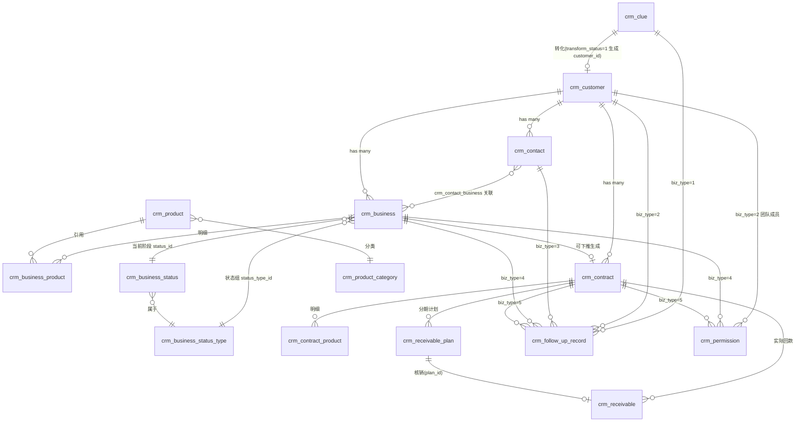

业务链一句话:**线索 → 客户 + 联系人 → 商机(阶段推进)→ 合同(审批)→ 回款计划 → 回款(审批)**。

---

## 5. 数据状态流转图(重点)

### 5.1 线索生命周期

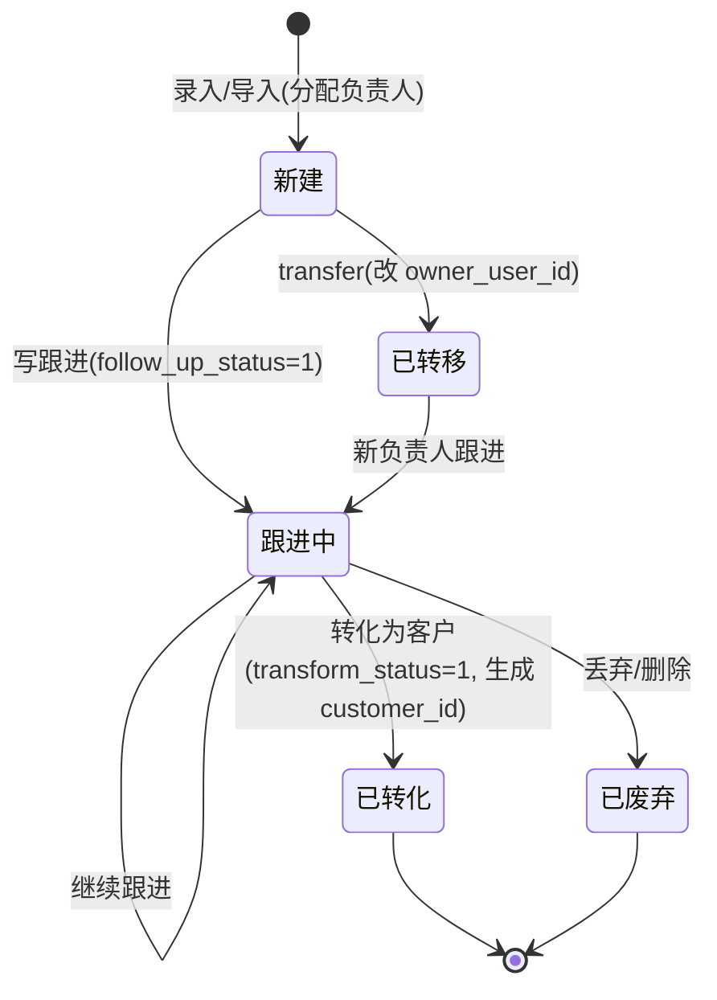

- 两个独立状态位:`follow_up_status`(跟进)、`transform_status`(转化),组合表达生命周期。
- 转化操作是单向前向:一旦 `transform_status=1` 不可逆,会同时创建客户并回填 `customer_id`。

### 5.2 客户生命周期(含公海流转) ⭐

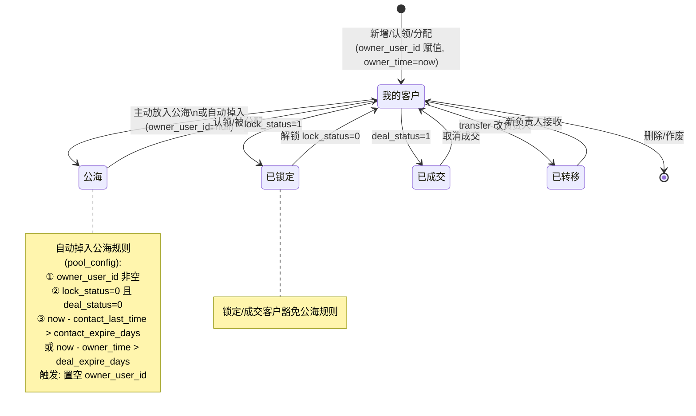

- **公海= `owner_user_id IS NULL` 的客户**,不是独立表,通过同一张 `crm_customer` 表的查询条件切换视图(我的客户 vs 公海客户)。
- 客户等级 `level`、来源 `source` 是字典字段,不属于状态机,但等级流转(普通→重要→核心)是业务上可记录的属性变化。

### 5.3 商机状态机(阶段流转) ⭐⭐

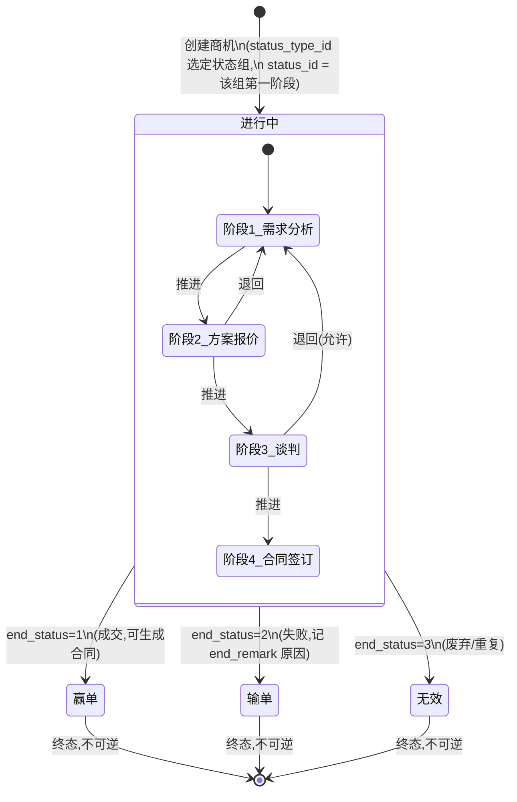

要点:

1. **状态组(`status_type_id`)可配置**:不同业务线可有不同阶段序列;`dept_ids` 控制哪些部门用哪组。
2. **阶段(`status_id`)有 `sort` 与 `percent`**:推进 = 把 `status_id` 改为下一个 `sort` 更大的阶段;`percent` 用于销售漏斗与加权预测金额。
3. **三态终局**:`end_status` 非 null 即终态,不可再改阶段(赢单/输单/无效都不可逆)。赢单后通常下推生成合同。
4. 阶段推进是否允许跨阶段、是否需审批,yudao 本身做的是"任意阶段可切换"的宽松模型;企业级(如用友 U8C)会引入"商机流程版本+阶段升迁条件"的强约束。Erupt 实现可先做宽松版,后续在 Service 层加规则。

### 5.4 合同状态流转

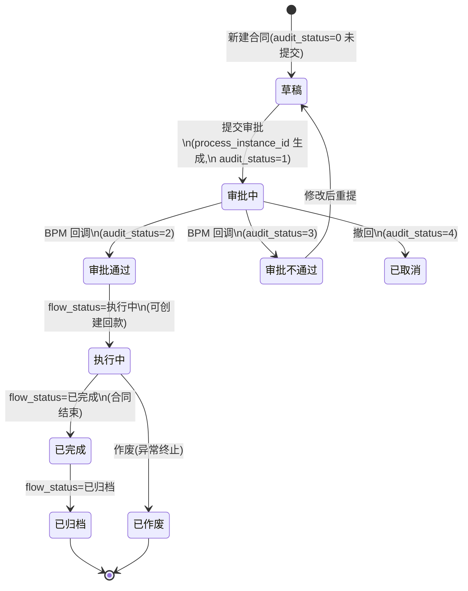

- 两条独立轴:`audit_status`(审批结果) + `flow_status`(生命周期)。审批通过是进入执行的前提。
- **到期提醒**:`end_time` 临近(如 30/7/0 天前)由定时任务扫描,触发站内信/邮件。
- 回款前置:必须 `audit_status=2` 才能新增回款。

### 5.5 回款状态流转

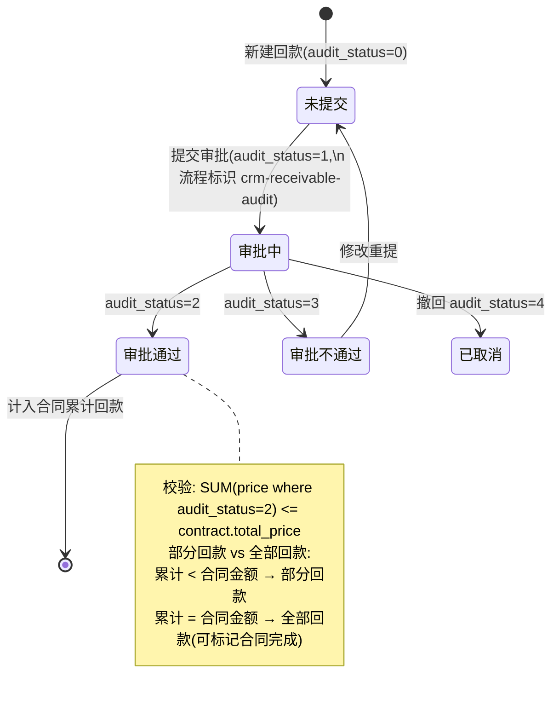

回款计划的状态相对简单:`plan.receivable_id IS NULL` → 待回款;被核销(创建回款时回填 `plan_id` 并把 `receivable_id` 写回 plan)→ 已回款。`remind_time` 到达前由定时任务提醒。

---

## 6. 关键业务流程

### 6.1 线索转化为客户

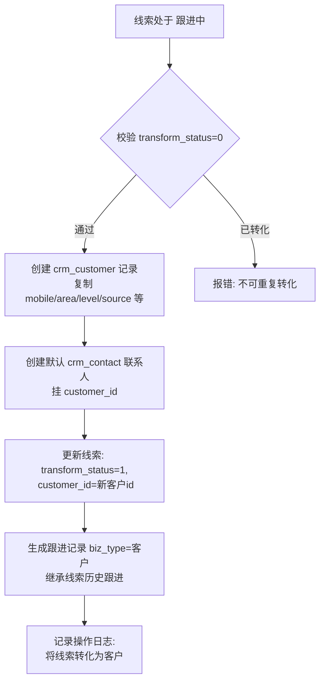

### 6.2 客户公海自动回收

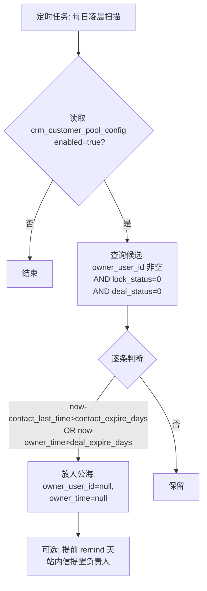

### 6.3 商机阶段推进与赢单下推

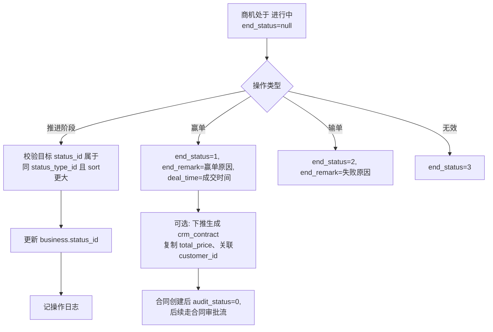

### 6.4 合同审批(对接工作流)

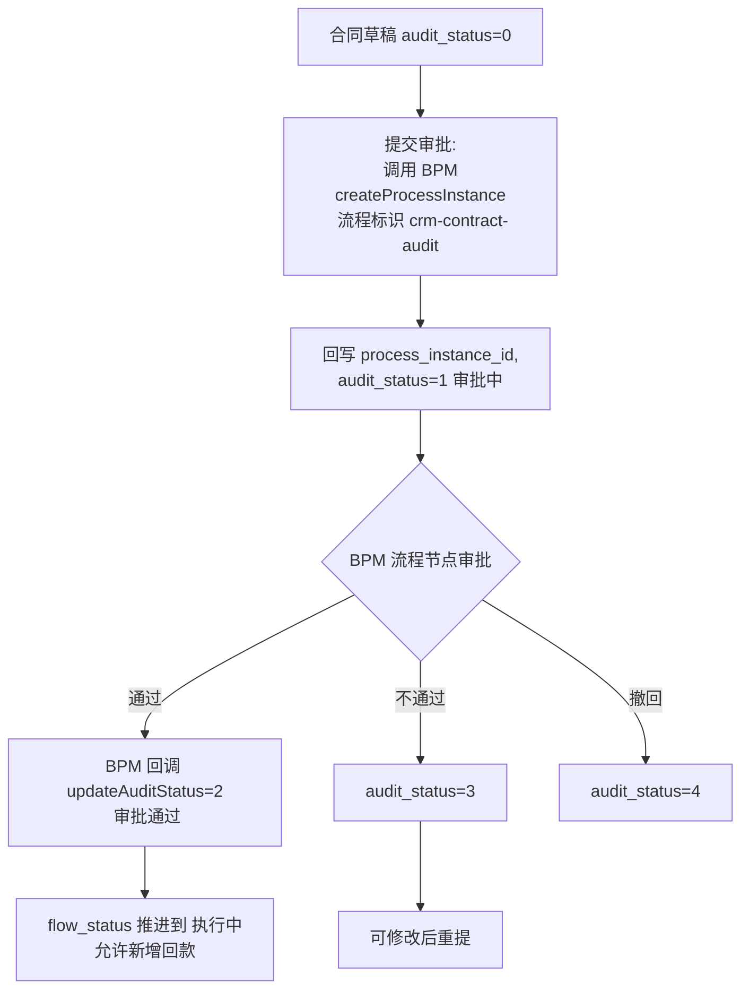

> Erupt 项目目前没有内置 Flowable,实现时有两种选择:① 用 `@RowOperation` + 自定义审批节点表做轻量审批流;② 集成 Flowable/Activiti。MVP 可先用 ①,在合同/回款表加 `audit_status` + 一个简单的 `crm_audit_node` 流转表。

### 6.5 回款流程(合同 → 回款计划 → 回款)

```mermaid
flowchart TD
    A[合同审批通过 audit_status=2] --> B{是否分期}
    B -- 是 --> C[创建多期 crm_receivable_plan\n period 1..N, price, return_time, remind_days]
    B -- 否 --> D[直接创建回款]
    C --> E[定时任务扫描 plan.remind_time 到达\n 发送提醒]
    C --> F[某期回款时: 新建 crm_receivable\n 关联 plan_id, price 同步]
    D --> F
    F --> G[提交审批: 流程标识 crm-receivable-audit]
    G --> H{BPM 审批}
    H -- 通过 --> I[audit_status=2]
    I --> J[回填 plan.receivable_id 标记已核销]
    J --> K[校验: SUM(回款 price) <= contract.total_price\n 超出则报错]
    K --> L{累计 = 合同金额?}
    L -- 是 --> M[合同标记 已完成]
    L -- 否 --> N[部分回款,继续]
```

### 6.6 跟进记录通用设计(biz_type + biz_id)

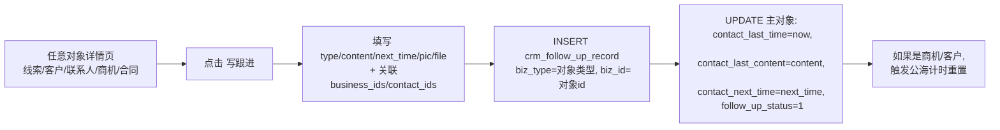

核心:一张 `crm_follow_up_record` 表 + `biz_type+biz_id` 多态外键,服务所有对象;主表只保留"最后一次跟进"的冗余汇总,用于列表展示与待办计算。

---

## 7. 数据权限设计

### 7.1 数据范围(场景栏)

yudao CRM 前端列表有"场景栏",后端按以下三种数据范围过滤:

| 场景 | 过滤逻辑 |
|---|---|
| **我负责的** | `owner_user_id = currentUserId` |
| **我参与的** | `EXISTS (SELECT 1 FROM crm_permission p WHERE p.biz_type=? AND p.biz_id=t.id AND p.user_id=currentUserId)` |
| **下属负责的** | `owner_user_id IN (下属用户id集)`(基于部门树 `system_dept` 的 `parent_id` 递归,或 `system_user_post` 上下级关系) |
| **全部** | 仅管理员/有全部数据权限的角色 |

后端在 Service 层根据当前登录用户拼 SQL 条件;前端"场景"本质是不同过滤参数。

### 7.2 数据权限表(crm_permission) — 团队成员共享

- 负责人 = 主表 `owner_user_id`(独占,单值)。
- 团队成员 = `crm_permission` 表,可多人,各自 `level` 为 `WRITE`/`READ`。
- 操作校验:编辑需 `OWNER` 或 `WRITE`;查看需 `OWNER`/`WRITE`/`READ`。
- "转移"操作:改 `owner_user_id` + 清理/保留旧 permission(默认旧负责人降级为 `READ` 团队成员)。

### 7.3 与 yudao 系统级数据权限的关系

yudao 还有 **系统级部门数据权限**(`DataScopeEnum`:全部/自定义部门/本部门/本部门及以下/仅本人),通过 MyBatis 拦截器注入 SQL。CRM 在此基础上叠加了自己的 `crm_permission` 共享模型。两者关系:

- 系统级:按 `dept_id`、`creator` 过滤,粗粒度,适合管理员/部门经理看团队数据。
- CRM 级:`owner_user_id` + `crm_permission`,细粒度到单条业务记录,适合销售个人/协作团队。

### 7.4 公海数据权限

公海客户(`owner_user_id IS NULL`)对所有有 CRM 权限的用户可见可认领,但认领后即转为"我负责的",他人不再可见(除非再次放入公海)。部分产品(用友/纷享)支持多公海池 + 池管理员 + 认领配额,yudao 简化为单一公海 + 全局认领上限(`receive_owner_count`)。

---

## 8. Erupt 实现建议

### 8.1 总体策略

- Erupt 是注解驱动,适合 **CRUD + 列表 + 详情 + 表单** 的标准部分,用 `@Erupt` / `@EruptField` / `@TabTree` 等。
- **状态机操作**(转化、推进、赢单输单、放入公海、认领、提交审批、转移)用 `@RowOperation` + `@RowOperationMethod` 自定义按钮 + Service。
- **通用扩展**(跟进记录、数据权限)用 `biz_type + biz_id` 设计,Erupt 通过 `@ReferenceTree` 或子表展示。
- **数据权限**与 `erupt-security` 结合:Erupt 自带按角色/字段的接口级权限;CRM 的"我负责的/我参与的/下属"需在 Service 层手写过滤(参考下方 8.5)。
- **审批流**:MVP 阶段不上 Flowable,自建轻量 `audit_status` + 审批节点表;`@RowOperation` 触发提交。

### 8.2 实体注解示例 — 客户

```java
@Table(name = "crm_customer")
@Entity
@Erupt(name = "客户管理")
public class CrmCustomer extends BaseModel {

    @EruptField(views = @View(title = "客户名称"),
        edit = @Edit(title = "客户名称", notNull = true, search = @Search))
    private String name;

    // 负责人:为空即公海。用ChoiceType或用户选择
    @EruptField(views = @View(title = "负责人"),
        edit = @Edit(title = "负责人", type = EditType.REFERENCE_TREE,
            referenceTree = @ReferenceTree(pk = "id", label = "nickname")))
    private Long ownerUserId;

    @EruptField(views = @View(title = "成为负责人时间"))
    private LocalDateTime ownerTime;

    // 状态字段用布尔/字典
    @EruptField(views = @View(title = "锁定状态"),
        edit = @Edit(title = "锁定状态"))
    private Boolean lockStatus;

    @EruptField(views = @View(title = "成交状态"),
        edit = @Edit(title = "成交状态"))
    private Boolean dealStatus;

    @EruptField(views = @View(title = "跟进状态"),
        edit = @Edit(title = "跟进状态"))
    private Boolean followUpStatus;

    @EruptField(views = @View(title = "最后跟进时间"))
    private LocalDateTime contactLastTime;

    @EruptField(views = @View(title = "下次联系时间"))
    private LocalDateTime contactNextTime;

    // 字典字段:行业/等级/来源 用 @ChoiceType 或 erupt-data-dict
    @EruptField(views = @View(title = "客户等级"),
        edit = @Edit(title = "客户等级", type = EditType.CHOICE,
            choiceType = @ChoiceType(fetch = @Fetch(val = "crm_customer_level"))))
    private Integer level;

    // 其他字段省略...
}
```

> 状态字段建议:简单二态(锁定/成交/跟进)用 `Boolean`;多态枚举(审批状态、end_status)用 `Integer` + `@ChoiceType` 字典,展示更友好。

### 8.3 商机状态机的 Erupt 表达

商机主表引用状态组与阶段:

```java
@Table(name = "crm_business")
@Entity
@Erupt(name = "商机管理")
public class CrmBusiness extends BaseModel {

    @EruptField(views = @View(title = "商机名称"),
        edit = @Edit(title = "商机名称", notNull = true))
    private String name;

    @EruptField(views = @View(title = "客户"),
        edit = @Edit(title = "客户", notNull = true, type = EditType.REFERENCE_TREE,
            referenceTree = @ReferenceTree(pk = "id", label = "name")))
    private Long customerId;

    // 状态组(决定可选阶段)
    @EruptField(views = @View(title = "状态组"),
        edit = @Edit(title = "状态组", type = EditType.REFERENCE_TREE,
            referenceTree = @ReferenceTree(pk = "id", label = "name")))
    private Long statusTypeId;

    // 当前阶段 — 联动 statusTypeId
    @EruptField(views = @View(title = "当前阶段"),
        edit = @Edit(title = "当前阶段", type = EditType.REFERENCE_TREE,
            referenceTree = @ReferenceTree(pk = "id", label = "name")))
    private Long statusId;

    // 结束状态:null=进行中;1赢单 2输单 3无效
    @EruptField(views = @View(title = "结束状态"),
        edit = @Edit(title = "结束状态", type = EditType.CHOICE,
            choiceType = @ChoiceType(fetch = @Fetch(val = "crm_business_end_status"))))
    private Integer endStatus;

    @EruptField(views = @View(title = "预计成交日期"),
        edit = @Edit(title = "预计成交日期"))
    private LocalDateTime dealTime;

    // 产品明细用 @TabTree 或子表关联展示
}
```

阶段推进、赢单输单用 `@RowOperation`:

```java
@RowOperation(
    code = "advanceStage",
    name = "推进阶段",
    mode = OperationMode.SINGLE,
    icon = "fa-arrow-right"
)
@RowOperationMethod
public String advanceStage(Long id, Long targetStatusId) {
    // 校验 endStatus == null(进行中才可推进)
    // 校验 targetStatusId 属于同 statusTypeId
    // 更新 status_id
    return "已推进到下一阶段";
}

@RowOperation(code = "win", name = "赢单", mode = OperationMode.SINGLE)
public String win(Long id, String endRemark) { /* end_status=1 */ }

@RowOperation(code = "lose", name = "输单", mode = OperationMode.SINGLE)
public String lose(Long id, String endRemark) { /* end_status=2 */ }
```

### 8.4 通用跟进记录(biz_type + biz_id)在 Erupt 中的实现

跟进记录是通用表,可在每个对象详情页以子表/抽屉形式展示。Erupt 实现思路:

```java
@Table(name = "crm_follow_up_record")
@Entity
@Erupt(name = "跟进记录")
public class CrmFollowUpRecord extends BaseModel {

    @EruptField(views = @View(title = "对象类型"),
        edit = @Edit(title = "对象类型", type = EditType.CHOICE,
            choiceType = @ChoiceType(fetch = @Fetch(val = "crm_biz_type"))))
    private Integer bizType;

    @EruptField(views = @View(title = "对象编号"),
        edit = @Edit(title = "对象编号"))
    private Long bizId;

    @EruptField(views = @View(title = "跟进类型"),
        edit = @Edit(title = "跟进类型", type = EditType.CHOICE,
            choiceType = @ChoiceType(fetch = @Fetch(val = "crm_follow_up_type"))))
    private Integer type;

    @EruptField(views = @View(title = "跟进内容"),
        edit = @Edit(title = "跟进内容", type = EditType.TEXTAREA))
    private String content;

    @EruptField(views = @View(title = "下次联系时间"),
        edit = @Edit(title = "下次联系时间"))
    private LocalDateTime nextTime;

    @EruptField(views = @View(title = "图片"),
        edit = @Edit(title = "图片", type = EditType.ATTACHMENT))
    private String picUrls;

    // 关联商机/联系人(JSON 数组字符串)
    @EruptField(views = @View(title = "关联商机"),
        edit = @Edit(title = "关联商机"))
    private String businessIds;
}
```

在客户/商机等对象的 Erupt 详情页用 `@TabTree` 或自定义 `@RowOperation` 弹出"写跟进"表单,提交时:

1. INSERT `crm_follow_up_record`(biz_type=2 / 4,biz_id=对象 id)。
2. UPDATE 主对象 `contact_last_time/contact_last_content/contact_next_time/follow_up_status`。

### 8.5 数据权限与 erupt-security 结合

Erupt 自带 `erupt-security` 做接口/字段级 RBAC,但不解决"我负责的/我参与的/下属"这种业务级数据范围。建议:

1. **接口级**:用 `erupt-security` 控制菜单、按钮、字段是否可见(销售 vs 主管 vs 管理员)。
2. **数据级**:在 Service 的查询方法上用 AOP 或显式注入当前用户,拼接 SQL:
   ```java
   public Page<Customer> page(CustomerQuery query) {
       Long uid = EruptUserUtil.getCurrentUserId();
       Integer scope = query.getSceneScope(); // 1我负责 2我参与 3下属
       Specification<Customer> spec = (root, q, cb) -> {
           List<Predicate> ps = new ArrayList<>();
           if (scope == 1) ps.add(cb.equal(root.get("ownerUserId"), uid));
           if (scope == 2) ps.add(cb.isTrue(
               cb.function("EXISTS", Boolean.class, /* subquery crm_permission */)));
           if (scope == 3) ps.add(root.get("ownerUserId").in(getSubordinateIds(uid)));
           return cb.or(ps.toArray(new Predicate[0]));
       };
       return repo.findAll(spec, page);
   }
   ```
3. **写权限校验**:在 `@RowOperation` 方法里校验 `ownerUserId == currentUserId || exists permission(WRITE)`,否则抛异常。
4. **公海视图**:单独一个 `CrmCustomerPool` Erupt 类(只读视图),底层查 `crm_customer WHERE owner_user_id IS NULL`,操作"认领"用 `@RowOperation` 改 `owner_user_id`。

### 8.6 状态字段的统一处理建议

| 状态类型 | 字段类型 | Erupt 注解 |
|---|---|---|
| 跟进状态(二态) | `Boolean` | `@Edit` 普通 |
| 锁定/成交(二态) | `Boolean` | `@Edit` 普通 + `@RowOperation` 切换 |
| 转化状态(二态,不可逆) | `Boolean` | 只读展示 + `@RowOperation` 转化 |
| 商机结束状态(多态) | `Integer` | `@ChoiceType` 字典,只读 + `@RowOperation` |
| 审批状态(多态,联动 BPM) | `Integer` | `@ChoiceType`,只读 + `@RowOperation` 提交审批 |
| 商机当前阶段(联动状态组) | `Long` | `@ReferenceTree` + 联动 + `@RowOperation` 推进 |

### 8.7 实施优先级(建议 4 阶段)

1. **P0 基础链路**:产品、产品分类 → 客户、联系人 → 线索 → 线索转化客户。纯 CRUD + 字典。
2. **P1 状态机核心**:商机 + 状态组/阶段(可配置)+ 赢单输单;合同(轻量审批:自建 audit_status)→ 回款。
3. **P2 通用能力**:跟进记录(biz_type+biz_id)、待办事项、公海配置与自动掉入定时任务、数据权限三场景。
4. **P3 增强**:BPM 工作流对接、数据统计(销售漏斗、转化率、排行榜)、客户限制配置、多公海池。

---

## 9. 参考来源

### 9.1 yudao / ruoyi-vue-pro(主要研究对象)
- 官方文档(线索):https://doc.iocoder.cn/crm/clue/
- 官方文档(客户/公海):https://doc.iocoder.cn/crm/customer/
- 官方文档(商机/状态):https://doc.iocoder.cn/crm/business/
- 官方文档(合同):https://doc.iocoder.cn/crm/contract/
- 官方文档(回款/回款计划):https://api.feixin.app/crm/receivable/
- 官方文档(产品/分类):https://note.lazzman.com:18084/project-1/doc-1010/
- 官方文档(跟进记录/待办):https://doc.iocoder.cn/crm/follow-up/
- 官方文档(数据权限):https://doc.iocoder.cn/crm/permission/
- CRM 表结构详细版:https://blog.hellocode.vip/36.后端/0.芋道/表/按模块详细版/06-CRM-详细版
- RuoYi-Vue-Pro 数据库表设计解析:https://blog.hellocode.vip/36.后端/0.芋道/表/ruoyi-vue-pro-数据库表设计解析
- yudao-cloud 源码(GitHub):https://github.com/YunaiV/yudao-cloud
  - `yudao-module-crm/yudao-module-crm-api/src/main/java/cn/iocoder/yudao/module/crm/enums/LogRecordConstants.java`(操作日志枚举,含线索转化/客户转移/商机推进/回款审批等关键操作的日志模板)
- 数据权限源码解析:https://www.erlo.vip/share/9/110509.html
- 自定义数据权限实战:https://blog.csdn.net/studio_1/article/details/158846672
- yudao 数据范围 DataScopeEnum(1全部/2自定义部门/3本部门/4本部门及以下/5仅本人):https://wenku.csdn.net/answer/249ieghy4s

### 9.2 同类开源/商业 CRM 参考
- 简道云 CRM 名词解释(线索/线索池/公海池/联系人/商机/跟进记录定义):https://hc.jiandaoyun.com/solution/12639
- 公海客户与线索客户区别:https://www.jiandaoyun.com/nblog/292004/
- 公海池规则(无跟进/无机会/无合同/最大拥有数/前负责人/捞取频率):https://qwhelp.xbongbong.com/?p=2342
- 客户公海自动划入规则(未跟进/未成交/未新增合同):https://www.kancloud.cn/weiwenjia_crm/crm/1937555
- 商机阶段设置(赢单/输单原因、进行中阶段最多 6 个):https://help.wshoto.com/index.html#/3.0_sj/
- 用友 U8C 商机(商机类型/商机流程/阶段升迁/赢丢单叠加状态):https://c2.yonyoucloud.com/iuap-hc-client/ucf-wh/client/index.html#/detail/oppta
- 用友 U8C 线索(待分配/跟进中/已转化/已关闭状态):https://c2.yonyoucloud.com/iuap-hc-client/ucf-wh/client/index.html#/detail/clue
- 升鲜宝 CRM 完整功能设计与数据库字典(待办/线索/客户/公海/商机/合同/回款/产品/统计):https://www.cnblogs.com/sunplay/p/18471819
- CRM 系统数据库表结构设计(独立线索/客户/商机/合同/回款/跟进表):https://juejin.cn/post/7562113701396365346
- CRM 商机状态分类(初始/跟进中/成交/失单):https://www.jiandaoyun.com/nblog/284826/
- 回款管理(场景栏、审批、导入导出):http://doc.njyima.com/docs/docs/payment.html
- 回款计划(期数/提醒/自定义场景):http://doc.qingdong.vip/docs/docs/refund_scheme.html
- CRM 权限体系(RBAC/数据权限/字段级/层级共享):https://www.sohu.com/a/925917192_122330590
- 合同到期自动提醒(定时任务/多级提醒策略):https://blog.csdn.net/CJF533/article/details/152276376
- 合同全过程管理(签订→履行→监控→变更→回款→关闭):https://www.sohu.com/a/895482435_122017072

### 9.3 关键发现汇总

1. **yudao CRM 状态机的精髓在商机**:`status_type_id`(状态组,可配置)+ `status_id`(阶段)+ `end_status`(赢单/输单/无效三态终局)三层模型,既支持自定义流程又保证终态统一。
2. **公海不是独立表**:`owner_user_id IS NULL` 即公海,通过查询条件切换"我的客户/公海客户"视图;`owner_time` + `lock_status` + `deal_status` 三字段共同表达"是否会被自动回收"。
3. **跟进记录是 biz_type+biz_id 通用表**:一张表服务线索/客户/联系人/商机/合同,主表冗余"最后跟进"汇总,既保留流水又便于列表/待办。
4. **数据权限双层**:系统级 `dept_id`/`creator` 拦截器(粗) + CRM 级 `owner_user_id` + `crm_permission`(细,团队成员共享)。前端"场景栏"=不同过滤参数。
5. **审批与 BPM 解耦**:合同/回款通过 `audit_status` + `process_instance_id` 字段对接工作流,流程标识 `crm-contract-audit` / `crm-receivable-audit`;无 BPM 时可用 `audit_status` 单字段 + 自建轻量节点表实现 MVP。
6. **Erupt 落地的关键**:CRUD 用注解,状态机操作用 `@RowOperation`,通用扩展用 biz_type+biz_id 子表,数据权限在 Service 层手写过滤叠加 erupt-security 的接口级权限。
