# ERP 模块功能分析报告（基于芋道 yudao 及同类开源项目）

> 本报告基于对芋道（yudao）`yudao-module-erp` 模块的源码与文档、以及 RuoYi-ERP、JeecgBoot ERP、IFP、金蝶云星空等开源/商用 ERP 的对照研究，重点剖析数据状态流转与库存计算模型，并给出在 Erupt 框架（注解驱动，Spring Boot + JPA）上的落地建议。
> 报告目标读者：在 Erupt 上实现 ERP 进销存 + 财务模块的开发者。

---

## 1. 模块概述

### 1.1 yudao ERP 在项目中的位置

- 后端模块：`yudao-module-erp`，业务实现包 `yudao-module-erp-biz`，分为 `purchase`（采购）、`sale`（销售）、`stock`（库存）、`finance`（财务）四个子包。
- 前端：`yudao-ui-admin-vue3` 的 `@/views/erp/*` 目录。
- 设计哲学：**业财一体**——业务单据（采购入库 / 销售出库）审核时自动联动库存与应付/应收；财务收付款单再回写业务单据的已收/已付金额，形成闭环。
- 数据建模：采用「**主数据 + 单据头 + 单据体（明细） + 库存流水**」四层结构，是标准进销存设计。

### 1.2 与同类项目对照

| 项目 | 技术栈 | 状态机复杂度 | 库存核算 | 多租户 | 备注 |
|---|---|---|---|---|---|
| yudao-erp | Spring Boot + MyBatis Plus + Vue3 | **极简**（仅 未审批/已审批 + 反审批） | 仅记录 product_price，未做 FIFO/加权平均 | ✅ | 文档完善，适合作为表结构蓝本 |
| RuoYi-ERP | Spring Boot + MyBatis + Vue | 中（草稿/待审/已审/完成） | 简单移动平均 | ✅ | 偏传统进销存 |
| JeecgBoot ERP | Spring Boot + MyBatis Plus + Vue3 | 中（含 approve_by/approve_time/refuse_reason） | 同上 | ✅ | 在线编码能力强 |
| IFP / crmeb_erp | Java/PHP | 中 | 简单 | 部分 | 偏电商融合 |
| 金蝶云星空 | 商用 | **复杂**（暂存/提交/审核/作废/反审核 + 行状态） | FIFO/加权/移动加权/分批 | ✅ | 企业级标杆，状态机最全 |

### 1.3 关键发现（重要）

> **yudao 的状态机并非用户预期的多状态机**，而是采用「**审批状态极简 + 执行状态派生**」的设计：
> - `status` 字段统一使用 `ErpAuditStatus` 枚举，只有 `10 未审批` / `20 已审批` 两个值，且支持「反审批」回退。
> - 「部分入库 / 已完成入库 / 关闭」等执行状态**不是显式状态字段**，而是由 `in_count` / `return_count` / `out_count` 与 `total_count` 比较后**派生**得出（参考金蝶「执行状态」概念：未执行 / 部分执行 / 全部执行）。
> - 没有「作废 / 关闭」状态，作废 = 逻辑删除（`deleted=1`）。
>
> 本报告在「状态流转图」部分会同时给出：**A. yudao 实际状态机**（极简）与 **B. 完整状态机**（用户预期，含草稿/待审批/已审批/部分入库/已完成/关闭/作废），供 Erupt 实现时按需选择复杂度。

---

## 2. 功能模块清单（完整覆盖）

### 2.1 主数据（基础档案）

| 模块 | 表 | 说明 | 关键字段 |
|---|---|---|---|
| 产品分类 | `erp_product_category` | 树形（pid 自关联） | name, parent_id, status |
| 产品单位 | `erp_product_unit` | 计量单位（个/箱/千克） | name, status |
| 产品 | `erp_product` | SPU 级，关联分类+单位 | name, category_id, unit_id, status |
| 仓库 | `erp_warehouse` | 仓库档案 | name, address, status, default_status |
| 供应商 | `erp_supplier` | 采购往来单位 | name, contact, mobile, tax_no, tax_percent, bank_* |
| 客户 | `erp_customer` | 销售往来单位 | 同供应商结构 |
| 结算账户 | `erp_account` | 资金账户（现金/银行） | name, no, status, default_status |

### 2.2 库存管理

| 模块 | 表 | 说明 | 状态字段 |
|---|---|---|---|
| 产品库存（余额表） | `erp_stock` | (product_id, warehouse_id) 维度的当前余额 | count |
| 库存明细（流水） | `erp_stock_record` | 每次出入库的流水记录 | biz_type, biz_id, count |
| 其它入库 | `erp_stock_in` / `erp_stock_in_item` | 无订单来源的入库（盘盈/期初/赠品） | status(ErpAuditStatus) |
| 其它出库 | `erp_stock_out` / `erp_stock_out_item` | 无订单来源的出库（报损/领用） | status(ErpAuditStatus) |
| 库存调拨 | `erp_stock_move` / `erp_stock_move_item` | 仓-仓调拨，明细含 from/to warehouse | status(ErpAuditStatus) |
| 库存盘点 | `erp_stock_check` / `erp_stock_check_item` | 盘点单，count 正=盘盈 / 负=盘亏 | status(ErpAuditStatus) |

### 2.3 采购管理

| 模块 | 表 | 说明 | 状态字段 |
|---|---|---|---|
| 采购订单 | `erp_purchase_order` / `erp_purchase_order_items` | 不影响库存，仅记录 | status + in_count + return_count |
| 采购入库 | `erp_purchase_in` / `erp_purchase_in_items` | 审批 → 增库存 + 生应付 | status + payment_price |
| 采购退货 | `erp_purchase_return` / `erp_purchase_return_items` | 审批 → 减库存 + 生应付红字 | status + refund_price |

### 2.4 销售管理

| 模块 | 表 | 说明 | 状态字段 |
|---|---|---|---|
| 销售订单 | `erp_sale_order` / `erp_sale_order_items` | 不影响库存 | status + out_count + return_count |
| 销售出库 | `erp_sale_out` / `erp_sale_out_items` | 审批 → 减库存 + 生应收 | status + receipt_price |
| 销售退货 | `erp_sale_return` / `erp_sale_return_items` | 审批 → 增库存 + 生应收红字 | status + refund_price |

### 2.5 财务管理

| 模块 | 表 | 说明 | 状态字段 |
|---|---|---|---|
| 付款单 | `erp_finance_payment` / `erp_finance_payment_item` | 付款给供应商，核销应付 | status(ErpAuditStatus) |
| 收款单 | `erp_finance_receipt` / `erp_finance_receipt_item` | 收客户款，核销应收 | status(ErpAuditStatus) |

> yudao 财务只实现了「付款单 / 收款单」两个核心单据，没有独立的「对账单 / 发票 / 核销单」实体（核销通过 payment_item / receipt_item 的 biz_type+biz_id 关联业务单据完成）。完整的应收应付模块还会包含：对账单、销项/进项发票、核销单（预收冲应收 / 预付冲应付 / 应收冲应付 / 应收转应收）、其他收入/支出单、资金转账单。Erupt 实现时建议至少补「对账单 + 发票」两个实体。

---

## 3. 核心实体与字段表

> 通用字段（所有表均含，下文省略）：`id` bigint PK, `creator`, `create_time`, `updater`, `update_time`, `deleted` bit(逻辑删除), `tenant_id` bigint(多租户)。
> 金额/数量统一使用 `decimal(24,6)`，避免浮点误差。

### 3.1 主数据

#### erp_product（产品）
| 字段 | 类型 | 说明 |
|---|---|---|
| id | bigint | 产品编号 |
| name | varchar(255) | 产品名称 |
| bar_code | varchar(255) | 条形码 |
| category_id | bigint | 分类（→ erp_product_category） |
| unit_id | bigint | 基本单位（→ erp_product_unit） |
| status | tinyint | 0 停用 / 1 启用 |
| sort | int | 排序 |

#### erp_product_category（产品分类，树形）
| 字段 | 类型 | 说明 |
|---|---|---|
| id | bigint | 分类编号 |
| name | varchar(255) | 分类名称 |
| parent_id | bigint | 父分类（自关联，根=0） |
| status | tinyint | 状态 |

#### erp_product_unit（计量单位）
| 字段 | 类型 | 说明 |
|---|---|---|
| id | bigint | 单位编号 |
| name | varchar(255) | 单位名称（个/箱/千克） |
| status | tinyint | 状态 |
| sort | int | 排序 |

#### erp_warehouse（仓库）
| 字段 | 类型 | 说明 |
|---|---|---|
| id | bigint | 仓库编号 |
| name | varchar(20) | 仓库名称 |
| address | varchar(255) | 仓库地址 |
| sort | int | 排序 |
| status | tinyint | 开启状态 |
| default_status | bit | 是否默认仓库 |

#### erp_supplier / erp_customer（供应商 / 客户）
| 字段 | 类型 | 说明 |
|---|---|---|
| id | bigint | 编号 |
| name | varchar(255) | 名称 |
| contact | varchar(100) | 联系人 |
| mobile / telephone / email / fax | varchar | 联系方式 |
| tax_no | varchar(50) | 纳税人识别号 |
| tax_percent | decimal(24,6) | 默认税率（%） |
| bank_name / bank_account / bank_address | varchar | 开户信息 |
| status / sort | | 状态/排序 |

#### erp_account（结算账户）
| 字段 | 类型 | 说明 |
|---|---|---|
| id | bigint | 账户编号 |
| name | varchar(255) | 账户名称（工行/现金） |
| no | varchar(50) | 账户编码 |
| status | tinyint | 开启状态 |
| default_status | bit | 是否默认 |

### 3.2 库存表（核心）

#### erp_stock（库存余额表）⭐
| 字段 | 类型 | 说明 |
|---|---|---|
| id | bigint | 编号 |
| product_id | bigint | 产品编号 |
| warehouse_id | bigint | 仓库编号 |
| count | decimal(24,6) | **当前可用库存数量**（正数） |

> 联合唯一键：(product_id, warehouse_id)。yudao 仅维护「可用库存」一个值；完整模型建议扩展为：`count`(可用) / `locked_count`(锁定) / `in_transit_count`(在途) / `avg_cost`(移动加权平均成本)。

#### erp_stock_record（库存流水/明细）⭐
| 字段 | 类型 | 说明 |
|---|---|---|
| id | bigint | 流水编号 |
| product_id | bigint | 产品 |
| warehouse_id | bigint | 仓库 |
| biz_type | tinyint | **业务类型**（10 其它入库/11 采购入库/12 销售退货入库/13 盘盈入库 / 20 其它出库/21 采购退货出库/22 销售出库/23 盘亏出库 / 30 调拨出/31 调拨入） |
| biz_id | bigint | 业务单据 ID |
| biz_no | varchar | 业务单据号 |
| count | decimal(24,6) | **变动数量**（正=入库 / 负=出库） |
| total_count | decimal(24,6) | 变动后该仓该产品的库存（冗余快照） |

### 3.3 采购单据

#### erp_purchase_order（采购订单）⭐
| 字段 | 类型 | 说明 |
|---|---|---|
| id | bigint | 编号 |
| no | varchar(255) | 采购单号（{prefix}{yyyyMMdd}{6位自增}） |
| status | tinyint | **审批状态** ErpAuditStatus（10/20） |
| order_time | datetime | 采购时间 |
| supplier_id | bigint | 供应商 |
| account_id | bigint | 结算账户 |
| total_count / total_price / total_product_price / total_tax_price | decimal | 合计数量/价/产品价/税额 |
| discount_percent / discount_price | decimal | 优惠率/优惠额 |
| deposit_price | decimal | 定金 |
| **in_count** | decimal | **已入库数量**（派生执行状态） |
| **return_count** | decimal | **已退货数量** |
| file_url / remark | | 附件/备注 |

> total_price = total_product_price + total_tax_price - discount_price

#### erp_purchase_order_items（采购订单明细）
| 字段 | 类型 | 说明 |
|---|---|---|
| id | bigint | 编号 |
| order_id | bigint | 订单编号（FK） |
| product_id | bigint | 产品 |
| product_unit_id | bigint | 单位 |
| product_price | decimal | 单价 |
| count | decimal | 数量 |
| total_price | decimal | 总价 = price*count + tax_price |
| tax_percent / tax_price | decimal | 税率/税额 |
| **in_count** / **return_count** | decimal | **行级已入库/已退货数量** |

#### erp_purchase_in（采购入库）
| 字段 | 类型 | 说明 |
|---|---|---|
| id | bigint | 编号 |
| no | varchar | 入库单号 |
| status | tinyint | 审批状态 |
| in_time | datetime | 入库时间 |
| supplier_id | bigint | 供应商 |
| account_id | bigint | 结算账户 |
| **order_id** / **order_no** | bigint/varchar | **关联采购订单** |
| total_* | decimal | 同订单 |
| other_price | decimal | 其它费用 |
| **payment_price** | decimal | **已付款金额**（派生付款状态） |
| file_url / remark | | |

#### erp_purchase_in_items（采购入库明细）
| 字段 | 类型 | 说明 |
|---|---|---|
| id | bigint | |
| in_id | bigint | 入库单 FK |
| **order_item_id** | bigint | **关联订单明细**（用于回写 in_count） |
| warehouse_id | bigint | 入库仓库 |
| product_id / product_unit_id / product_price / count / total_price / tax_* | | 同订单明细 |

#### erp_purchase_return / _items（采购退货）
结构与 `erp_purchase_in` 基本一致，关键字段差异：
- `return_time` 替代 `in_time`
- `refund_price` 替代 `payment_price`（已退款金额）
- 审批时**减少**库存、生成应付红字

### 3.4 销售单据

#### erp_sale_order / _items（销售订单）
结构与采购订单对称，差异：
- `customer_id` 替代 `supplier_id`
- `sale_user_id` 销售员
- `out_count` / `return_count` 替代 `in_count` / `return_count`

#### erp_sale_out / _items（销售出库）
结构与采购入库对称，关键字段：
- `out_time`、`customer_id`、`order_id`/`order_no`
- `receipt_price`（已收款金额）
- 审批时**减少**库存、生成应收

#### erp_sale_return / _items（销售退货）
对称采购退货，审批时**增加**库存、生成应收红字。

### 3.5 其它库存单据

#### erp_stock_in / _item（其它入库） / erp_stock_out / _item（其它出库）
| 主表字段 | 说明 |
|---|---|
| no / status / in_time(or out_time) | 单号/状态/时间 |
| supplier_id / customer_id | 来源（可空） |
| total_count / total_price | 合计 |
| 主表无 order_id（无订单来源） | |

明细字段：warehouse_id / product_id / product_unit_id / product_price / count / total_price

#### erp_stock_move / _item（库存调拨）⭐
主表：no / move_time / total_count / total_price / status / remark
明细：
| 字段 | 说明 |
|---|---|
| move_id | 调拨单 FK |
| **from_warehouse_id** | 调出仓库 |
| **to_warehouse_id** | 调入仓库 |
| product_id / product_unit_id / product_price / count / total_price | |

> 审批时：① from 仓 -count（出库流水）② to 仓 +count（入库流水），共 2n 条流水。

#### erp_stock_check / _item（库存盘点）⭐
明细关键字段：
| 字段 | 说明 |
|---|---|
| check_id | 盘点单 FK |
| warehouse_id / product_id | 盘点对象 |
| **stock_count** | 账面数量（系统当前库存） |
| **actual_count** | 实际数量（实盘） |
| **count** | **盈亏数量** = actual - stock（正=盘盈入库 / 负=盘亏出库） |
| total_price | = product_price * count |

### 3.6 财务单据

#### erp_finance_payment（付款单）⭐
| 字段 | 类型 | 说明 |
|---|---|---|
| id | bigint | |
| no | varchar | 付款单号 |
| status | tinyint | 审批状态 |
| payment_time | datetime | 付款时间 |
| finance_user_id | bigint | 财务人员 |
| supplier_id | bigint | 供应商 |
| account_id | bigint | 付款账户 |
| total_price | decimal | 合计金额 |
| discount_price | decimal | 优惠/折扣 |
| **payment_price** | decimal | **实付金额** |
| remark | varchar | 备注 |

#### erp_finance_payment_item（付款明细）⭐ 核销关系
| 字段 | 类型 | 说明 |
|---|---|---|
| id | bigint | |
| payment_id | bigint | 付款单 FK |
| **biz_type** | tinyint | **业务类型**（10 采购入库 / 11 采购退货 / ... 系统枚举） |
| **biz_id** | bigint | **业务单据 ID** |
| **biz_no** | varchar | 业务单号 |
| total_price | decimal | 该业务单应付总额 |
| paid_price | decimal | 该业务单已付总额（含本次前） |
| **payment_price** | decimal | **本次付款金额** |

> 收款单 `erp_finance_receipt` / `_item` 结构与付款单对称，customer_id 替代 supplier_id。

---

## 4. 实体关系图

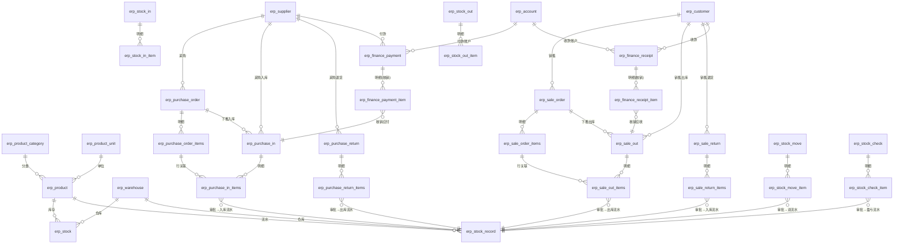

### 业务链一句话总结

> **采购**：采购订单（不影响库存）→ 采购入库（增库存+生应付）→ 付款单（核销应付）。
> **销售**：销售订单（不影响库存）→ 销售出库（减库存+生应收）→ 收款单（核销应收）。
> **退货**：采购退货（减库存+应付红字） / 销售退货（增库存+应收红字）。
> **库存内部**：调拨（仓-仓双流水）、盘点（盈亏流水）、其它入/出库（无来源流水）。

---

## 5. 状态流转图（重点）

### 5.1 yudao 实际状态机（极简，所有业务单据通用）

yudao 所有业务单据（订单/入库/出库/退货/调拨/盘点/付款/收款）共用同一套审批状态机：

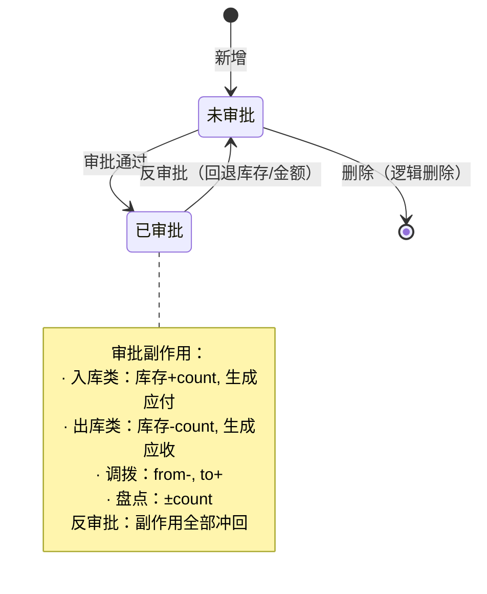

**ErpAuditStatus 枚举值**：
- `10` = 未审批（DEFAULT/DRAFT）
- `20` = 已审批（APPROVE）

**执行状态（派生）**：通过比较 `in_count` / `out_count` / `return_count` 与 `total_count` 得出：
- `in_count == 0` → 未入库
- `0 < in_count < total_count` → 部分入库
- `in_count >= total_count` → 已完成入库
- 同理：付款状态比较 `payment_price` vs `total_price`（未付款/部分付款/全部付款）

### 5.2 完整状态机（Erupt 实现建议采用）

针对用户预期，建议在 Erupt 实现时引入更完整的状态字段 `status`：

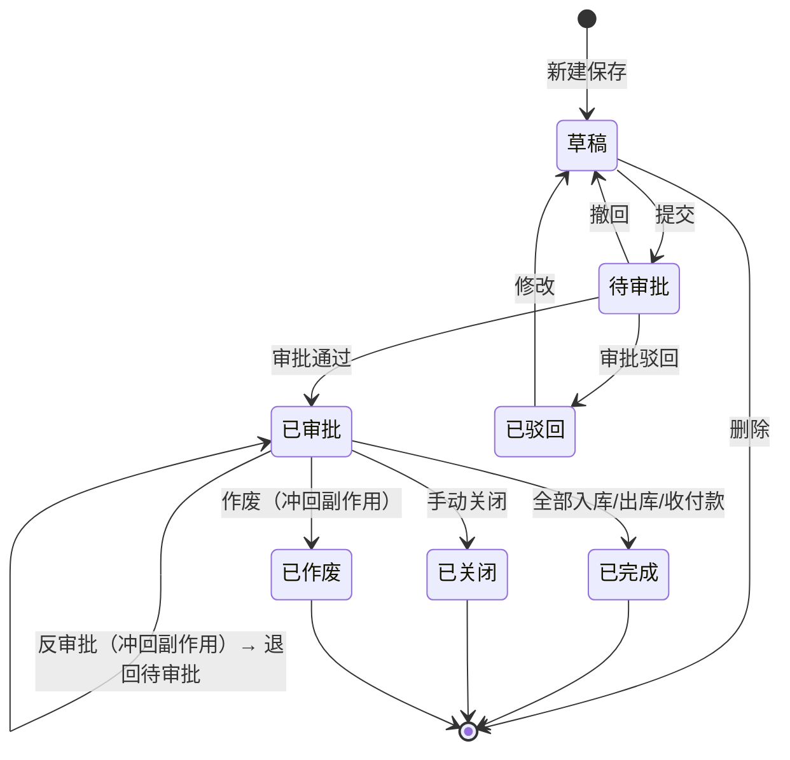

**状态枚举建议**：
| 值 | 状态 | 说明 |
|---|---|---|
| 0 | 草稿 DRAFT | 可编辑/删除 |
| 10 | 待审批 SUBMITTED | 不可编辑，等待审批 |
| 20 | 已审批 APPROVED | 触发库存/财务副作用 |
| 30 | 已驳回 REJECTED | 审批不通过，可修改后重新提交 |
| 40 | 已完成 COMPLETED | 全部入库/出库/收付款 |
| 50 | 已关闭 CLOSED | 手动关闭，未完成也不可再执行 |
| 60 | 已作废 CANCELLED | 作废，副作用冲回 |

### 5.3 采购订单状态流转（推荐完整版）

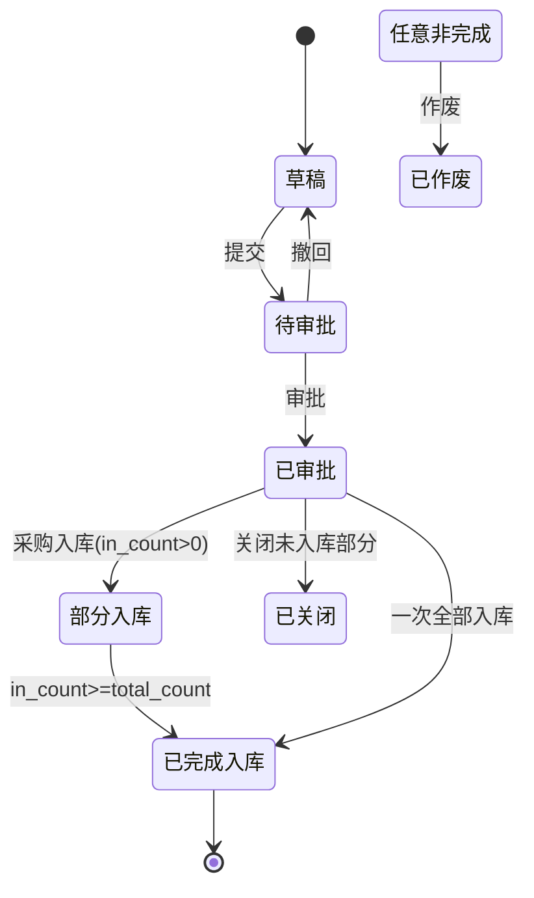

> 注：采购订单本身**不影响库存**，「已审批」只是订单生效，可下推采购入库单。

### 5.4 采购入库单状态流转

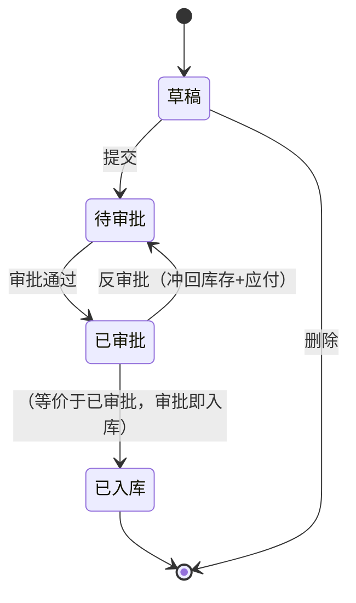

### 5.5 销售出库单状态流转（对称采购入库）

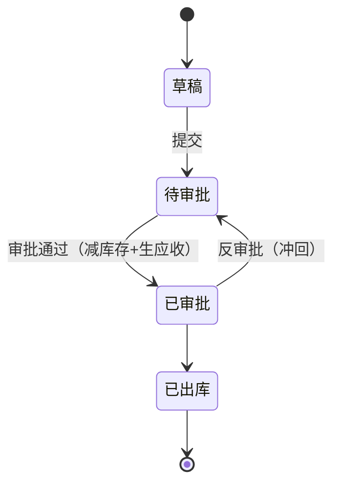

### 5.6 库存调拨状态流转（含在途）

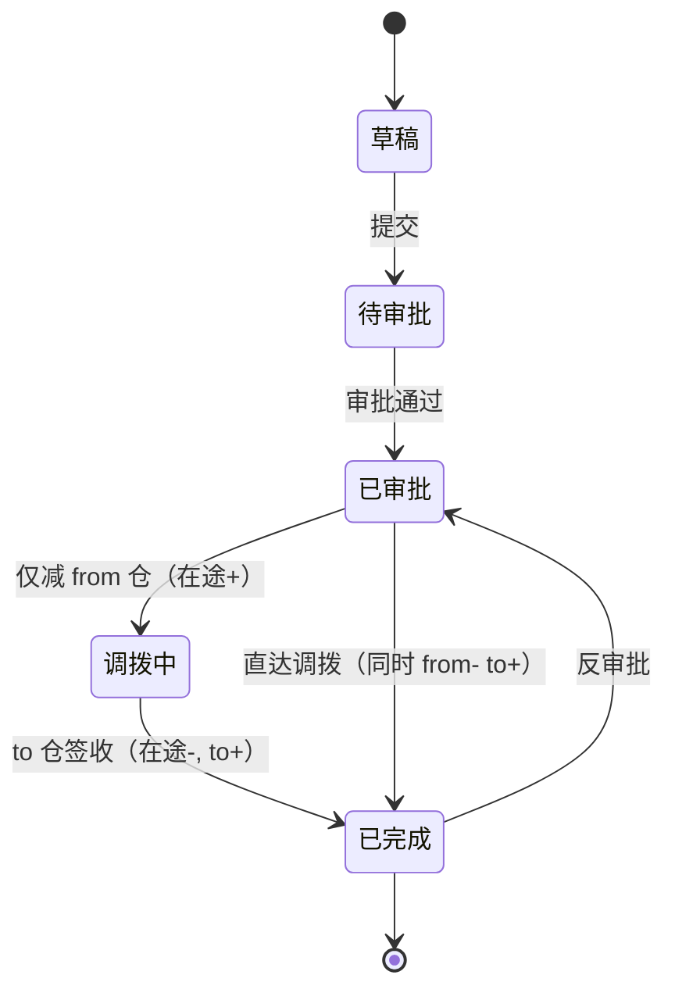

**调拨事务性**（重要）：
- 一步调拨：审批 → `from.count -= n` + `to.count += n` + 2 条流水，单事务提交。
- 两步调拨（在途）：审批 → `from.count -= n` + `from.in_transit += n` + 1 条出库流水；签收 → `to.count += n` + `from.in_transit -= n` + 1 条入库流水。
- 反审批：必须判断 to 仓当前库存是否足够冲回（已被出库则不能反审批）。

### 5.7 库存盘点状态流转

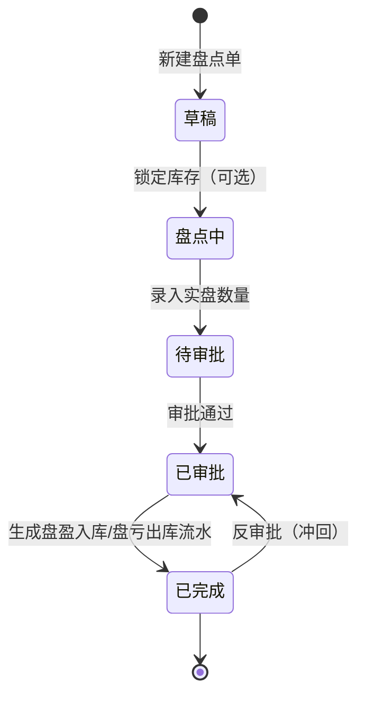

**盘盈/盘亏处理**：
- `count > 0`（盘盈）：`stock.count += count`，生成 biz_type=13（盘盈入库）流水
- `count < 0`（盘亏）：`stock.count += count`（负值），生成 biz_type=23（盘亏出库）流水

### 5.8 付款单 / 收款单状态流转

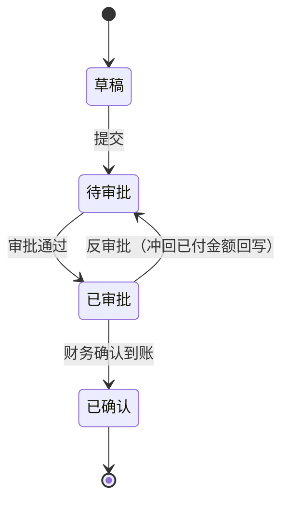

**部分付款 vs 全部付款**（派生状态，回写到业务单据）：
- 付款单审批通过 → 累加 `payment_price` 到对应 `erp_purchase_in.payment_price`
- 比较 `payment_price` vs `total_price`：
  - `payment_price == 0` → 未付款
  - `0 < payment_price < total_price` → 部分付款
  - `payment_price >= total_price` → 全部付款

---

## 6. 关键业务流程

### 6.1 采购全流程

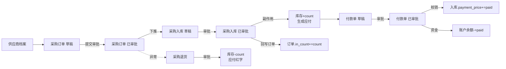

### 6.2 销售全流程

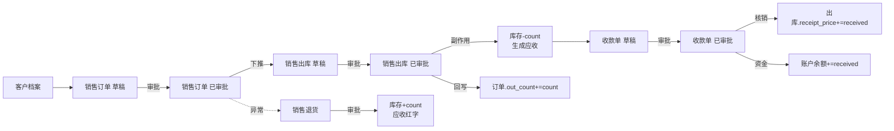

### 6.3 库存联动机制（审批副作用统一处理）

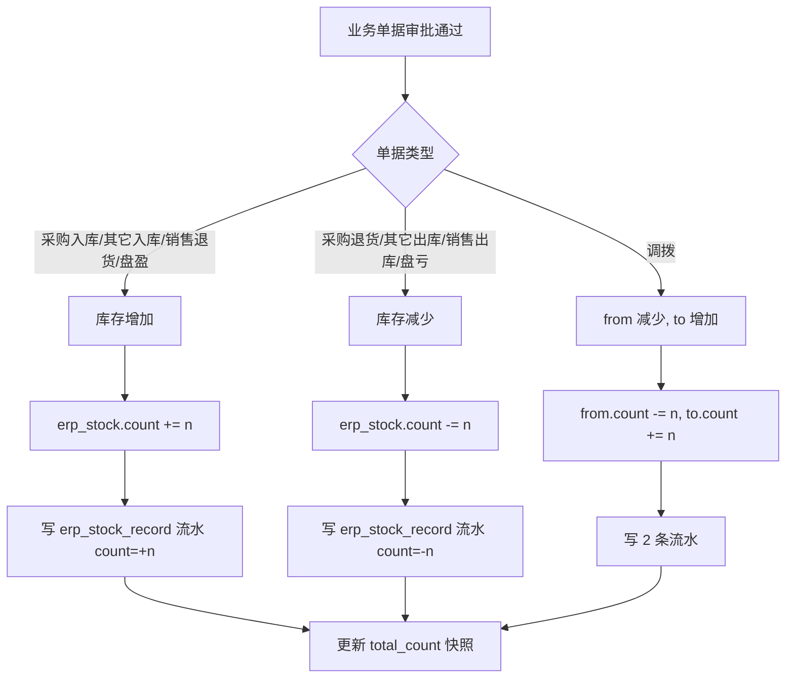

### 6.4 财务联动机制

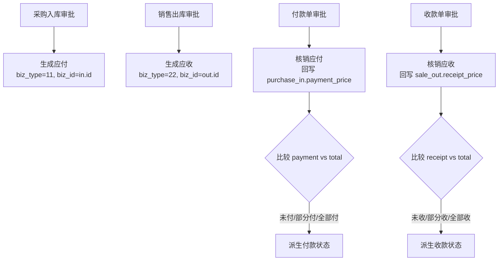

---

## 7. 库存计算模型（重点）

### 7.1 库存余额表设计（三种模型对照）

| 模型 | 字段 | 适用场景 |
|---|---|---|
| **yudao 极简模型** | `count` | 仅可用库存，无锁定/在途/成本 |
| **推荐扩展模型** | `count`(可用) + `locked_count`(锁定) + `in_transit_count`(在途) + `avg_cost`(移动加权成本) | 通用进销存 |
| **完整批次模型** | 上述 + `erp_stock_batch`(batch_no, qty, cost, in_time) | 食品/医药/高价值商品 |

**推荐 Erupt 实现 erp_stock 表结构**：

| 字段 | 类型 | 说明 |
|---|---|---|
| id | bigint | |
| product_id | bigint | 产品 |
| warehouse_id | bigint | 仓库 |
| count | decimal(24,6) | 可用库存（≥0） |
| locked_count | decimal(24,6) | 锁定库存（销售订单已审未出库） |
| in_transit_count | decimal(24,6) | 在途库存（调拨已出未入/采购订单已审未入） |
| avg_cost | decimal(24,6) | 移动加权平均成本 |
| total_cost | decimal(24,6) | 库存总成本 = count * avg_cost |

> 可用量 = count - locked_count；预计可用 = count - locked_count + in_transit_count。

### 7.2 出入库事务处理（统一接口）

所有影响库存的单据审批，统一调用 `ErpStockService.updateStock(...)`：

```
入参：bizType, bizId, bizNo, productId, warehouseId, count(可正负)
事务：
  1. SELECT erp_stock FOR UPDATE WHERE product_id=? AND warehouse_id=?
  2. 不存在则 INSERT (count=0)
  3. stock.count += count   // count 正=入库 负=出库
  4. 校验 stock.count >= 0（出库不足抛业务异常）
  5. INSERT erp_stock_record (biz_type, biz_id, biz_no, count, total_count=stock.count)
  6. （可选）更新 avg_cost（见 7.4）
```

反审批：以 `-count` 再调一次 `updateStock`，自动冲回（流水同样记录，biz_no 加 `-REV` 后缀）。

### 7.3 库存快照

- **行级快照**：`erp_stock_record.total_count` 记录该笔流水执行后的库存余额，便于追溯任一时间点库存。
- **表级快照**（可选）：`erp_stock_snapshot(product_id, warehouse_id, date, count, cost)`，按日/月冻结，用于月结报表，避免历史数据被后续调整污染。

### 7.4 成本核算方法

#### A. 移动加权平均法（推荐，yudao 扩展首选）

每次入库重算 avg_cost，出库按最新 avg_cost 结转：

```
入库：avg_cost = (原 total_cost + 本次入库成本) / (原 count + 本次入库数量)
     total_cost += 本次入库成本
     count += 本次入库数量

出库：本次出库成本 = 出库数量 × avg_cost
     total_cost -= 本次出库成本
     count -= 出库数量
```

**示例**（参考案例）：
| 日期 | 业务 | 数量 | 单价 | 数量余 | avg_cost | 总成本 |
|---|---|---|---|---|---|---|
| 5/1 | 期初 | 100 | 10 | 100 | 10.00 | 1000 |
| 5/8 | 采购入库 | 50 | 12 | 150 | 10.67 | 1600 |
| 5/15 | 销售出库 | 80 | - | 70 | 10.67 | 746.67 |
| 5/22 | 采购入库 | 80 | 11 | 150 | 10.84 | 1626.67 |
| 5/28 | 销售出库 | 100 | - | 50 | 10.84 | 542.40 |

校验：期初 1000 + 采购 600+880 = 2480；出库 853.6+1084=1937.6；期末 542.4。2480 = 1937.6 + 542.4 ✓

#### B. FIFO 先进先出法

需要批次表 `erp_stock_batch`：

```
出库时：按 in_time ASC 遍历未消耗批次
  for batch in batches where qty_remaining > 0 order by in_time:
    take = min(needed, batch.qty_remaining)
    cost += take * batch.unit_cost
    batch.qty_remaining -= take
    needed -= take
    if needed == 0: break
```

**SQL 实现（窗口函数）**：
```sql
WITH batches AS (
  SELECT product_id, warehouse_id, in_time, qty, unit_cost,
         SUM(qty) OVER (PARTITION BY product_id, warehouse_id ORDER BY in_time) - qty AS cum_start,
         SUM(qty) OVER (PARTITION BY product_id, warehouse_id ORDER BY in_time) AS cum_end
  FROM erp_stock_batch
  WHERE product_id = ? AND warehouse_id = ?
)
SELECT batch_id, allocated_qty, unit_cost, allocated_qty * unit_cost AS cost
FROM batches
WHERE cum_end > ?  -- 累计到该出库之前
```

#### C. 全月一次加权平均法

```
月加权单价 = (月初库存总成本 + 本月全部入库总成本) / (月初库存数量 + 本月全部入库数量)
本月出库成本 = 本月出库数量 × 月加权单价
月末库存成本 = 月末库存数量 × 月加权单价
```

适合月底统一结转，平时出库不计算成本，月结时一次性计算。

#### 方法对比

| 方法 | 实时性 | 计算复杂度 | 适用场景 |
|---|---|---|---|
| 移动加权平均 | 高（每次入库重算） | 中 | 商超/电商，收发频繁 |
| FIFO | 高（出库时扣批次） | 高（需批次表） | 食品/医药/有保质期 |
| 全月加权平均 | 低（月结算） | 低 | 传统制造业 |

> **Erupt 实现建议**：第一阶段实现「移动加权平均」，在 `ErpStockService.updateStock` 入库分支中更新 `avg_cost`；第二阶段如需批次管理再扩展 `erp_stock_batch` 表 + FIFO 扣减逻辑。

---

## 8. Erupt 实现建议

本项目基于 Erupt 2.0.3（Spring Boot + JPA），下面给出注解落地方案。

### 8.1 总体架构

```
xyz.herz.ep
├── entity              // @Erupt 实体（每个表一个类）
│   ├── base/           // 基础档案：Product, ProductCategory, Warehouse, Supplier, Customer, Account
│   ├── stock/          // Stock, StockRecord, StockIn(+Item), StockOut(+Item), StockMove(+Item), StockCheck(+Item)
│   ├── purchase/       // PurchaseOrder(+Item), PurchaseIn(+Item), PurchaseReturn(+Item)
│   ├── sale/           // SaleOrder(+Item), SaleOut(+Item), SaleReturn(+Item)
│   └── finance/        // FinancePayment(+Item), FinanceReceipt(+Item)
├── proxy               // DataProxy 业务钩子（审批副作用、库存联动）
│   ├── PurchaseInDataProxy.java
│   ├── StockMoveDataProxy.java
│   └── ...
├── handler             // OperationHandler 自定义按钮（审批/反审批）
│   ├── ApproveHandler.java
│   └── UnapproveHandler.java
└── service             // 库存/财务核心服务
    ├── ErpStockService.java
    └── ErpFinanceService.java
```

### 8.2 基础档案实体示例（产品）

```java
@Erupt(name = "产品管理",
       dataProxy = ProductDataProxy.class,
       power = @Power(add = true, edit = true, delete = true, importable = true, export = true))
@Table(name = "erp_product")
@Entity
public class Product extends BaseModel {

    @EruptField(views = @View(title = "产品名称"),
                edit = @Edit(title = "产品名称", notNull = true, search = @Search(vague = true)))
    private String name;

    @EruptField(views = @View(title = "条形码"),
                edit = @Edit(title = "条形码", search = @Search))
    private String barCode;

    @ManyToOne
    @JoinColumn(name = "category_id")
    @EruptField(views = @View(title = "分类", column = "name"),
                edit = @Edit(title = "分类",
                             type = EditType.REFERENCE_TREE,
                             referenceTreeType = @ReferenceTreeType(pid = "parent.id")))
    private ProductCategory category;

    @ManyToOne
    @JoinColumn(name = "unit_id")
    @EruptField(views = @View(title = "单位", column = "name"),
                edit = @Edit(title = "单位", type = EditType.REFERENCE_CHOICE))
    private ProductUnit unit;

    @EruptField(views = @View(title = "状态"),
                edit = @Edit(title = "状态",
                             type = EditType.CHOICE,
                             choiceType = @ChoiceType(fetchHandler = SqlChoiceFetchHandler.class,
                                                      fetchHandlerParams = {"0:停用","1:启用"}),
                             notNull = true))
    private Integer status;

    @EruptField(views = @View(title = "排序"))
    private Integer sort;
}
```

### 8.3 产品分类（左树右表）

```java
@Erupt(name = "产品分类", linkTree = @LinkTree(field = "parent"))
@Table(name = "erp_product_category")
@Entity
public class ProductCategory extends BaseModel {

    @EruptField(views = @View(title = "分类名称"),
                edit = @Edit(title = "分类名称", notNull = true, search = @Search(vague = true)))
    private String name;

    @ManyToOne
    @JoinColumn(name = "parent_id")
    @EruptField(views = @View(title = "上级分类", column = "name"),
                edit = @Edit(title = "上级分类", type = EditType.REFERENCE_TREE,
                             referenceTreeType = @ReferenceTreeType(pid = "parent.id")))
    private ProductCategory parent;

    @EruptField(edit = @Edit(title = "状态", type = EditType.CHOICE,
                             choiceType = @ChoiceType(fetchHandler = SqlChoiceFetchHandler.class,
                                                      fetchHandlerParams = {"0:停用","1:启用"})))
    private Integer status;
}
```

> `@LinkTree(field = "parent")` 实现左树右表，左侧按 parent 树形展示，右侧按选中节点过滤。

### 8.4 主子表（订单-明细）

Erupt 主子表通过 `@OneToMany` + `@Edit(type = EditType.TAB_TABLE)` 实现：

```java
@Erupt(name = "采购订单",
       dataProxy = PurchaseOrderDataProxy.class,
       rowOperation = {
           @RowOperation(title = "审批", code = "APPROVE", icon = "fa fa-check",
                         mode = RowOperation.Mode.SINGLE, operationHandler = ApproveHandler.class),
           @RowOperation(title = "反审批", code = "UNAPPROVE", icon = "fa fa-undo",
                         mode = RowOperation.Mode.SINGLE, operationHandler = UnapproveHandler.class),
           @RowOperation(title = "下推入库", code = "PUSH_IN", icon = "fa fa-truck",
                         mode = RowOperation.Mode.SINGLE, eruptClass = PurchaseIn.class,
                         operationHandler = PurchaseInPushHandler.class)
       })
@Table(name = "erp_purchase_order")
@Entity
public class PurchaseOrder extends BaseModel {

    @EruptField(views = @View(title = "采购单号"),
                edit = @Edit(title = "采购单号", notNull = true, search = @Search, readonly = true))
    private String no;

    @EruptField(views = @View(title = "审批状态"),
                edit = @Edit(title = "审批状态", type = EditType.CHOICE,
                             choiceType = @ChoiceType(fetchHandler = SqlChoiceFetchHandler.class,
                                                      fetchHandlerParams = {"0:草稿","10:待审批","20:已审批","30:已驳回","40:已完成","50:已关闭","60:已作废"})))
    private Integer status;

    @ManyToOne
    @JoinColumn(name = "supplier_id")
    @EruptField(views = @View(title = "供应商", column = "name"),
                edit = @Edit(title = "供应商", type = EditType.REFERENCE_CHOICE, notNull = true))
    private Supplier supplier;

    @EruptField(views = @View(title = "采购时间"),
                edit = @Edit(title = "采购时间", type = EditType.DATE, notNull = true))
    private Date orderTime;

    @EruptField(views = @View(title = "合计数量"))
    private BigDecimal totalCount;

    @EruptField(views = @View(title = "合计金额"))
    private BigDecimal totalPrice;

    @EruptField(views = @View(title = "已入库数量"))
    private BigDecimal inCount;

    @EruptField(views = @View(title = "已退货数量"))
    private BigDecimal returnCount;

    // 主子表：明细 TAB_TABLE
    @OneToMany(mappedBy = "order", cascade = CascadeType.ALL, orphanRemoval = true)
    @OrderBy("id asc")
    @EruptField(
        views = @View(title = "订单明细"),
        edit = @Edit(title = "订单明细", type = EditType.TAB_TABLE)
    )
    private List<PurchaseOrderItem> items = new ArrayList<>();
}
```

### 8.5 明细实体（子表）

```java
@Erupt(name = "采购订单明细")
@Table(name = "erp_purchase_order_items")
@Entity
public class PurchaseOrderItem extends BaseModel {

    @ManyToOne
    @JoinColumn(name = "order_id")
    @EruptField(edit = @Edit(title = "所属订单", type = EditType.REFERENCE_TABLE, show = false))
    private PurchaseOrder order;

    @ManyToOne
    @JoinColumn(name = "product_id")
    @EruptField(views = @View(title = "产品", column = "name"),
                edit = @Edit(title = "产品", type = EditType.REFERENCE_CHOICE, notNull = true))
    private Product product;

    @ManyToOne
    @JoinColumn(name = "product_unit_id")
    @EruptField(views = @View(title = "单位", column = "name"),
                edit = @Edit(title = "单位", type = EditType.REFERENCE_CHOICE, notNull = true))
    private ProductUnit productUnit;

    @EruptField(views = @View(title = "单价"),
                edit = @Edit(title = "单价", type = EditType.NUMBER, notNull = true))
    private BigDecimal productPrice;

    @EruptField(views = @View(title = "数量"),
                edit = @Edit(title = "数量", type = EditType.NUMBER, notNull = true))
    private BigDecimal count;

    @EruptField(views = @View(title = "税率(%)"),
                edit = @Edit(title = "税率(%)", type = EditType.NUMBER))
    private BigDecimal taxPercent;

    @EruptField(views = @View(title = "税额"))
    private BigDecimal taxPrice;

    @EruptField(views = @View(title = "总价"))
    private BigDecimal totalPrice;
}
```

> 子表通过 `@ManyToOne` 反向引用主表，主表用 `mappedBy = "order"` 声明被映射方。`EditType.TAB_TABLE` 在主表编辑界面以 Tab 形式展开子表。

### 8.6 状态字段与审批操作

**方案 A（推荐）：状态字段 + RowOperation + OperationHandler**

```java
@Component
public class ApproveHandler implements OperationHandler<PurchaseOrder, Object> {
    @Autowired private PurchaseOrderService orderService;

    @Override
    public String exec(List<PurchaseOrder> data, Object param, String[] operationParam) {
        for (PurchaseOrder order : data) {
            if (!Integer.valueOf(10).equals(order.getStatus()) && !Integer.valueOf(0).equals(order.getStatus())) {
                return "仅草稿/待审批状态可审批";
            }
            orderService.approve(order.getId());  // 业务侧：更新状态 + 副作用
        }
        return "审批成功";
    }
}
```

**方案 B：DataProxy 在 update 钩子中处理状态迁移**

```java
@Component
public class PurchaseOrderDataProxy implements DataProxy<PurchaseOrder> {
    @Override
    public void beforeUpdate(PurchaseOrder order) {
        PurchaseOrder old = repo.findById(order.getId()).orElseThrow();
        if (!Objects.equals(old.getStatus(), order.getStatus())) {
            // 状态迁移校验
            validateTransition(old.getStatus(), order.getStatus());
        }
    }
    @Override
    public void afterUpdate(PurchaseOrder order) {
        // 状态变更副作用
    }
}
```

### 8.7 库存联动（审批副作用统一入口）

```java
@Service
@Transactional
public class ErpStockService {
    @Autowired private StockRepository stockRepo;
    @Autowired private StockRecordRepository recordRepo;

    public void updateStock(Integer bizType, Long bizId, String bizNo,
                            Long productId, Long warehouseId, BigDecimal count) {
        // 1. 锁库存行
        Stock stock = stockRepo.findByProductAndWarehouse(productId, warehouseId)
            .orElseGet(() -> new Stock(productId, warehouseId, BigDecimal.ZERO));
        stockRepo.save(stock);  // SELECT FOR UPDATE 可用 @Lock 或 jpa hint

        // 2. 校验
        BigDecimal newCount = stock.getCount().add(count);
        if (newCount.compareTo(BigDecimal.ZERO) < 0) {
            throw new BusinessException(String.format("产品[%d]在仓库[%d]库存不足", productId, warehouseId));
        }

        // 3. 更新余额
        stock.setCount(newCount);
        // 移动加权平均成本（仅入库更新）
        if (count.compareTo(BigDecimal.ZERO) > 0 && avgCostEnabled) {
            updateAvgCost(stock, count, ...);
        }

        // 4. 写流水
        StockRecord record = new StockRecord();
        record.setBizType(bizType); record.setBizId(bizId); record.setBizNo(bizNo);
        record.setProductId(productId); record.setWarehouseId(warehouseId);
        record.setCount(count); record.setTotalCount(newCount);
        recordRepo.save(record);
    }
}
```

各业务单据的 DataProxy 在 `afterUpdate`（状态→已审批）时调用 `updateStock`：

```java
@Component
public class PurchaseInDataProxy implements DataProxy<PurchaseIn> {
    @Autowired private ErpStockService stockService;
    @Autowired private PurchaseInItemRepository itemRepo;
    @Autowired private ErpFinanceService financeService;

    @Override
    public void afterUpdate(PurchaseIn in) {
        if (Integer.valueOf(20).equals(in.getStatus())) {  // 已审批
            // 1. 增库存
            for (PurchaseInItem item : itemRepo.findByInId(in.getId())) {
                stockService.updateStock(11, in.getId(), in.getNo(),
                    item.getProductId(), item.getWarehouseId(), item.getCount());
            }
            // 2. 生成应付（写入待核销）
            financeService.createPayable(11, in.getId(), in.getNo(), in.getSupplierId(), in.getTotalPrice());
            // 3. 回写订单 in_count
            if (in.getOrderId() != null) {
                orderService.addInCount(in.getOrderId(), in.getItems());
            }
        }
    }
}
```

### 8.8 财务核销（付款单回写业务单据）

```java
@Component
public class FinancePaymentDataProxy implements DataProxy<FinancePayment> {
    @Override
    public void afterUpdate(FinancePayment payment) {
        if (Integer.valueOf(20).equals(payment.getStatus())) {
            for (FinancePaymentItem item : payment.getItems()) {
                // 回写业务单据的 payment_price
                switch (item.getBizType()) {
                    case 11: // 采购入库
                        purchaseInService.addPaymentPrice(item.getBizId(), item.getPaymentPrice());
                        break;
                    case 12: // 采购退货
                        purchaseReturnService.addRefundPrice(item.getBizId(), item.getPaymentPrice());
                        break;
                }
                // 扣减结算账户余额
                accountService.decrease(payment.getAccountId(), item.getPaymentPrice());
            }
        }
    }
}
```

### 8.9 库存计算异步处理（erupt-job）

对于月结、成本重算、库存快照等耗时操作，使用 `erupt-job` 异步执行：

```java
@EruptJob(name = "ERP 月结任务", cron = "0 0 1 1 * ?")  // 每月1日凌晨
@Component
public class ErpMonthEndJob implements JobHandler {
    @Override
    public String exec(Map<String, Object> param) {
        // 1. 全月加权平均成本结转
        // 2. 生成月度库存快照
        // 3. 校验库存余额 = 期初 + 入库 - 出库
        // 4. 生成应收应付账龄报表
        return "月结完成";
    }
}
```

### 8.10 Erupt 注解速查表

| 注解 | 作用 | 示例 |
|---|---|---|
| `@Erupt(name, dataProxy, power, rowOperation)` | 实体元数据 | `@Erupt(name="采购订单", dataProxy=PODataProxy.class)` |
| `@EruptField(views, edit)` | 字段配置 | 见上 |
| `@View(title, column, sortable)` | 列表视图列 | `@View(title="产品名", column="name")` |
| `@Edit(title, type, notNull, search, readonly)` | 表单编辑 | `@Edit(type=EditType.CHOICE)` |
| `EditType.TEXT/TEXTAREA/NUMBER/DATE/CHOICE/REFERENCE_CHOICE/REFERENCE_TREE/REFERENCE_TABLE/TAB_TABLE/HTML_EDITOR` | 编辑控件类型 | |
| `@ChoiceType(fetchHandler, fetchHandlerParams)` | 下拉选项 | `SqlChoiceFetchHandler` + `"0:停用,1:启用"` |
| `@ManyToOne` + `@JoinColumn` | 多对一引用 | 关联供应商/产品/仓库 |
| `@OneToMany(mappedBy=, cascade=)` + `@Edit(type=TAB_TABLE)` | 主子表 | 订单-明细 |
| `@LinkTree(field=)` | 左树右表 | 产品分类树 |
| `@ReferenceTreeType(pid=)` | 树形引用 | `pid="parent.id"` |
| `@RowOperation(title, code, icon, mode, operationHandler, eruptClass)` | 行操作按钮 | 审批/反审批/下推 |
| `OperationHandler<P, D>.exec(List<P>, D, String[])` | 操作处理器 | 业务逻辑入口 |
| `DataProxy<T>` 钩子：`beforeAdd/afterAdd/beforeUpdate/afterUpdate/beforeDelete/afterDelete` | 数据代理 | 副作用/校验 |
| `@EruptJob(name, cron)` + `JobHandler.exec(Map)` | 定时任务 | 月结/快照 |

### 8.11 实施路线图建议

| 阶段 | 内容 | 优先级 |
|---|---|---|
| P0 | 基础档案：产品/分类/单位/仓库/供应商/客户/账户 | 高 |
| P0 | 库存余额表 + 流水表 + 统一 `updateStock` 服务 | 高 |
| P1 | 采购订单 + 采购入库（含库存联动 + 应付生成） | 高 |
| P1 | 销售订单 + 销售出库（含库存联动 + 应收生成） | 高 |
| P2 | 付款单 + 收款单（核销回写） | 高 |
| P2 | 采购退货 / 销售退货 | 中 |
| P3 | 库存调拨 + 库存盘点 + 其它入出库 | 中 |
| P3 | 审批操作 RowOperation + DataProxy 副作用统一 | 中 |
| P4 | 移动加权平均成本核算 | 中 |
| P4 | 状态机完善（草稿/待审批/已审批/已完成/已关闭/已作废） | 中 |
| P5 | 批次管理 + FIFO、月结 Job、对账单、发票 | 低 |

---

## 9. 参考来源

### 9.1 yudao 官方与社区文档
- [【采购】采购订单、入库、退货 - yudao 文档镜像](https://note.lazzman.com:18084/doc/999/)
- [【销售】销售订单、出库、退货 - yudao 文档镜像](https://note.lazzman.com:18084/doc/1000/)
- [【库存】库存调拨、库存盘点 - yudao 文档镜像](https://note.lazzman.com:18084/project-1/doc-998/)
- [yudao-module-erp 数据库表详细版](https://blog.hellocode.vip/36.%E5%90%8E%E7%AB%AF/0.%E8%8A%8B%E9%81%93/%E8%A1%A8/%E6%8C%89%E6%A8%A1%E5%9D%97%E8%AF%A6%E7%BB%86%E7%89%88/07-ERP-%E8%AF%A6%E7%BB%86%E7%89%88)
- [芋道管理后台ERP系统架构解析（CSDN）](https://blog.csdn.net/gitblog_01193/article/details/151303601)
- [long-slt/yudao-erp GitHub 镜像](https://github.com/long-slt/yudao-erp)
- [yudao-module-erp 模块介绍（CSDN 文库）](https://wenku.csdn.net/answer/4vmzi8nmw6)

### 9.2 ERP 业务设计参考
- [ERP——采购模块产品设计（人人都是产品经理）](https://www.woshipm.com/pd/2426523.html)
- [ERP系统如何实现财务管理（人人都是产品经理）](https://www.woshipm.com/share/6107562.html)
- [万字拆解应收账款的产品设计（人人都是产品经理）](https://www.woshipm.com/share/6318439.html)
- [ERP 系统里的应收应付管理（erpweb）](http://erpweb.zhaizongguan.cn/news/5011.html)
- [金蝶云星空：订单的执行状态说明](https://vip.kingdee.com/knowledge/479454722525578752)
- [用友 D5 库存管理场景（用友云）](https://c2.yonyoucloud.com/iuap-hc-client/ucf-wh/client/index.html)
- [多租户下的ERP系统的仓储管理模块分析设计（博客园）](https://www.cnblogs.com/wuhuacong/p/19763242)

### 9.3 JeecgBoot / RuoYi ERP 数据库参考
- [基于Jeecgboot前后端分离的ERP系统开发数据库设计（CSDN）](https://blog.csdn.net/qq_40032778/article/details/126524826)
- [Java版ERP管理系统源码解析（CSDN）](https://blog.csdn.net/m0_67544708/article/details/142093773)
- [ERP系统应收应付子系统-付款单（CSDN）](https://blog.csdn.net/caixuanji/article/details/107091248)
- [进销存系统表设计方法详解（简道云）](https://www.jiandaoyun.com/nblog/495638/)

### 9.4 库存核算方法
- [移动加权平均法核心逻辑+实操案例（头条）](http://m.toutiao.com/group/7569951074133361187/)
- [企业级存货核算明细表模板与实战应用（CSDN）](https://blog.csdn.net/weixin_28681379/article/details/153301094)
- [SQL 进销存模式详解（简道云）](https://www.jiandaoyun.com/nblog/43757/)
- [SQL实现FIFO利润核算跨记录分配（CSDN问答）](https://wenku.csdn.net/answer/71z0mq6yfc)
- [SQL进销存语句详解（简道云）](https://www.jiandaoyun.com/nblog/271762/)

### 9.5 Erupt 框架
- [Erupt Framework 官方文档 - Gitee](https://gitee.com/erupt/erupt)
- [Erupt Framework GitHub](https://github.com/erupts/erupt)
- [Erupt 框架左树右表创建过程（CSDN）](https://blog.csdn.net/scott_zt/article/details/112554982)
- [ERUPT注解驱动开发指南（CSDN）](https://blog.csdn.net/gitblog_00545/article/details/156283822)
- [Erupt 自定义按钮弹窗全攻略（CSDN）](https://blog.csdn.net/gitblog_01412/article/details/150054690)
- [Erupt 框架入门教程（CSDN）](https://blog.csdn.net/qq_18827959/article/details/138130855)
- [Erupt：开源神器无需前端代码搞定后台（CSDN）](https://learner.blog.csdn.net/article/details/111493802)
- [Erupt 6 年注解框架：可视化设计器（掘金）](https://juejin.cn/post/7659258669087752226)

### 9.6 JPA 关联映射
- [JPA 表间关联映射全解析（CSDN）](https://blog.csdn.net/weixin_54444518/article/details/149343763)
- [Spring Data JPA: One-to-Many & Many-to-One（devops-monk）](https://blog.devops-monk.com/tutorials/spring-data-jpa/one-to-many-many-to-one/)

---

## 附录 A：yudao 单号生成规则

- 实现：`ErpNoRedisDAO`
- 格式：`{prefix}{yyyyMMdd}{6位自增}`
- 例：`PO20260811000001`（采购订单）、`IN20260811000001`（采购入库）、`RT20260811000001`（退货）
- 前缀按业务类型配置：采购订单 PO / 采购入库 IN / 采购退货 RT / 销售订单 SO / 销售出库 OUT / 销售退货 SRT / 调拨 MOV / 盘点 CHK / 付款 PAY / 收款 REC

## 附录 B：业务类型枚举（biz_type）建议

| 值 | 业务类型 | 库存方向 | 财务方向 |
|---|---|---|---|
| 10 | 其它入库 | + | - |
| 11 | 采购入库 | + | 应付+ |
| 12 | 销售退货入库 | + | 应收- |
| 13 | 盘盈入库 | + | - |
| 20 | 其它出库 | - | - |
| 21 | 采购退货出库 | - | 应付- |
| 22 | 销售出库 | - | 应收+ |
| 23 | 盘亏出库 | - | - |
| 30 | 调拨出（from） | - | - |
| 31 | 调拨入（to） | + | - |

## 附录 C：关键校验规则

1. **采购入库数量校验**：`order_item.in_count + 本次count <= order_item.count`，否则超量入库。
2. **出库库存校验**：`stock.count - count >= 0`，否则库存不足。
3. **付款金额校验**：`sum(payment_item.payment_price) <= finance_payment.payment_price`，本次付款不超过应付余额。
4. **反审批校验**：已下推下游单据（如订单已生成入库）不可反审批；已部分付款的入库单不可反审批。
5. **调拨反审批校验**：to 仓当前库存 >= 调拨数量，否则不能冲回。
6. **多租户隔离**：所有表 `tenant_id`，查询自动注入租户条件。

---

> 报告完。后续在 Erupt 实现时，建议从「基础档案 + 库存余额表 + 采购入库」三个最小闭环切入，验证 `updateStock` + `DataProxy` 副作用机制跑通后，再逐步扩展销售、退货、财务、调拨盘点等模块。
