# IoT 物联网模块功能分析报告

> **版本**: v1.1（设计文档 + 实现状态）  |  **更新**: 2026-09-07
> **实现状态**: ✅ **已完成** | 冒烟单测 **5/5 全部通过**
> **模块代码**: [ep-module-iot](../ep-module-iot/src/main/java/xyz/herz/ep/iot/)
> **测试代码**: [IotSmokeTests.java](../ep-module-iot/src/test/java/xyz/herz/ep/iot/IotSmokeTests.java)
>
> 研究对象：芋道 yudao iot 模块、ThingsBoard、JetLinks、IoT-DC3、RuoYi-IoT(enjoy-iot/thinglinks-iot) 等开源 IoT 项目
> 目标：为本项目（基于 Erupt 框架，注解驱动 + Spring Boot + JPA）实现 IoT 模块提供设计依据
> 重点：数据状态流转（状态机）而非简单 CRUD

---

## 实现状态

| 子项 | 状态 | 代码位置 |
|---|---|---|
| 枚举字典 + 状态下拉处理器 | ✅ | `iot.enums.IotDictEnums` / `IotEnumChoiceFetchHandler` |
| 产品分类(树) + 产品(节点类型/网络类型) + 启停行按钮 | ✅ | [IotProductCategory.java](../ep-module-iot/src/main/java/xyz/herz/ep/iot/entity/IotProductCategory.java) / [IotProduct.java](../ep-module-iot/src/main/java/xyz/herz/ep/iot/entity/IotProduct.java) |
| 物模型(属性/服务/事件 + 数据类型 + 读写模式) | ✅ | [IotThingModel.java](../ep-module-iot/src/main/java/xyz/herz/ep/iot/entity/IotThingModel.java) |
| 设备(状态机:未激活→离线↔在线→禁用) + 3 行按钮 | ✅ | [IotDevice.java](../ep-module-iot/src/main/java/xyz/herz/ep/iot/entity/IotDevice.java) |
| 设备消息(上行/下行 + 属性/事件/服务) | ✅ | [IotDeviceMessage.java](../ep-module-iot/src/main/java/xyz/herz/ep/iot/entity/IotDeviceMessage.java) |
| 告警规则 + 告警(四态) + 告警日志 | ✅ | [IotAlarmRule.java](../ep-module-iot/src/main/java/xyz/herz/ep/iot/entity/IotAlarmRule.java) / [IotAlarm.java](../ep-module-iot/src/main/java/xyz/herz/ep/iot/entity/IotAlarm.java) / [IotAlarmLog.java](../ep-module-iot/src/main/java/xyz/herz/ep/iot/entity/IotAlarmLog.java) |
| 冒烟单测 5 场景全闭环 | ✅ | [IotSmokeTests.java](../ep-module-iot/src/test/java/xyz/herz/ep/iot/IotSmokeTests.java) |
| 接入 MQTT(EMQX) + 设备影子(P1) | 🔵 | `MqttDeviceFacade` 接口已定义,ep-module-iot/core |

详细实现追踪见 [todo.md](./todo.md#6-iot-模块)。

---

## 一、模块概述

### 1.1 设计目标

物联网（IoT）平台的核心在于**连接万物、统一模型、规则驱动、实时反馈**。不同于普通业务模块的 CRUD，IoT 模块需要解决三大核心问题：

1. **异构设备统一接入**：屏蔽 MQTT / CoAP / HTTP / TCP / Modbus 等多种协议差异，对上层提供统一的设备消息模型。
2. **设备全生命周期状态流转**：设备从注册 → 激活 → 在线/离线循环 → 禁用 → 删除，每个状态都有明确的触发条件和允许动作。
3. **数据驱动的业务联动**：设备上报数据 → 物模型解析 → 规则引擎匹配 → 触发告警 / 联动控制 / 数据流转，形成闭环。

### 1.2 主流开源方案对比

| 平台 | 技术栈 | 核心特点 | 适用场景 |
|---|---|---|---|
| **yudao iot** | Spring Boot + MyBatis Plus | 与 yudao 主框架深度集成，MVP 版本，结构清晰，学习成本低 | 已用 yudao 体系的企业快速扩展 IoT |
| **ThingsBoard** | Java + Netty + Actor 模型 | 工业级成熟，规则链可视化，设备配置（Device Profile）抽象完善 | 大规模生产部署 |
| **JetLinks** | Spring Boot + WebFlux + Reactor | 全响应式，统一物模型，自定义协议包热部署 | 高并发百万级设备接入 |
| **IoT-DC3** | Spring Cloud 微服务 | 四层架构（驱动/数据/管理/应用），多协议驱动 SDK | 工业物联网、Modbus/OPC 场景 |
| **enjoy-iot / thinglinks** | 若依 + MyBatis Plus | 基于 RuoYi，集成 EMQX/MQTT/TCP/Modbus 组件，规则引擎可视化 | 中小项目快速落地 |

### 1.3 yudao iot 模块分层架构

yudao 将 IoT 模块拆分为四个子模块：

```
yudao-module-iot/
├── yudao-module-iot-api      # 对外 API（设备接入、数据采集、远程控制）
├── yudao-module-iot-core      # 核心业务（设备管理、数据存储、规则引擎）
├── yudao-module-iot-gateway   # 物联网网关（协议转换、数据转发）
└── yudao-module-iot-server    # Web 管理界面 + API 服务
```

**技术栈**：MQTT 3.1.1/5.0、动态 Token + SSL 认证、Redis（在线状态）+ MySQL（业务数据）+ TDEngine（时序数据）、可视化规则引擎、插件化协议架构。

---

## 二、功能模块清单

| 一级模块 | 二级模块 | 核心能力 | yudao | ThingsBoard | JetLinks |
|---|---|---|:---:|:---:|:---:|
| 产品管理 | 产品 | 产品定义、ProductKey、节点类型、数据格式、协议类型 | ✅ | ✅(Device Profile) | ✅ |
| 产品管理 | 产品分类 | 多级分类树 | ✅ | ✅ | ✅ |
| 产品管理 | 物模型-属性 | 可读/可写/可读写，数据类型、单位、取值范围 | ✅ | ✅ | ✅ |
| 产品管理 | 物模型-服务 | 输入参数、输出参数、异步调用 | ✅ | ✅(RPC) | ✅ |
| 产品管理 | 物模型-事件 | info / alert / error 级别 | ✅ | ✅ | ✅ |
| 设备管理 | 设备 | 注册、激活、状态监控、远程控制 | ✅ | ✅ | ✅ |
| 设备管理 | 设备分组 | 按业务场景分组、批量操作 | ✅ | ✅(Entity Group) | ✅ |
| 设备管理 | 设备状态 | 在线/离线/未激活/禁用 | ✅ | ✅ | ✅ |
| 设备消息 | 消息上下行 | 上行遥测/属性、下行 RPC/属性写入 | ✅ | ✅ | ✅ |
| 设备消息 | 消息日志 | 全量消息记录、按类型/方向查询 | ✅ | ✅ | ✅ |
| 设备消息 | 消息规则 | Topic 路由、QoS 配置 | ✅ | ✅ | ✅ |
| 规则引擎 | 数据流转 | HTTP/MQTT/Kafka/Redis Stream/数据库 | ✅ | ✅ | ✅ |
| 规则引擎 | 告警规则 | 阈值、持续时间、重复次数、严重级别 | ✅ | ✅ | ✅ |
| 规则引擎 | 场景联动 | 触发条件 → 执行动作（设备控制/告警/通知） | ✅ | ✅(Rule Chain) | ✅ |
| 数据可视化 | 实时数据 | 最新属性值、在线状态 | ✅ | ✅ | ✅ |
| 数据可视化 | 历史数据 | 时序数据查询、图表展示 | ✅(TDEngine) | ✅ | ✅(ES/TDengine) |
| 数据可视化 | 设备大屏 | 统计卡片、地图、趋势图 | ✅ | ✅(Dashboard) | ✅ |
| 设备接入 | MQTT | MQTT 3.1.1/5.0 Broker 集成（EMQX/Mosquitto） | ✅ | ✅ | ✅ |
| 设备接入 | HTTP | RESTful 接入 | ✅ | ✅ | ✅ |
| 设备接入 | CoAP | 轻量级 UDP 协议 | ✅ | ✅ | ✅ |
| 设备接入 | TCP/UDP | 自定义二进制协议 | ✅(Netty) | ✅ | ✅(Netty) |
| 设备接入 | Modbus | 工业协议 | ✅ | - | ✅ |
| OTA 升级 | 固件管理 | 版本管理、差分包、灰度推送 | ✅ | ✅ | ✅ |

---

## 三、核心实体与字段表

> 参考自 yudao iot 实体类（`IotDeviceDO`、`IotThingModelDO`、`IotProductDO` 等）及 ThingsBoard / JetLinks 表结构。

### 3.1 产品表 `iot_product`

| 字段 | 类型 | 说明 |
|---|---|---|
| id | BIGINT PK | 主键 |
| name | VARCHAR(64) | 产品名称 |
| product_key | VARCHAR(32) | 产品唯一标识（设备接入用） |
| product_secret | VARCHAR(64) | 产品密钥（一型一密） |
| category_id | BIGINT | 产品分类 ID（关联 iot_product_category） |
| node_type | TINYINT | 节点类型：1=直连设备、2=网关子设备、3=网关设备 |
| net_type | VARCHAR(16) | 联网方式：WIFI/CELLULAR/ETHERNET/OTHER |
| protocol_type | VARCHAR(16) | 接入协议：MQTT/HTTP/COAP/TCP/UDP/WEBSOCKET |
| data_format | VARCHAR(16) | 数据格式：JSON / BINARY |
| auth_type | TINYINT | 认证方式：1=一机一密、2=一型一密、3=动态注册 |
| description | VARCHAR(255) | 描述 |
| status | TINYINT | 状态：0=启用、1=禁用 |
| creator / updater | VARCHAR(64) | 创建/更新人 |
| create_time / update_time | DATETIME | 时间戳 |
| deleted | BIT | 逻辑删除 |

### 3.2 产品分类表 `iot_product_category`（树形）

| 字段 | 类型 | 说明 |
|---|---|---|
| id | BIGINT PK | 主键 |
| name | VARCHAR(64) | 分类名称 |
| parent_id | BIGINT | 父分类（0 为根） |
| sort | INT | 排序 |

### 3.3 物模型表 `iot_thing_model`

| 字段 | 类型 | 说明 |
|---|---|---|
| id | BIGINT PK | 主键 |
| product_id | BIGINT | 产品 ID |
| identifier | VARCHAR(64) | 标识符（如 `temperature`） |
| name | VARCHAR(64) | 名称（如"温度"） |
| type | TINYINT | 类型：1=属性、2=服务、3=事件 |
| access_mode | TINYINT | 读写模式（仅属性）：1=只读、2=只写、3=读写 |
| data_type | VARCHAR(16) | 数据类型：int/float/double/bool/string/enum/struct |
| data_specs | TEXT | 数据规格 JSON（最大值/最小值/步长/单位/枚举项等） |
| event_type | TINYINT | 事件级别（仅事件）：1=info、2=alert、3=error |
| input_params | TEXT | 服务输入参数 JSON（仅服务） |
| output_params | TEXT | 服务输出参数 JSON（仅服务） |
| description | VARCHAR(255) | 描述 |

### 3.4 设备表 `iot_device`

| 字段 | 类型 | 说明 |
|---|---|---|
| id | BIGINT PK | 主键 |
| name | VARCHAR(64) | 设备名称 |
| product_id | BIGINT | 所属产品 ID |
| device_key / device_name | VARCHAR(64) | 设备唯一标识（MQTT username 用） |
| device_secret | VARCHAR(64) | 设备密钥（一机一密） |
| device_type | TINYINT | 设备类型：0=普通、1=网关 |
| state | TINYINT | 设备状态：0=未激活、1=在线、2=离线 |
| status | TINYINT | 启用状态：0=启用、1=禁用 |
| group_id | BIGINT | 设备分组 ID |
| gateway_device_id | BIGINT | 网关设备 ID（子设备字段） |
| last_online_time | DATETIME | 最后上线时间 |
| last_offline_time | DATETIME | 最后离线时间 |
| activate_time | DATETIME | 激活时间 |
| firmware_version | VARCHAR(32) | 当前固件版本 |
| location | VARCHAR(128) | 地理位置 |
| remark | VARCHAR(255) | 备注 |

### 3.5 设备分组表 `iot_device_group`（树形）

| 字段 | 类型 | 说明 |
|---|---|---|
| id | BIGINT PK | 主键 |
| name | VARCHAR(64) | 分组名称 |
| parent_id | BIGINT | 父分组 |
| product_id | BIGINT | 关联产品（可空，表示通用分组） |

### 3.6 设备消息表 `iot_device_message`

| 字段 | 类型 | 说明 |
|---|---|---|
| id | BIGINT PK | 主键 |
| device_id | BIGINT | 设备 ID |
| product_id | BIGINT | 产品 ID |
| message_id | VARCHAR(64) | 消息唯一 ID（用于上下行匹配） |
| direction | TINYINT | 方向：1=上行、2=下行 |
| message_type | VARCHAR(32) | 类型：PROPERTY_REPORT/READ_PROPERTY/WRITE_PROPERTY/FUNCTION_INVOKE/EVENT/ONLINE/OFFLINE |
| topic | VARCHAR(255) | MQTT Topic |
| payload | TEXT | 消息内容 JSON |
| status | TINYINT | 消息状态：0=已发送、1=已送达、2=已确认、3=失败 |
| qos | TINYINT | QoS 级别：0/1/2 |
| timestamp | BIGINT | 设备时间戳（毫秒） |
| create_time | DATETIME | 平台接收时间 |

### 3.7 规则表 `iot_rule`

| 字段 | 类型 | 说明 |
|---|---|---|
| id | BIGINT PK | 主键 |
| name | VARCHAR(64) | 规则名称 |
| rule_type | TINYINT | 规则类型：1=数据规则、2=告警规则、3=场景联动 |
| trigger_type | VARCHAR(32) | 触发类型：DEVICE_DATA/DEVICE_STATE/TIMER/MANUAL |
| trigger_config | TEXT | 触发条件 JSON |
| condition_config | TEXT | 判断条件 JSON（AND/OR 组合） |
| action_config | TEXT | 执行动作 JSON（数组） |
| status | TINYINT | 状态：0=启用、1=禁用 |
| last_trigger_time | DATETIME | 最后触发时间 |
| exec_count | INT | 累计执行次数 |

### 3.8 告警表 `iot_alarm`

| 字段 | 类型 | 说明 |
|---|---|---|
| id | BIGINT PK | 主键 |
| rule_id | BIGINT | 触发规则 ID |
| device_id | BIGINT | 设备 ID |
| product_id | BIGINT | 产品 ID |
| level | TINYINT | 级别：1=info、2=warning、3=error、4=critical |
| title | VARCHAR(128) | 告警标题 |
| content | TEXT | 告警内容 |
| state | TINYINT | 状态：0=待处理、1=处理中、2=已解决、3=已忽略 |
| trigger_time | DATETIME | 触发时间 |
| resolve_time | DATETIME | 解决时间 |
| handler | VARCHAR(64) | 处理人 |
| handle_remark | TEXT | 处理备注 |

### 3.9 告警日志表 `iot_alarm_log`

| 字段 | 类型 | 说明 |
|---|---|---|
| id | BIGINT PK | 主键 |
| alarm_id | BIGINT | 告警 ID |
| action | VARCHAR(32) | 动作：TRIGGER/ESCALATE/ACK/RESOLVE/IGNORE/NOTIFY |
| before_state | TINYINT | 变更前状态 |
| after_state | TINYINT | 变更后状态 |
| operator | VARCHAR(64) | 操作人（系统/用户） |
| remark | TEXT | 备注 |
| create_time | DATETIME | 操作时间 |

### 3.10 固件 / OTA 表 `iot_firmware`

| 字段 | 类型 | 说明 |
|---|---|---|
| id | BIGINT PK | 主键 |
| product_id | BIGINT | 适用产品 |
| version | VARCHAR(32) | 版本号 |
| file_url | VARCHAR(255) | 固件包地址 |
| file_size | BIGINT | 文件大小 |
| file_md5 | VARCHAR(64) | MD5 校验 |
| description | VARCHAR(255) | 描述 |
| status | TINYINT | 状态：0=未发布、1=已发布 |

### 3.11 OTA 升级任务表 `iot_ota_task`

| 字段 | 类型 | 说明 |
|---|---|---|
| id | BIGINT PK | 主键 |
| firmware_id | BIGINT | 固件 ID |
| product_id | BIGINT | 产品 ID |
| device_scope | TEXT | 升级设备范围（设备 ID 列表或分组） |
| strategy | TINYINT | 策略：1=静态推送、2=动态拉取 |
| upgrade_order | TINYINT | 顺序：1=顺序、2=并发 |
| status | TINYINT | 任务状态：0=待执行、1=执行中、2=已完成、3=已取消 |

### 3.12 OTA 升级明细表 `iot_ota_device`

| 字段 | 类型 | 说明 |
|---|---|---|
| id | BIGINT PK | 主键 |
| task_id | BIGINT | 任务 ID |
| device_id | BIGINT | 设备 ID |
| status | TINYINT | 状态：0=待推送、1=推送中、2=设备确认、3=升级中、4=升级成功、5=升级失败 |

---

## 四、实体关系图

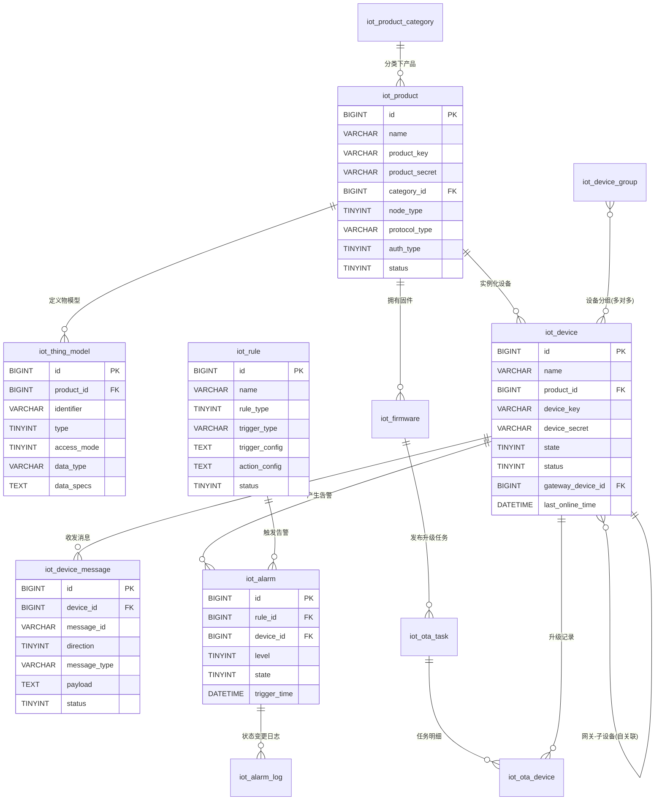

**核心业务链**：产品（定义物模型）→ 设备（实例化）→ 消息（上下行）→ 规则（匹配）→ 告警（触发）→ 告警日志（处理）。

---

## 五、状态流转图（重点）

### 5.1 设备生命周期状态机

设备状态采用三态基础模型（yudao 默认）：`未激活(INACTIVE)` / `在线(ONLINE)` / `离线(OFFLINE)`，叠加 `启用/禁用` 与 `已删除` 维度。

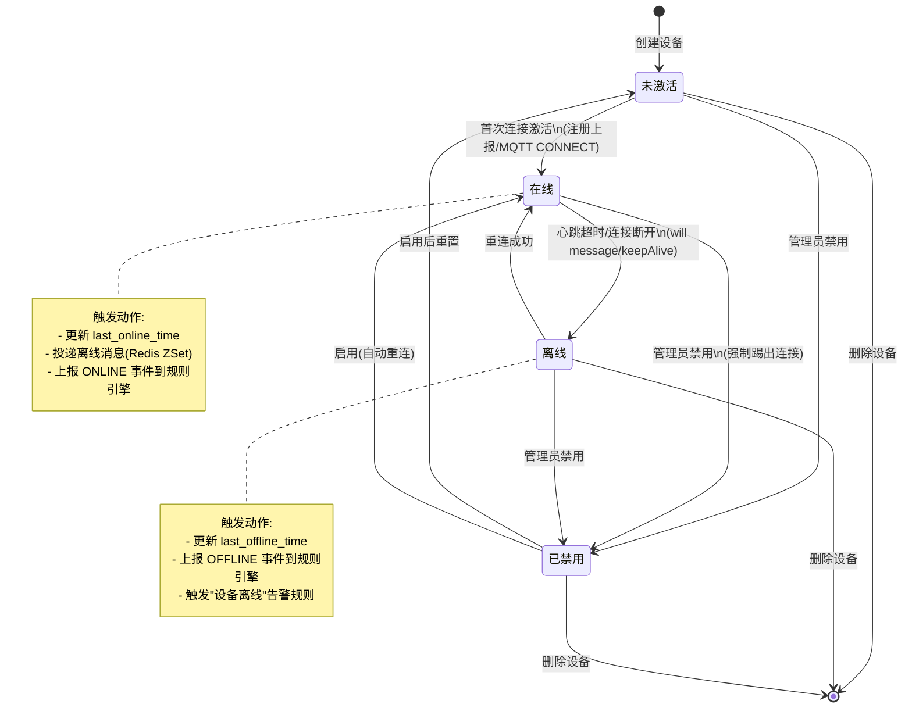

**状态判定机制**（综合 yudao / Tuya / JetLinks）：

| 协议 | 在线判定 | 离线判定 |
|---|---|---|
| MQTT | MQTT CONNECT 成功 | Broker 心跳超时 / Will Message / DISCONNECT |
| TCP | 长连接建立 | 连接关闭 / 心跳超时 |
| HTTP | 上报数据时短暂在线 | 超过配置的"在线超时时间" |
| CoAP | Observe 注册 | 超时未刷新 |
| 网关子设备 | 网关在线 + 子设备属性上报 | 网关离线 / 主动注销 |

**keepOnline 机制**（参考 JetLinks）：TCP 短连接场景下，可通过消息头 `keepOnline=true` + `keepOnlineTimeoutSeconds` 让设备在连接断开后保持"在线"状态一段时间，避免短连接频繁切换状态。

### 5.2 物模型类型与访问模式

物模型本身无独立状态机，但其类型决定了消息流向：

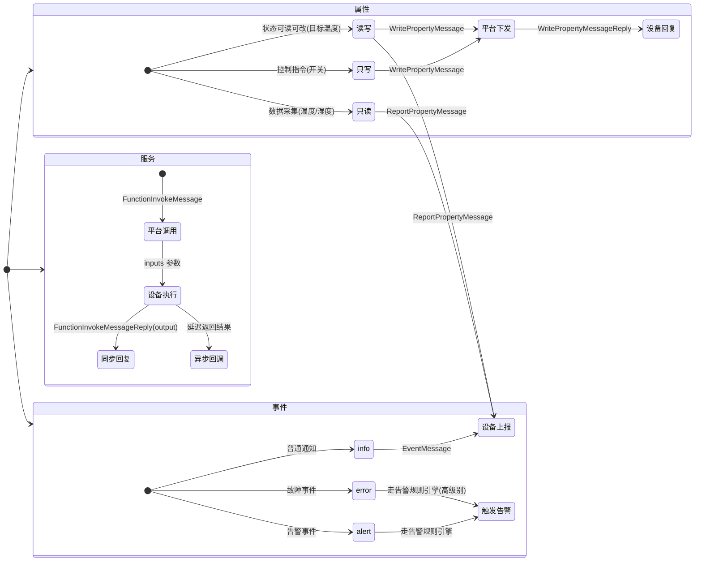

### 5.3 设备消息状态机

消息状态关注**可靠投递**，参考 MQTT QoS 1/2 与 ThingsBoard RPC 的 confirmed 状态：

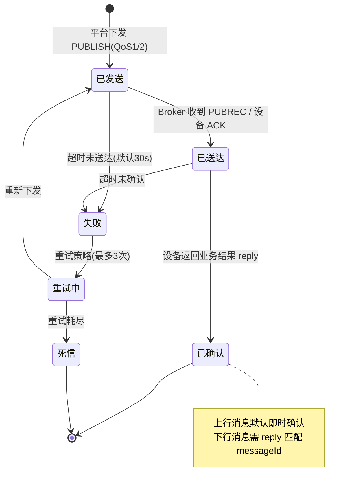

**消息匹配机制**：下行消息携带 `messageId`，设备回复时原样返回相同 `messageId`，平台通过 `messageId` 做请求-响应绑定。若设备无法保证唯一，可在协议编解码层加前缀映射。

### 5.4 规则引擎状态机

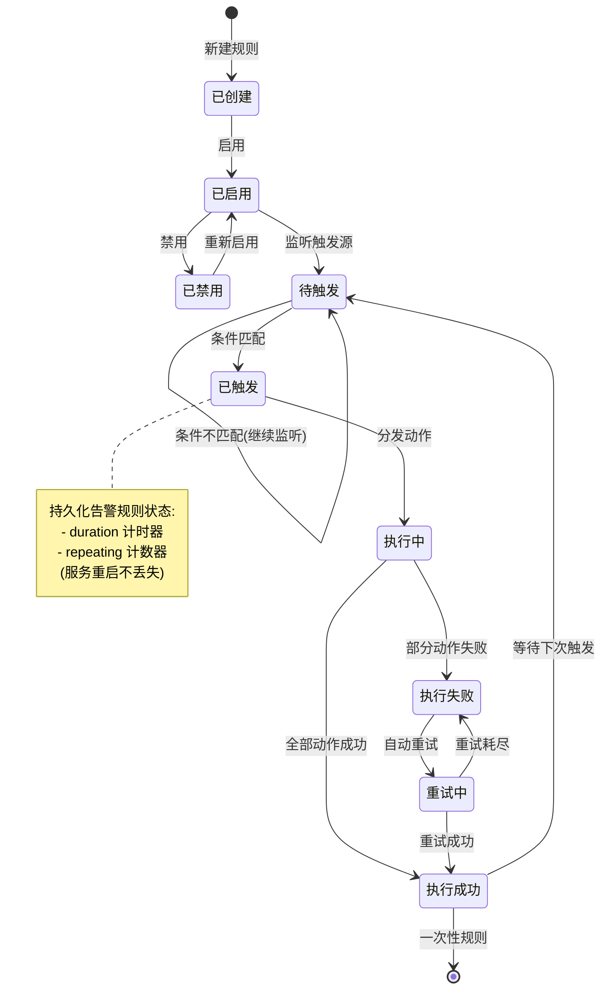

**触发类型**（参考 OneNET / ThingsBoard / 华为云）：
- `DEVICE_DATA`：设备数据上报（属性变化）
- `DEVICE_STATE`：设备状态变化（在线/离线）
- `TIMER`：定时触发（Cron 表达式）
- `MANUAL`：手动触发（API 调用）
- `THIRD_PARTY`：第三方数据（天气、API 回调）

**条件持久化**（ThingsBoard 关键设计）：duration-based（持续 10 分钟超阈值才触发）与 repeating（连续 5 次超阈值才触发）的状态需写入数据库，避免服务重启后计时归零。可通过 `persistAlarmRulesState=true` 配置启用。

### 5.5 告警状态机

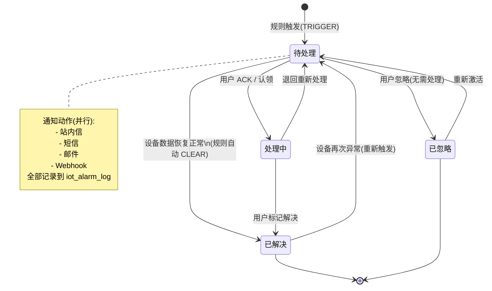

**告警级别与升级**：
- 4 级严重度：info / warning / error / critical（对应 ThingsBoard 的 Indeterminate/Minor/Major/Critical）
- 升级机制（ESCALATE）：`待处理` 超过 N 分钟未响应，自动提升级别并通知上级

**告警日志动作**（参考 ThingsBoard Device Profile Node 输出）：`TRIGGER` / `ESCALATE` / `ACK` / `RESOLVE` / `IGNORE` / `NOTIFY` / `CLEAR`，每次状态变更写入 `iot_alarm_log`。

---

## 六、关键业务流程

### 6.1 设备接入流程

```mermaid
flowchart TD
    A[1. 创建产品] --> B[定义物模型<br/>属性/服务/事件]
    B --> C[配置接入协议<br/>MQTT/HTTP/CoAP]
    C --> D[选择认证方式<br/>一机一密/一型一密/动态注册]
    D --> E[2. 注册设备]
    E --> F{认证方式}
    F -->|一机一密| G[平台预生成 deviceKey/deviceSecret]
    F -->|动态注册| H[设备首次连接用 productKey+productSecret 预认证<br/>换取 deviceSecret]
    G --> I[3. 设备激活]
    H --> I
    I --> J[设备 MQTT CONNECT<br/>username=deviceKey, password=sign(deviceSecret,timestamp)]
    J --> K{平台校验}
    K -->|成功| L[状态: 未激活 → 在线]
    K -->|失败| M[拒绝连接, 记录日志]
    L --> N[4. 业务通信]
    N --> O[上行: 属性上报/事件上报]
    N --> P[下行: 属性读写/服务调用]
    O --> Q[物模型解析 → 存储/规则引擎]
    P --> Q
```

### 6.2 物模型数据解析流程

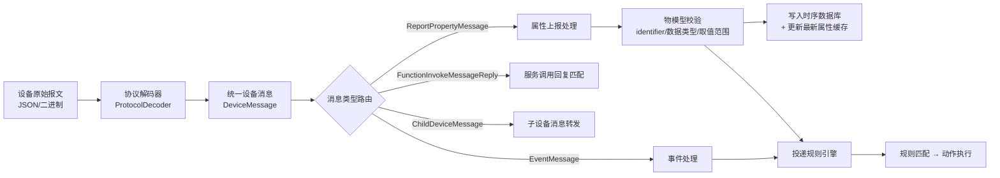

**统一消息模型**（参考 JetLinks 平台消息定义，建议本项目采纳）：

| 消息类型 | 方向 | 说明 |
|---|---|---|
| `ReportPropertyMessage` | 上行 | 设备主动上报属性 |
| `ReadPropertyMessage` / `ReadPropertyMessageReply` | 下行/上行 | 平台读属性 + 设备回复 |
| `WritePropertyMessage` / `WritePropertyMessageReply` | 下行/上行 | 平台写属性 + 设备回复 |
| `FunctionInvokeMessage` / `FunctionInvokeMessageReply` | 下行/上行 | 调用服务 + 回复 |
| `EventMessage` | 上行 | 设备事件上报 |
| `ChildDeviceMessage` | 上行 | 网关代理子设备消息 |
| `DeviceOnlineMessage` / `DeviceOfflineMessage` | 系统 | 上下线事件 |
| `DerivedMetadataMessage` | 上行 | 物模型动态变更 |

### 6.3 告警触发流程

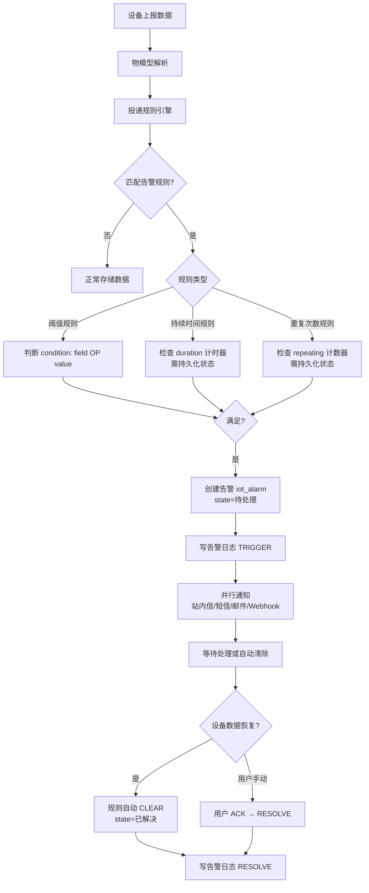

### 6.4 场景联动流程（TCA 模型：Trigger-Condition-Action）

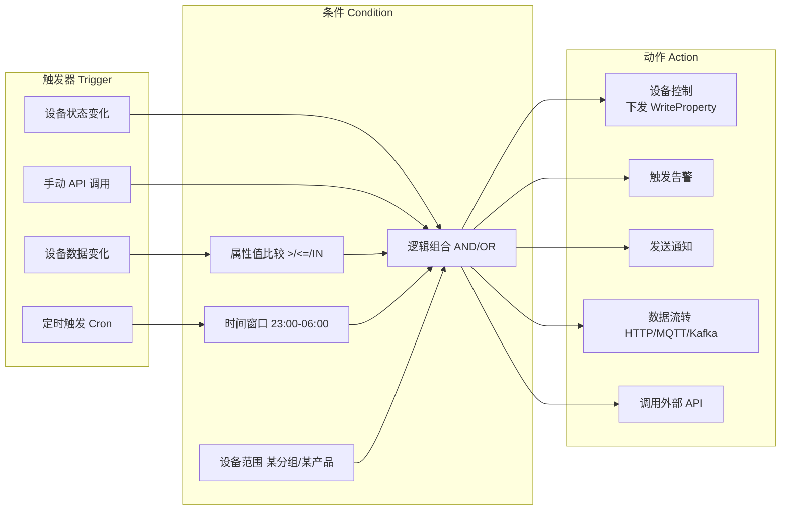

**示例规则**（JSON 配置，参考 yudao 规则引擎）：

```json
{
  "ruleName": "温度过高联动空调",
  "ruleType": "SCENE",
  "triggerType": "DEVICE_DATA",
  "triggerConfig": {
    "productId": 1001,
    "deviceId": "sensor-temp-001",
    "property": "temperature"
  },
  "conditionConfig": {
    "logic": "AND",
    "conditions": [
      {"field": "temperature", "operator": "GT", "value": 30},
      {"field": "humidity", "operator": "LT", "value": 40}
    ]
  },
  "actionConfig": [
    {"type": "DEVICE_CONTROL", "deviceId": "ac-001", "command": "TURN_ON", "params": {"temp": 26}},
    {"type": "ALERT", "level": "WARNING", "message": "环境温度过高"},
    {"type": "HTTP_FORWARD", "url": "https://api.example.com/notify", "method": "POST"}
  ]
}
```

### 6.5 OTA 升级流程

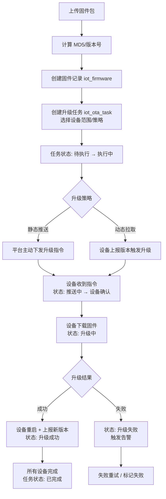

---

## 七、设备通信架构

### 7.1 整体通信架构

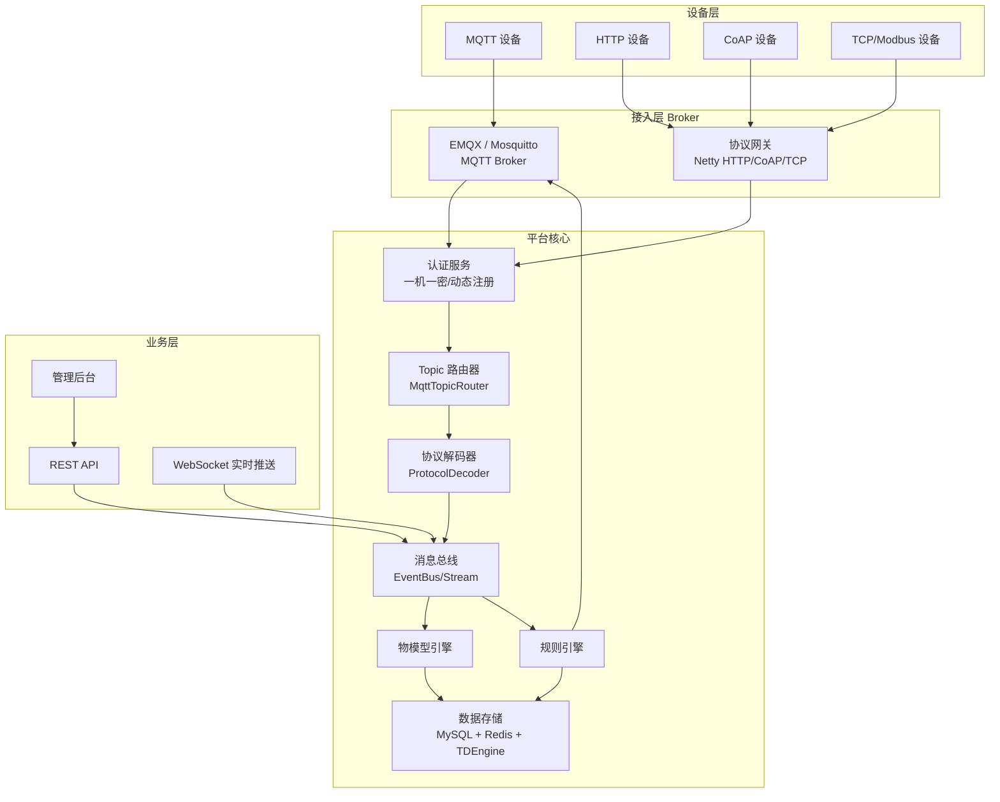

### 7.2 MQTT Topic 设计

综合 ThingsBoard（`v1/devices/me/...`）与 JetLinks（`/{productId}/{deviceId}/...`）两种风格，本项目推荐 **JetLinks 风格**（产品+设备双层路径，便于按产品维度做权限隔离与批量操作）：

| 方向 | Topic | 说明 |
|---|---|---|
| 上行 | `/{productId}/{deviceId}/properties/report` | 属性上报 |
| 下行 | `/{productId}/{deviceId}/properties/read` | 平台读属性 |
| 上行 | `/{productId}/{deviceId}/properties/read/reply` | 读属性回复 |
| 下行 | `/{productId}/{deviceId}/properties/write` | 平台写属性 |
| 上行 | `/{productId}/{deviceId}/properties/write/reply` | 写属性回复 |
| 下行 | `/{productId}/{deviceId}/function/invoke` | 调用服务 |
| 上行 | `/{productId}/{deviceId}/function/invoke/reply` | 服务回复 |
| 上行 | `/{productId}/{deviceId}/event/{eventId}` | 事件上报 |
| 上行 | `/{productId}/{deviceId}/online` | 设备上线 |
| 上行 | `/{productId}/{deviceId}/offline` | 设备离线 |
| 上行 | `/{productId}/{deviceId}/child/{childDeviceId}/register` | 子设备注册 |
| 上行 | `/{productId}/{deviceId}/child/{childDeviceId}/unregister` | 子设备注销 |
| 上行 | `/{productId}/{deviceId}/child/{childDeviceId}/online` | 子设备上线 |
| 下行 | `/{productId}/{deviceId}/ota/upgrade` | OTA 升级指令 |
| 上行 | `/{productId}/{deviceId}/ota/progress` | OTA 进度上报 |

**属性上报报文示例**：
```json
{
  "timestamp": 1601196762389,
  "messageId": "msg-uuid-xxx",
  "properties": {"temperature": 36.8, "humidity": 45.2}
}
```

**下行写属性报文示例**：
```json
{
  "timestamp": 1601196762389,
  "messageId": "msg-uuid-yyy",
  "deviceId": "device-001",
  "properties": {"targetTemp": 26}
}
```

**回复报文示例**（原样返回 messageId）：
```json
{
  "timestamp": 1601196762389,
  "messageId": "msg-uuid-yyy",
  "success": true,
  "properties": {"targetTemp": 26}
}
```

### 7.3 设备认证机制

参考 JetLinks HMAC-SHA256 签名方案：

| 认证方式 | 适用 | 流程 |
|---|---|---|
| **一机一密**（推荐） | 已知设备的正式接入 | 平台预生成 `deviceKey` + `deviceSecret`，设备连接时：`clientId=deviceId, username=secureId\|timestamp, password=md5(secureId\|timestamp\|secureKey)` |
| **一型一密** | 批量设备动态注册 | 设备首次用 `productKey`+`productSecret` 调用注册接口，平台返回 `deviceSecret`，之后走一机一密 |
| **动态注册** | 未知设备的免预注册 | 设备首次连接携带 `productKey`+`productSecret`+`deviceName`，平台自动创建设备记录 |
| **X.509 证书** | 高安全场景 | 双向 TLS，设备证书指纹作为身份标识 |
| **Access Token** | 简单场景（ThingsBoard 风格） | Token 作为 MQTT username，无密码 |

**时间戳防重放**：`timestamp` 与系统时间差超过 5 分钟拒绝连接。

### 7.4 消息序列化

| 格式 | 适用 | 优势 |
|---|---|---|
| **JSON**（默认） | 调试友好、协议简单 | 可读性强，生态丰富 |
| **Protobuf** | 高频数据、带宽敏感 | 体积小 30%-50%，解析快 |
| **MessagePack** | 二进制紧凑 | 比 JSON 小，无需 schema |
| **自定义二进制** | 私有协议、Modbus | 由协议解码器处理 |

### 7.5 消息头（Headers）机制

参考 JetLinks 统一消息头设计，用于控制消息处理行为：

| Header | 类型 | 说明 |
|---|---|---|
| `async` | boolean | 是否异步消息（不等回复） |
| `timeout` | long | 超时时间（毫秒） |
| `keepOnline` | boolean | 短连接保持在线 |
| `keepOnlineTimeoutSeconds` | long | 在线超时 |
| `ignoreStorage` | boolean | 不存储到时序库 |
| `ignoreLog` | boolean | 不记录消息日志 |
| `mergeLatest` | boolean | 合并最新属性数据 |
| `frag_msg_id` / `frag_num` / `frag_part` / `frag_last` | - | 分片消息支持 |

---

## 八、Erupt 实现建议

本项目基于 Erupt 框架（注解驱动 + Spring Boot + JPA），IoT 模块应充分利用 Erupt 的零前端代码特性，同时补充 Erupt 不擅长的实时通信与协议接入能力。

### 8.1 整体实现策略

| 能力 | 实现方式 |
|---|---|
| 产品/设备/物模型/规则/告警 CRUD | Erupt `@Erupt` + `@EruptField` 注解，零前端代码 |
| 设备状态流转（状态机） | `@ChoiceType` 枚举 + `dataProxy` 业务回调 + `@RowOperation` 按钮操作 |
| 物模型嵌套结构 | `@TabTree` 左树右表 + 主子表 + 动态字段 |
| 设备消息实时列表 | Erupt 实时列表 + WebSocket 推送（自研 Controller） |
| 告警处理 | `@RowOperation` 弹窗表单 + `OperationHandler` 处理 |
| 规则引擎配置 | `erupt-designer` 可视化设计器 + JSON Schema |
| MQTT 协议接入 | 独立 `@Component` MQTT 客户端（非 Erupt 管控），监听后写库 |
| 时序数据查询 | 自研 Controller + 时序数据库（TDEngine/InfluxDB） |

### 8.2 产品管理实现

```java
@Erupt(name = "产品管理", dataProxy = IotProductDataProxy.class)
@Table(name = "iot_product")
@Entity
public class IotProduct extends BaseModel {

    @EruptField(views = @View(title = "产品名称"), edit = @Edit(title = "产品名称", notNull = true, search = @Search(vague = true)))
    private String name;

    @EruptField(views = @View(title = "ProductKey"), edit = @Edit(title = "ProductKey", notNull = true, desc = "设备接入标识"))
    private String productKey;

    @EruptField(views = @View(title = "产品分类"), edit = @Edit(title = "产品分类", type = EditType.CHOICE,
        choiceType = @ChoiceType(fetchHandler = SqlChoiceFetchHandler.class, fetchHandlerParams = {"select id, name from iot_product_category order by sort"})))
    private Long categoryId;

    @EruptField(views = @View(title = "节点类型"), edit = @Edit(title = "节点类型", type = EditType.CHOICE,
        choiceType = @ChoiceType(vl = {@VL(label = "直连设备", value = "1"), @VL(label = "网关子设备", value = "2"), @VL(label = "网关设备", value = "3")})))
    private Integer nodeType;

    @EruptField(views = @View(title = "接入协议"), edit = @Edit(title = "接入协议", type = EditType.CHOICE,
        choiceType = @ChoiceType(vl = {@VL(label = "MQTT", value = "MQTT"), @VL(label = "HTTP", value = "HTTP"), @VL(label = "CoAP", value = "COAP"), @VL(label = "TCP", value = "TCP")})))
    private String protocolType;

    @EruptField(views = @View(title = "状态"), edit = @Edit(title = "状态", type = EditType.BOOLEAN))
    private Integer status;

    // 行操作：管理物模型 / 管理设备 / 发布固件
    @RowOperation(title = "物模型", icon = "fa fa-cubes", mode = RowOperation.Mode.SINGLE, eruptClass = IotThingModel.class)
    @RowOperation(title = "设备列表", icon = "fa fa-microchip", mode = RowOperation.Mode.SINGLE, eruptClass = IotDevice.class)
    @RowOperation(title = "发布固件", icon = "fa fa-upload", mode = RowOperation.Mode.SINGLE, eruptClass = IotFirmware.class)
    private String ops;
}
```

**产品分类树**（左树右表）：

```java
@Erupt(name = "产品分类")
@Table(name = "iot_product_category")
@Entity
public class IotProductCategory extends BaseModel {

    @EruptField(views = @View(title = "分类名称"), edit = @Edit(title = "分类名称", notNull = true))
    private String name;

    @EruptField(edit = @Edit(title = "父分类", type = EditType.CHOICE,
        choiceType = @ChoiceType(fetchHandler = SqlChoiceFetchHandler.class, fetchHandlerParams = {"select id, name from iot_product_category"})))
    private Long parentId;

    @EruptField(edit = @Edit(title = "排序"))
    private Integer sort;

    // 配合 @Erupt(tree=@Tree(...)) 实现树形展示
}
```

### 8.3 物模型嵌套实现

物模型有"属性 / 服务 / 事件"三种类型，每种字段结构不同。建议**主表 + 动态 JSON** 的混合方案：

```java
@Erupt(name = "物模型", dataProxy = IotThingModelDataProxy.class)
@Table(name = "iot_thing_model")
@Entity
public class IotThingModel extends BaseModel {

    @EruptField(views = @View(title = "所属产品"), edit = @Edit(title = "所属产品", type = EditType.CHOICE,
        choiceType = @ChoiceType(fetchHandler = SqlChoiceFetchHandler.class, fetchHandlerParams = {"select id, name from iot_product where status=0"})))
    private Long productId;

    @EruptField(views = @View(title = "标识符"), edit = @Edit(title = "标识符", notNull = true, search = @Search, desc = "如 temperature"))
    private String identifier;

    @EruptField(views = @View(title = "名称"), edit = @Edit(title = "名称", notNull = true))
    private String name;

    @EruptField(views = @View(title = "类型"), edit = @Edit(title = "类型", type = EditType.CHOICE,
        choiceType = @ChoiceType(vl = {@VL(label = "属性", value = "1"), @VL(label = "服务", value = "2"), @VL(label = "事件", value = "3")})))
    private Integer type;

    // 读写模式（仅属性显示，通过 showBy 动态控制）
    @EruptField(views = @View(title = "读写模式"), edit = @Edit(title = "读写模式", type = EditType.CHOICE, showBy = "@type == 1",
        choiceType = @ChoiceType(vl = {@VL(label = "只读", value = "1"), @VL(label = "只写", value = "2"), @VL(label = "读写", value = "3")})))
    private Integer accessMode;

    // 数据类型
    @EruptField(edit = @Edit(title = "数据类型", type = EditType.CHOICE,
        choiceType = @ChoiceType(vl = {@VL(label = "int", value = "int"), @VL(label = "float", value = "float"), @VL(label = "bool", value = "bool"), @VL(label = "string", value = "string"), @VL(label = "enum", value = "enum")})))
    private String dataType;

    // 数据规格（JSON：最大值/最小值/单位/枚举项/输入参数/输出参数）
    @EruptField(edit = @Edit(title = "数据规格", type = EditType.CODEEDITOR))
    @Column(columnDefinition = "text")
    private String dataSpecs;

    // 事件级别（仅事件显示）
    @EruptField(edit = @Edit(title = "事件级别", type = EditType.CHOICE, showBy = "@type == 3",
        choiceType = @ChoiceType(vl = {@VL(label = "info", value = "1"), @VL(label = "alert", value = "2"), @VL(label = "error", value = "3")})))
    private Integer eventType;
}
```

**物模型编辑增强建议**：物模型的"输入参数 / 输出参数 / 数据规格"是结构化嵌套，建议用 `erupt-designer` 可视化设计器配置 JSON Schema，或自研弹窗表单（`@RowOperation` + `eruptClass`）实现参数列表的增删改。

### 8.4 设备管理实现

```java
@Erupt(name = "设备管理", dataProxy = IotDeviceDataProxy.class,
    rowOperation = {
        @RowOperation(title = "激活设备", icon = "fa fa-bolt", code = "ACTIVATE", mode = RowOperation.Mode.SINGLE, operationHandler = IotDeviceActivateHandler.class),
        @RowOperation(title = "启用", icon = "fa fa-play", code = "ENABLE", mode = RowOperation.Mode.MULTI, operationHandler = IotDeviceStatusHandler.class),
        @RowOperation(title = "禁用", icon = "fa fa-stop", code = "DISABLE", mode = RowOperation.Mode.MULTI, operationHandler = IotDeviceStatusHandler.class),
        @RowOperation(title = "下发指令", icon = "fa fa-paper-plane", code = "INVOKE", mode = RowOperation.Mode.SINGLE, eruptClass = DeviceInvokeDialog.class, operationHandler = IotDeviceInvokeHandler.class),
        @RowOperation(title = "查看消息", icon = "fa fa-envelope", code = "MSG", mode = RowOperation.Mode.SINGLE, eruptClass = IotDeviceMessage.class),
        @RowOperation(title = "查看告警", icon = "fa fa-bell", code = "ALARM", mode = RowOperation.Mode.SINGLE, eruptClass = IotAlarm.class)
    })
@Table(name = "iot_device")
@Entity
public class IotDevice extends BaseModel {

    @EruptField(views = @View(title = "设备名称"), edit = @Edit(title = "设备名称", notNull = true, search = @Search(vague = true)))
    private String name;

    @EruptField(views = @View(title = "所属产品"), edit = @Edit(title = "所属产品", type = EditType.CHOICE,
        choiceType = @ChoiceType(fetchHandler = SqlChoiceFetchHandler.class, fetchHandlerParams = {"select id, name from iot_product where status=0"})))
    private Long productId;

    @EruptField(views = @View(title = "DeviceKey"), edit = @Edit(title = "DeviceKey", notNull = true))
    private String deviceKey;

    @EruptField(views = @View(title = "设备状态"), edit = @Edit(title = "设备状态", type = EditType.CHOICE,
        choiceType = @ChoiceType(vl = {@VL(label = "未激活", value = "0"), @VL(label = "在线", value = "1"), @VL(label = "离线", value = "2")})))
    private Integer state;

    @EruptField(views = @View(title = "启用状态"), edit = @Edit(title = "启用状态", type = EditType.BOOLEAN))
    private Integer status;

    @EruptField(views = @View(title = "最后上线时间"), edit = @Edit(title = "最后上线时间", type = EditType.DATE, search = @Search))
    private Date lastOnlineTime;

    @EruptField(views = @View(title = "固件版本"), edit = @Edit(title = "固件版本"))
    private String firmwareVersion;

    @EruptField(views = @View(title = "备注"), edit = @Edit(title = "备注"))
    private String remark;
}
```

**设备状态流转业务回调**（`DataProxy` 实现）：

```java
@Component
public class IotDeviceDataProxy implements DataProxy<IotDevice> {
    @Autowired private IotDeviceService deviceService;

    @Override
    public void beforeAdd(IotDevice device) {
        // 创建设备时：自动生成 deviceKey/deviceSecret，状态置为"未激活"
        device.setDeviceKey(IdUtil.fastSimpleUUID());
        device.setDeviceSecret(SecureUtil.md5(IdUtil.fastSimpleUUID()));
        if (device.getState() == null) device.setState(0); // 未激活
        device.setStatus(0); // 启用
    }

    @Override
    public void afterUpdate(IotDevice device) {
        // 状态变更：禁用时强制下线，启用时允许重连
        if (Objects.equals(device.getStatus(), 1)) {
            deviceService.forceOffline(device.getId()); // 调用 MQTT broker 踢出连接
        }
    }
}
```

### 8.5 设备消息实时列表

Erupt 列表是请求-响应模式，不适合实时推送。建议**双通道**：
- **Erupt 标准列表**：历史消息查询（`IotDeviceMessage` 实体，支持按设备/方向/类型筛选）
- **自研 WebSocket 实时流**：独立 `@RestController` + `WebSocketHandler`，前端订阅后实时推送新消息

```java
@Erupt(name = "设备消息日志")
@Table(name = "iot_device_message")
@Entity
public class IotDeviceMessage extends BaseModel {

    @EruptField(views = @View(title = "设备ID"), edit = @Edit(title = "设备ID", search = @Search))
    private Long deviceId;

    @EruptField(views = @View(title = "方向"), edit = @Edit(title = "方向", type = EditType.CHOICE,
        choiceType = @ChoiceType(vl = {@VL(label = "上行", value = "1"), @VL(label = "下行", value = "2")})))
    private Integer direction;

    @EruptField(views = @View(title = "消息类型"), edit = @Edit(title = "消息类型", search = @Search))
    private String messageType;

    @EruptField(views = @View(title = "Topic"))
    private String topic;

    @EruptField(views = @View(title = "内容"))
    @Column(columnDefinition = "text")
    private String payload;

    @EruptField(views = @View(title = "状态"), edit = @Edit(title = "状态", type = EditType.CHOICE,
        choiceType = @ChoiceType(vl = {@VL(label = "已发送", value = "0"), @VL(label = "已送达", value = "1"), @VL(label = "已确认", value = "2"), @VL(label = "失败", value = "3")})))
    private Integer status;

    @EruptField(views = @View(title = "时间", sortable = true))
    private Date createTime;
}
```

### 8.6 告警处理实现

```java
@Erupt(name = "告警中心", dataProxy = IotAlarmDataProxy.class,
    rowOperation = {
        @RowOperation(title = "认领", icon = "fa fa-hand-paper-o", code = "ACK", mode = RowOperation.Mode.SINGLE, operationHandler = IotAlarmAckHandler.class),
        @RowOperation(title = "解决", icon = "fa fa-check", code = "RESOLVE", mode = RowOperation.Mode.SINGLE, eruptClass = AlarmResolveDialog.class, operationHandler = IotAlarmResolveHandler.class),
        @RowOperation(title = "忽略", icon = "fa fa-times", code = "IGNORE", mode = RowOperation.Mode.SINGLE, eruptClass = AlarmIgnoreDialog.class, operationHandler = IotAlarmIgnoreHandler.class),
        @RowOperation(title = "查看日志", icon = "fa fa-list", code = "LOG", mode = RowOperation.Mode.SINGLE, eruptClass = IotAlarmLog.class)
    })
@Table(name = "iot_alarm")
@Entity
public class IotAlarm extends BaseModel {

    @EruptField(views = @View(title = "告警标题"), edit = @Edit(title = "告警标题", search = @Search(vague = true)))
    private String title;

    @EruptField(views = @View(title = "级别"), edit = @Edit(title = "级别", type = EditType.CHOICE,
        choiceType = @ChoiceType(vl = {@VL(label = "info", value = "1"), @VL(label = "warning", value = "2"), @VL(label = "error", value = "3"), @VL(label = "critical", value = "4")})))
    private Integer level;

    @EruptField(views = @View(title = "状态"), edit = @Edit(title = "状态", type = EditType.CHOICE,
        choiceType = @ChoiceType(vl = {@VL(label = "待处理", value = "0"), @VL(label = "处理中", value = "1"), @VL(label = "已解决", value = "2"), @VL(label = "已忽略", value = "3")}),
        search = @Search))
    private Integer state;

    @EruptField(views = @View(title = "设备ID"))
    private Long deviceId;

    @EruptField(views = @View(title = "触发时间", sortable = true))
    private Date triggerTime;

    @EruptField(views = @View(title = "处理人"))
    private String handler;

    @EruptField(views = @View(title = "内容"))
    @Column(columnDefinition = "text")
    private String content;
}

// 解决告警弹窗
@Erupt(name = "解决告警", modalWidth = 500)
public class AlarmResolveDialog extends BaseModel {
    @EruptField(views = @View(title = "处理备注"), edit = @Edit(title = "处理备注", type = EditType.TEXTAREA, notNull = true, rows = 4))
    private String remark;
}

// 处理器
@Component
public class IotAlarmResolveHandler implements OperationHandler<IotAlarm, AlarmResolveDialog> {
    @Override
    public String exec(List<IotAlarm> alarms, AlarmResolveDialog param, String[] operationParam) {
        alarms.forEach(a -> {
            Integer before = a.getState();
            a.setState(2); // 已解决
            a.setResolveTime(new Date());
            a.setHandler(SecurityUtil.getCurrentUserName());
            // 写告警日志
            alarmLogService.log(a.getId(), "RESOLVE", before, 2, param.getRemark());
            // 通知规则引擎告警已解决
            eventBus.publish(new AlarmResolvedEvent(a));
        });
        return "已解决 " + alarms.size() + " 条告警";
    }
}
```

### 8.7 规则引擎配置

规则引擎的"触发条件 + 判断条件 + 执行动作"结构复杂，建议结合 `erupt-designer` 可视化设计器：

```java
@Erupt(name = "规则引擎", dataProxy = IotRuleDataProxy.class)
@Table(name = "iot_rule")
@Entity
public class IotRule extends BaseModel {

    @EruptField(views = @View(title = "规则名称"), edit = @Edit(title = "规则名称", notNull = true, search = @Search(vague = true)))
    private String name;

    @EruptField(views = @View(title = "规则类型"), edit = @Edit(title = "规则类型", type = EditType.CHOICE,
        choiceType = @ChoiceType(vl = {@VL(label = "数据规则", value = "1"), @VL(label = "告警规则", value = "2"), @VL(label = "场景联动", value = "3")})))
    private Integer ruleType;

    @EruptField(views = @View(title = "触发类型"), edit = @Edit(title = "触发类型", type = EditType.CHOICE,
        choiceType = @ChoiceType(vl = {@VL(label = "设备数据", value = "DEVICE_DATA"), @VL(label = "设备状态", value = "DEVICE_STATE"), @VL(label = "定时", value = "TIMER"), @VL(label = "手动", value = "MANUAL")})))
    private String triggerType;

    // 触发条件 JSON - 用 erupt-designer 可视化配置
    @EruptField(edit = @Edit(title = "触发条件", type = EditType.CODEEDITOR, desc = "JSON 配置"))
    @Column(columnDefinition = "text")
    private String triggerConfig;

    // 判断条件 JSON - 支持 AND/OR 组合
    @EruptField(edit = @Edit(title = "判断条件", type = EditType.CODEEDITOR))
    @Column(columnDefinition = "text")
    private String conditionConfig;

    // 执行动作 JSON - 数组，支持多个动作
    @EruptField(edit = @Edit(title = "执行动作", type = EditType.CODEEDITOR))
    @Column(columnDefinition = "text")
    private String actionConfig;

    @EruptField(views = @View(title = "状态"), edit = @Edit(title = "状态", type = EditType.BOOLEAN))
    private Integer status;

    @RowOperation(title = "测试规则", icon = "fa fa-flask", code = "TEST", mode = RowOperation.Mode.SINGLE, operationHandler = IotRuleTestHandler.class)
    @RowOperation(title = "查看执行日志", icon = "fa fa-history", code = "EXEC_LOG", mode = RowOperation.Mode.SINGLE, eruptClass = IotRuleExecLog.class)
    private String ops;
}
```

**规则执行引擎**（独立 Spring `@Component`，非 Erupt 管控）：

```java
@Component
public class IotRuleEngine {
    @Autowired private IotRuleRepository ruleRepo;
    @Autowired private IotActionExecutor actionExecutor;

    // 监听设备消息事件
    @EventListener
    public void onDeviceMessage(DeviceMessageEvent event) {
        List<IotRule> rules = ruleRepo.findEnabledByProductAndTrigger(event.getProductId(), "DEVICE_DATA");
        for (IotRule rule : rules) {
            if (matchCondition(rule.getConditionConfig(), event.getData())) {
                executeActions(rule.getActionConfig(), event);
            }
        }
    }

    private void executeActions(String actionConfigJson, DeviceMessageEvent event) {
        List<Action> actions = JSON.parseArray(actionConfigJson, Action.class);
        for (Action action : actions) {
            actionExecutor.execute(action, event); // DEVICE_CONTROL / ALERT / HTTP_FORWARD / NOTIFY
        }
    }
}
```

### 8.8 大屏可视化

Erupt 内置 BI 模块，但 IoT 大屏通常需要自定义。建议：
- **简单统计**：Erupt `@Erupt(name="设备总览")` + 聚合查询
- **复杂大屏**：自研前端页面（Vue + ECharts），通过 Erupt `@Erupt(linkTree=...)` 或自定义菜单挂载

### 8.9 协议接入实现（Erupt 之外）

MQTT 接入是独立模块，不依赖 Erupt：

```java
@Component
public class IotMqttSubscriber {
    @Autowired private IotDeviceService deviceService;
    @Autowired private IotThingModelService thingModelService;
    @Autowired private IotMessageBus messageBus;

    @PostConstruct
    public void subscribe() {
        mqttClient.subscribe("/+/+/properties/report", (topic, payload) -> {
            // 解析 topic: /{productId}/{deviceId}/properties/report
            String[] parts = topic.split("/");
            Long productId = Long.valueOf(parts[1]);
            Long deviceId = Long.valueOf(parts[2]);

            // 1. 认证 + 状态更新（首次激活）
            deviceService.markOnlineIfNeeded(deviceId);

            // 2. 物模型解析校验
            Map<String, Object> properties = JSON.parseObject(payload).getJSONObject("properties");
            thingModelService.validate(productId, properties);

            // 3. 写消息日志
            messageService.log(deviceId, "PROPERTY_REPORT", 1, topic, payload);

            // 4. 存储时序数据
            timeSeriesService.save(deviceId, properties);

            // 5. 投递规则引擎
            messageBus.publish(new DeviceMessageEvent(deviceId, productId, properties));
        });
    }
}
```

---

## 九、参考来源

### 9.1 yudao / 芋道 iot 模块
- [yudaocode/ruoyi-vue-pro IoT 模块深度解析](https://modelers.csdn.net/69a51dca7bbde9200b9addc7.html)
- [芋道管理后台物联网(IoT)平台开发最佳实践](https://blog.csdn.net/gitblog_00919/article/details/152260305)
- [RuoYi-Vue-Pro v2.4.2 IoT 模块初版发布](https://blog.csdn.net/gitblog_01418/article/details/149957646)
- [企业级物联网平台架构设计：ruoyi-vue-pro IoT 模块技术优势](https://blog.csdn.net/gitblog_00369/article/details/148989790)
- [芋道源码 iot 设备接入底层实现](https://wenku.csdn.net/answer/5pa2inyokp)

### 9.2 ThingsBoard
- [ThingsBoard 设备配置(Device Profiles)](http://www.ithingsboard.com/docs/user-guide/device-profiles/)
- [ThingsBoard MQTT 设备 API 参考](http://www.ithingsboard.com/docs/reference/mqtt-api/)
- [ThingsBoard MQTT Device API](https://thingsboard.io/docs/paas/reference/mqtt-api/)
- [ThingsBoard Rule Engine Device Profile Node](https://thingsboard.io/docs/reference/rule-engine/nodes/action/device-profile/)
- [ThingsBoard LwM2M Device API](https://thingsboard.io/docs/pe/reference/lwm2m-api/)

### 9.3 JetLinks
- [JetLinks 官方协议](https://docs.iot.bihuoa.cn/basics-guide/jetlinks-protocol-support.html)
- [JetLinks 最佳实践 - 平台统一设备消息定义](https://jetlinks.github.io/jetlinks-docs/best-practices/start.html)
- [JetLinks 物联网平台全响应式架构](https://blog.csdn.net/gitblog_00030/article/details/137036975)
- [JetLinks 设备生命周期管理](https://blog.csdn.net/gitblog_00956/article/details/151831479)
- [JetLinks MQTT 网关设备与子设备场景](https://jishuzhan.net/article/2020649912040488962)
- [使用 MQTTBroker 接入 JetLinks 平台](https://blog.csdn.net/xy3233/article/details/146155854)

### 9.4 IoT-DC3
- [IoT-DC3 开源物联网平台使用手册](https://blog.csdn.net/qq_22903677/article/details/156877810)
- [IoT-DC3 分布式物联网平台解决方案](https://blog.csdn.net/gitblog_01186/article/details/158563250)
- [基于 IoT-DC3 构建高可用数据采集系统](https://blog.csdn.net/gitblog_00560/article/details/158563080)

### 9.5 RuoYi-IoT / enjoy-iot / thinglinks-iot
- [enjoy-iot 基于 Java 若依的物联网平台](http://m.toutiao.com/group/7576083084764889600/)
- [Thinglinks-iot 开源物联网平台](https://blog.csdn.net/Tao____/article/details/158344795)

### 9.6 设备状态机与生命周期
- [基于 TCP 协议连接 OneNET 平台 - 设备生命周期模型](https://blog.csdn.net/weixin_28713083/article/details/152652823)
- [LwM2M 设备生命周期状态建模](https://blog.csdn.net/weixin_35364187/article/details/155174472)
- [Device Lifecycle Management](https://iotclass.org/ux-design/connected-devices-lifecycle.html)
- [Tuya 设备在线/离线规则](https://support.tuya.com/zh/help/_detail/Kd3xks5t0cz1f)

### 9.7 规则引擎与场景联动
- [从产品角度看物联网平台的规则引擎](https://www.woshipm.com/pd/4237660.html)
- [OneNET 场景联动](https://open.iot.10086.cn/doc/iot_platform/book/application-develop/scene/scene.html)
- [华为云 IoT 端侧规则](https://support.huaweicloud.com/usermanual-iothub/iot_01_0041.html)
- [智能家居联动场景设计 TCA 架构](https://blog.csdn.net/InstrIsle/article/details/155882627)

### 9.8 Erupt 框架
- [Erupt Framework 注解驱动开发指南](https://blog.csdn.net/gitblog_00545/article/details/156283822)
- [Erupt 自定义按钮弹窗 @RowOperation 全攻略](https://blog.csdn.net/gitblog_01412/article/details/150054690)
- [Erupt 基础表单注解介绍](https://blog.csdn.net/jadekettle/article/details/144943718)
- [告别 996，纯 Java 注解开发 Admin 管理后台](https://juejin.cn/post/6915182964527595534)
- [Erupt Framework 开源神器](https://learner.blog.csdn.net/article/details/111493802)

---

## 十、实施路线图建议

基于研究结论，建议本项目分阶段实施：

| 阶段 | 模块 | 优先级 | 产出 |
|---|---|:---:|---|
| **P0** | 产品管理 + 物模型 + 设备管理 | 高 | Erupt 注解实体 + 状态枚举 + DataProxy |
| **P0** | MQTT 接入 + Topic 路由 | 高 | EMQX 集成 + 协议解码器 + 消息日志 |
| **P1** | 设备状态流转 + 在线/离线检测 | 高 | Redis 在线状态 + 心跳超时 + Will Message |
| **P1** | 物模型数据解析 + 时序存储 | 高 | TDEngine 集成 + 属性校验 |
| **P2** | 告警规则 + 告警中心 | 中 | 规则匹配引擎 + @RowOperation 处理 |
| **P2** | 场景联动 | 中 | TCA 模型 + 动作执行器 |
| **P3** | 数据流转 (HTTP/MQTT/Kafka) | 中 | 桥接执行器 |
| **P3** | 设备大屏 + 实时数据 | 中 | WebSocket 推送 + BI 看板 |
| **P4** | OTA 升级 | 低 | 固件管理 + 升级任务 |
| **P4** | CoAP / Modbus 接入 | 低 | 协议扩展 |

**关键决策点**：
1. **MQTT Broker 选型**：推荐 EMQX（生产级，支持规则引擎与 webhook，可与 yudao 解耦）
2. **时序数据库**：推荐 TDEngine（yudao 默认，IoT 优化）或 InfluxDB
3. **设备状态存储**：Redis Hash（实时状态） + MySQL（持久化）
4. **消息匹配**：基于 `messageId` 的请求-响应绑定，超时默认 30s
5. **告警状态持久化**：duration / repeating 计时器需写库，避免重启丢失
