# 芋道 yudao 商城模块功能分析报告

> 报告目标：分析 yudao mall 商城模块的完整功能设计,重点关注数据状态流转(状态机),为在 Erupt 框架(注解驱动,Spring Boot + JPA)上实现类似功能提供指导。

## 1. 模块概述

### 1.1 整体架构

芋道源码 yudao 商城采用**模块化设计**,后端代码位于 `yudao-module-mall`,前端包含管理后台(Vue3 + Element Plus)与移动端(uniapp)两套界面。整个商城由 **4 个核心模块 + 2 个基础模块**构成:

| 模块 | 表前缀 | 职责 |
|---|---|---|
| 商品中心 | `product_` | SPU/SKU、分类、属性、品牌、评价 |
| 交易中心 | `trade_` | 购物车、订单、售后、发货、自提、分销 |
| 营销中心 | `promotion_` | 优惠券、拼团、秒杀、砍价、满减送、限时折扣、DIY |
| 统计中心 | `_statistics` | 会员、商品、交易统计 |
| 会员中心 | `member_` | 等级、积分、标签(独立模块) |
| 支付中心 | `pay_` | 支付单、退款单、支付渠道(独立模块) |

整个商城 **70+ 张表**,采用 `MyBatis Plus` 操作,所有表统一包含审计字段:`creator`、`create_time`、`updater`、`update_time`、`deleted`(逻辑删除)、`tenant_id`(多租户)。

### 1.2 技术栈映射

| yudao 技术 | Erupt 替代 |
|---|---|
| MyBatis Plus + MySQL | Spring Data JPA |
| 数据库表 + SQL 脚本 | `@Entity` + `@Table` 自动建表(`spring.jpa.generate-ddl=true`) |
| Controller + Service + Mapper 三层 | `@Erupt` 注解 + `DataProxy<T>` 扩展点 |
| Vue3 前端代码 | 注解自动生成 UI(Angular 渲染) |
| 状态枚举类 | `@ChoiceType` + `@VL` |
| 后台业务按钮 | `@RowOperation` + `OperationHandler` |

---

## 2. 功能模块清单

### 2.1 商品中心(product_)

| 子模块 | 核心表 | 关键功能 |
|---|---|---|
| 商品 SPU | `product_spu` | 商品基础信息、上下架、规格配置 |
| 商品 SKU | `product_sku` | 规格组合、库存、销售价、成本价、条码 |
| 商品分类 | `product_category` | 三级树形结构(parent_id 自关联) |
| 商品属性 | `product_property` + `product_property_value` | 规格名(颜色)+ 规格值(红色) |
| 商品品牌 | `product_brand` | 品牌名、图标、排序、状态 |
| 商品评价 | `product_comment` | 评分、图文评价、商家回复 |
| 商品留言 | `product_comment` | 用户咨询 |

### 2.2 交易中心(trade_)

| 子模块 | 核心表 | 关键功能 |
|---|---|---|
| 购物车 | `trade_cart` | 加入购物车、选中、数量 |
| 商品订单 | `trade_order` + `trade_order_item` | 主子表,订单基本信息 + 商品明细快照 |
| 售后退款 | `trade_after_sale` + `trade_after_sale_log` | 售后单 + 状态流转日志 |
| 快递发货 | `trade_delivery_express` + `trade_delivery_express_log` | 快递公司、运单号 |
| 门店自提 | `trade_delivery_pick_up` + `trade_delivery_pick_up_order` | 自提门店、核销码 |
| 分销返佣 | `trade_brokerage_user` + `trade_brokerage_record` | 推广人、佣金记录 |

### 2.3 营销中心(promotion_)

| 子模块 | 核心表 | 关键功能 |
|---|---|---|
| 优惠券 | `promotion_coupon` + `promotion_coupon_template` | 模板、领取、使用、过期 |
| 拼团活动 | `promotion_combination_activity` + 头记录 | 成团人数、有效时长、拼团价 |
| 秒杀活动 | `promotion_seckill_activity` + `promotion_seckill_config` | 秒杀时段、库存、限购 |
| 砍价活动 | `promotion_bargain_activity` + 助力记录 | 底价、首刀、帮砍人数 |
| 满减送 | `promotion_reward` | 满 N 元减 M、赠送赠品 |
| 限时折扣 | `promotion_discount_activity` | 时间段折扣 |
| 积分商城 | `promotion_point_activity` | 积分兑换商品 |
| 内容管理 | `promotion_article` | 商城资讯、活动说明 |
| 装修 DIY | `promotion_diy_page` + `promotion_diy_template` | 可视化页面装修 |

### 2.4 统计中心(_statistics)

| 子模块 | 表 |
|---|---|
| 会员统计 | `member_statistics_*` |
| 商品统计 | `product_statistics_*` |
| 交易统计 | `trade_statistics_*` |

---

## 3. 核心实体与字段表

### 3.1 商品 SPU(product_spu)

| 字段 | 类型 | 说明 |
|---|---|---|
| id | bigint | 主键 |
| name | varchar(128) | 商品名称 |
| keyword | varchar(255) | 关键词 |
| introduction | varchar(255) | 商品简介 |
| description | text | 商品详情(富文本) |
| banner_urls | varchar(255) | 轮播图,逗号分隔 |
| category_id | bigint | 分类 ID |
| brand_id | bigint | 品牌 ID |
| spec_type | tinyint | **规格类型**:1 单规格 / 2 多规格 |
| price | int | **最低价格**(分),冗余便于搜索 |
| market_price | int | 市场价(分) |
| cost_price | int | 成本价(分) |
| stock | int | **总库存**(冗余,所有 SKU 之和) |
| sales_count | int | 销量 |
| status | tinyint | **状态**:0 上架(开启) / 1 下架(关闭) |
| sub_commission_type | tinyint | 分销抽成类型 |

### 3.2 商品 SKU(product_sku)

| 字段 | 类型 | 说明 |
|---|---|---|
| id | bigint | 主键 |
| spu_id | bigint | 关联 SPU |
| name | varchar(255) | SKU 名称 |
| properties | varchar(512) | **规格属性 JSON**:[{"propertyId":1,"value":"红色"},{"propertyId":2,"value":"L"}] |
| price | int | 销售价(分) |
| market_price | int | 市场价 |
| cost_price | int | 成本价 |
| bar_code | varchar(64) | 商品条码 |
| pic_url | varchar(255) | SKU 图片 |
| stock | int | **库存** |
| first_brokerage_price | int | 一级分销佣金 |
| second_brokerage_price | int | 二级分销佣金 |

### 3.3 订单主表(trade_order)

| 字段 | 类型 | 说明 |
|---|---|---|
| id | bigint | 主键 |
| no | varchar(32) | **订单号**(业务唯一) |
| type | tinyint | **订单类型**:1 普通 / 2 秒杀 / 3 砍价 / 4 拼团 |
| status | int | **订单状态**(详见状态机) |
| user_id | bigint | 用户 ID |
| user_ip | varchar(50) | 下单 IP |
| user_remark | varchar(255) | 买家留言 |
| receiver_name | varchar(50) | 收货人 |
| receiver_phone | varchar(20) | 收货电话 |
| receiver_area_id | int | 收货地区 |
| receiver_detail_address | varchar(255) | 收货详细地址 |
| pay_order_id | bigint | **支付单 ID**(关联 pay_order) |
| pay_channel_code | varchar(16) | 支付渠道 |
| pay_time | datetime | 支付时间 |
| finish_time | datetime | 完成时间 |
| cancel_time | datetime | 取消时间 |
| cancel_type | int | **取消类型**:1 用户超时 / 2 用户主动 / 3 管理员 |
| product_count | int | 商品总数 |
| product_total_price | int | 商品总价(分) |
| discount_price | int | 优惠金额(分) |
| delivery_price | int | 运费(分) |
| adjust_price | int | 调整价(管理员改价) |
| pay_price | int | **实付金额**(分) |
| refund_price | int | 已退款金额 |
| comment_status | bit(1) | 是否已评价 |
| brokerage_user_id | bigint | 推广人 ID |
| combination_activity_id | bigint | 拼团活动 ID |
| seckill_activity_id | bigint | 秒杀活动 ID |
| bargain_activity_id | bigint | 砍价活动 ID |

### 3.4 订单明细(trade_order_item)

**重要:订单快照设计,冗余存储下单时刻的商品信息**

| 字段 | 类型 | 说明 |
|---|---|---|
| id | bigint | 主键 |
| order_id | bigint | 关联订单 |
| spu_id | bigint | SPU ID |
| spu_name | varchar(255) | **商品名称(快照)** |
| sku_id | bigint | SKU ID |
| sku_pic | varchar(255) | 商品图片 |
| properties | varchar(512) | 规格属性 JSON |
| count | int | 购买数量 |
| original_price | int | 原价(分) |
| original_discount_price | int | 优惠后单价 |
| pay_price | int | 实付单价 |
| refund_price | int | 已退款金额 |
| after_sale_status | int | **售后状态**(详见售后状态机) |
| comment_status | bit(1) | 是否已评价 |

### 3.5 售后单(trade_after_sale)

| 字段 | 类型 | 说明 |
|---|---|---|
| id | bigint | 主键 |
| no | varchar(32) | **售后单号** |
| user_id | bigint | 用户 ID |
| type | tinyint | **售后类型**:1 仅退款 / 2 退货退款 |
| status | int | **售后状态**(详见状态机) |
| way | tinyint | 退款路径:1 退到余额 / 2 原路退回 |
| refund_price | int | 退款金额(分) |
| apply_reason | varchar(255) | 申请原因 |
| apply_description | varchar(255) | 补充描述 |
| apply_pic_urls | varchar(512) | 凭证图片,逗号分隔 |
| order_id | bigint | 关联订单 ID |
| order_no | varchar(32) | 订单号(冗余) |
| order_item_id | bigint | **关联订单项 ID**(颗粒度到商品行) |
| audit_time | datetime | 审核时间 |
| audit_user_id | bigint | 审核人 |
| audit_reason | varchar(255) | 审核备注 |
| logistics_id | bigint | 退货物流 ID |
| logistics_no | varchar(255) | 退货物流单号 |
| logistics_time | datetime | 买家发货时间 |
| receive_time | datetime | 商家收货时间 |
| receive_reason | varchar(255) | 收货备注 |
| refund_time | datetime | 退款成功时间 |

### 3.6 售后日志(trade_after_sale_log)

| 字段 | 说明 |
|---|---|
| after_sale_id | 售后单 ID |
| user_id | 操作人 |
| user_type | 操作人类型:1 用户 / 2 管理员 / 3 系统 |
| before_status | 变更前状态 |
| after_status | 变更后状态 |
| content | 操作内容描述 |
| create_time | 操作时间 |

### 3.7 拼团活动(promotion_combination_activity)

| 字段 | 类型 | 说明 |
|---|---|---|
| id | bigint | 主键 |
| spu_id | bigint | 商品 SPU |
| name | varchar(128) | 活动名称 |
| status | tinyint | **状态**:0 关闭 / 1 开启 |
| start_time | datetime | 开始时间 |
| end_time | datetime | 结束时间 |
| user_size | int | **成团人数** |
| limit_count | int | 单人限购数 |
| valid_hours | int | **拼团有效时长(小时)** |
| products | varchar(512) | SKU 与拼团价 JSON |

### 3.8 拼团记录(combination_record)

| 字段 | 说明 |
|---|---|
| id | 主键 |
| user_id | 团长用户 ID |
| head_id | 团长记录 ID(0 表示自己是团长) |
| activity_id | 活动 ID |
| spu_id / sku_id | 商品 |
| status | **状态**:0 进行中 / 1 成团成功 / 2 失败 |
| user_count | 当前参团人数 |
| user_size | 目标人数 |
| start_time | 开团时间 |
| end_time | 结束时间(成团 / 失败时填) |

### 3.9 秒杀活动(promotion_seckill_activity)

| 字段 | 说明 |
|---|---|
| id | 主键 |
| spu_id | 商品 |
| name | 活动名称 |
| status | **状态**:0 关闭 / 1 开启 |
| start_time / end_time | 活动时段 |
| config_ids | 关联秒杀时段配置 |
| stock | **秒杀库存** |
| total_stock | 总库存 |
| limit_count | 限购 |
| products | SKU 与秒杀价 |

### 3.10 优惠券模板(promotion_coupon)

| 字段 | 说明 |
|---|---|
| id | 主键 |
| name | 券名 |
| status | **状态**:0 关闭 / 1 开启 |
| type | **类型**:1 满减券 / 2 折扣券 |
| use_price | **使用门槛**(满 N 元) |
| discount_price | 优惠金额 |
| discount_limit_price | 折扣封顶金额 |
| take_count | **已领取数** |
| use_count | 已使用数 |
| receive_count | 限领数 |
| valid_start_time / valid_end_time | 有效期 |
| fixed_start_term / fixed_end_term | 领取后 N 天生效 |
| product_scope | 适用范围:1 全部 / 2 指定分类 / 3 指定商品 |

### 3.11 用户优惠券(member_coupon)

| 字段 | 说明 |
|---|---|
| id | 主键 |
| coupon_id | 券模板 |
| user_id | 用户 |
| status | **状态**:0 未使用 / 1 已使用 / 2 已过期 |
| use_order_id | 使用的订单 |
| use_time | 使用时间 |
| valid_start_time / valid_end_time | 有效期 |

---

## 4. 实体关系图

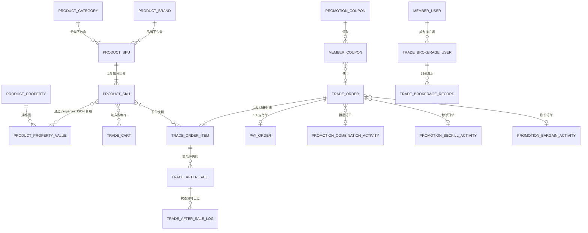

### 4.1 关键关联关系说明

1. **SPU → SKU (1:N)**:同一 SPU 下,根据规格笛卡尔积生成多个 SKU。`spec_type=1` 单规格时只生成 1 个 SKU。
2. **订单主子表**:订单创建时,把商品快照(名称、规格、单价、图片)**冗余写入** `trade_order_item`,而非仅存 `sku_id`。这是电商标准设计,保证历史订单不被商品改动影响。
3. **订单 ↔ 支付单**:订单的 `pay_order_id` 关联支付中心的 `pay_order` 表,支付状态由支付模块独立管理,通过回调更新订单状态。
4. **售后单的颗粒度**:售后是**针对订单项(order_item_id)**而非整单,一笔订单的不同商品可分别发起售后。
5. **拼团/秒杀/砍价订单**:通过 `trade_order.type` 区分,并冗余对应的活动 ID,便于反向追溯活动数据。

---

## 5. 状态流转图(重点)

### 5.1 订单状态机(核心)

yudao 的 `TradeOrderStateEnum` 定义 5 个主状态:

| 值 | 枚举 | 名称 |
|---|---|---|
| 0 | UNPAID | 待付款 |
| 10 | UNDELIVERED | 待发货 |
| 20 | UNRECEIVED | 待收货 |
| 30 | COMPLETED | 已完成 |
| 40 | CANCELED | 已取消 |

> 注意:yudao 的状态值是**跳跃式递增**(0/10/20/30/40),为后续插入中间状态留出空间。

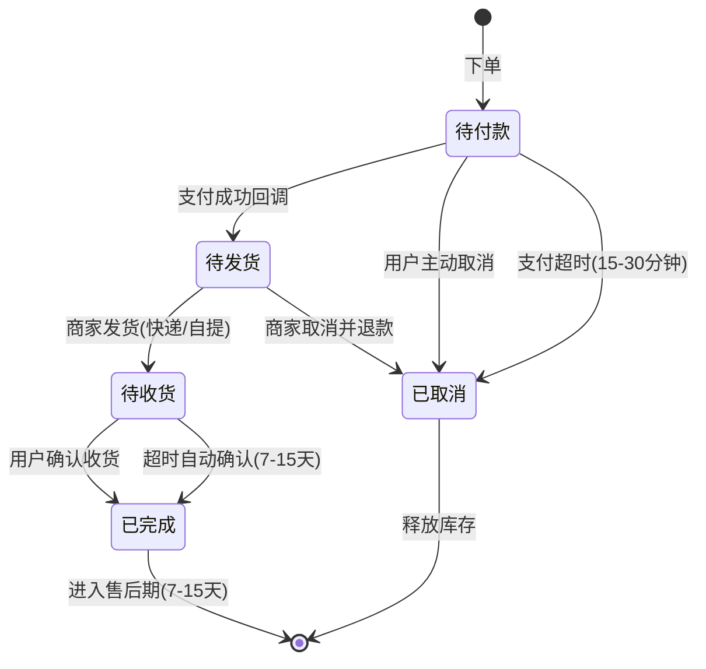

#### 状态转换触发条件与副作用

| 转换 | 触发者 | 条件 | 副作用 |
|---|---|---|---|
| → 待付款 | 买家 | 提交订单 | 锁定库存(lock_stock + N)、扣减优惠券、扣减积分 |
| 待付款 → 待发货 | 支付回调 | pay_order 状态变 SUCCESS | 真扣库存(stock - N)、累加销量 sales_count、确认优惠券使用 |
| 待付款 → 已取消 | 买家/定时任务 | 主动取消 / 超时 | 释放锁定库存、返还优惠券、返还积分 |
| 待发货 → 待收货 | 商家 | 填写运单号 / 核销自提码 | 记录 delivery_express、设发货时间 |
| 待发货 → 已取消 | 商家 | 取消订单 | 走全额退款流程(原路退回) |
| 待收货 → 已完成 | 买家/定时任务 | 确认收货 / 超时自动 | 触发分销返佣、加积分、解锁评价入口 |
| 已完成 → (售后中) | 买家 | 售后期内申请 | 创建 trade_after_sale,进入售后子流程 |

### 5.2 售后状态机(细化)

yudao 的 `AfterSaleStatusEnum`(基于 `trade_after_sale.status`):

| 值 | 枚举 | 名称 |
|---|---|---|
| 0 | NONE | 无售后 |
| 10 | APPLY | 申请退款(待商家审核) |
| 20 | AGREED | 商家同意退款(待管理员退款) |
| 30 | BUYER_DELIVERY | 买家已退货(待商家收货) |
| 40 | SELLER_RECEIVE | 商家已收货(待退款) |
| 50 | WAIT_REFUND | 待退款(中间态,系统处理中) |
| 60 | SUCCESS | 退款成功(终态) |
| 70 | CLOSED_ADMIN | 管理员关闭(终态) |
| 80 | CLOSED_BUYER | 买家取消(终态) |

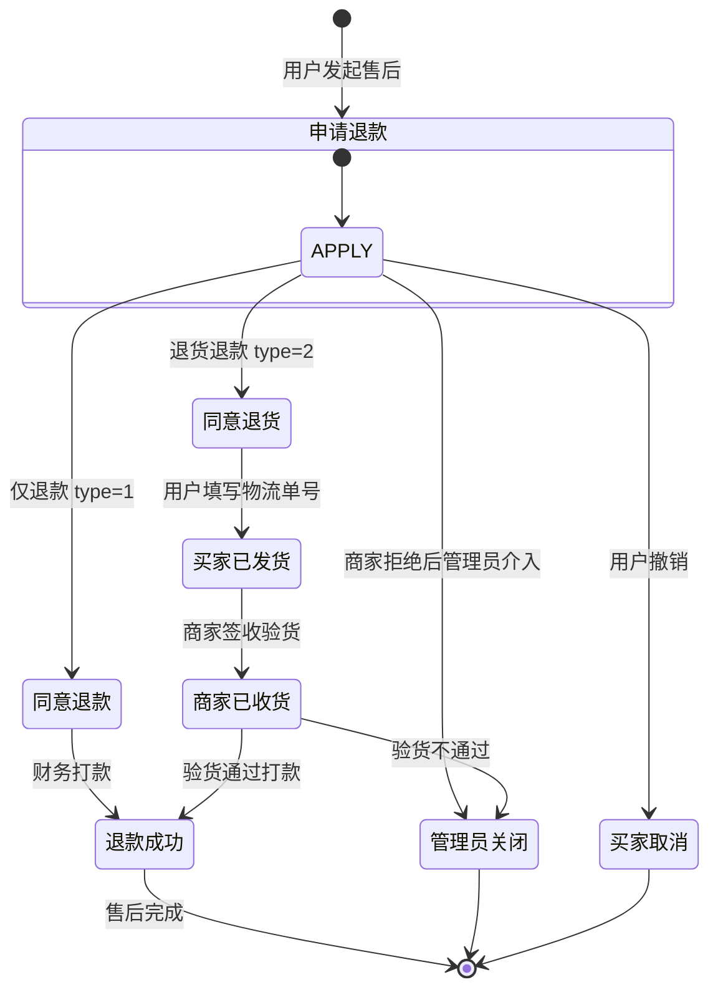

#### 售后流程的关键设计

1. **类型区分**:`type=1` 仅退款(无物流环节),`type=2` 退货退款(含物流)。
2. **日志可追溯**:每次状态变更,插入一条 `trade_after_sale_log`,记录 `before_status → after_status`、操作人、内容。
3. **退款金额**:由系统按订单项实付金额计算,客服有权限调整(`adjust_price`)。
4. **退款路径**:`way=1` 退到会员余额,`way=2` 调用支付中心原路退回。
5. **库存联动**:退货退款成功时,需要回补 SKU 库存。
6. **优惠联动**:仅退商品实付金额,**已使用的优惠券和促销优惠不退**。

### 5.3 拼团状态机

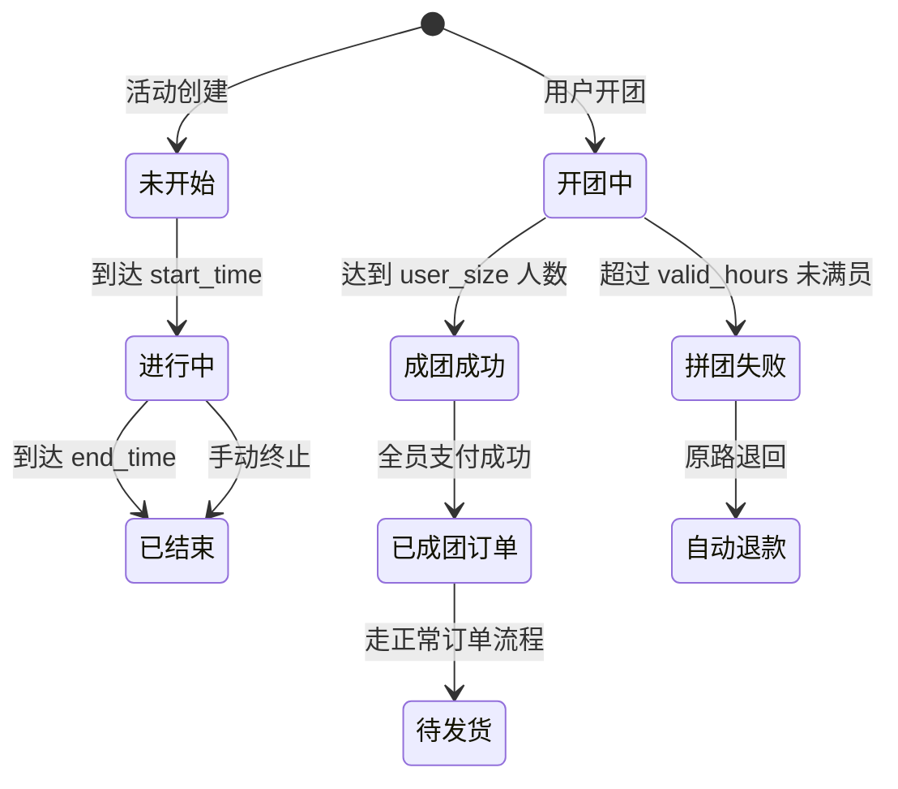

| 团记录状态 | 触发 | 副作用 |
|---|---|---|
| 进行中(0) | 买家开团 / 参团 | 锁定库存 |
| 成团成功(1) | 参团人数达标 | 全员订单状态推进到待发货 |
| 失败(2) | 超时未满员 | 全员订单取消、自动退款、释放库存 |

### 5.4 秒杀活动状态机

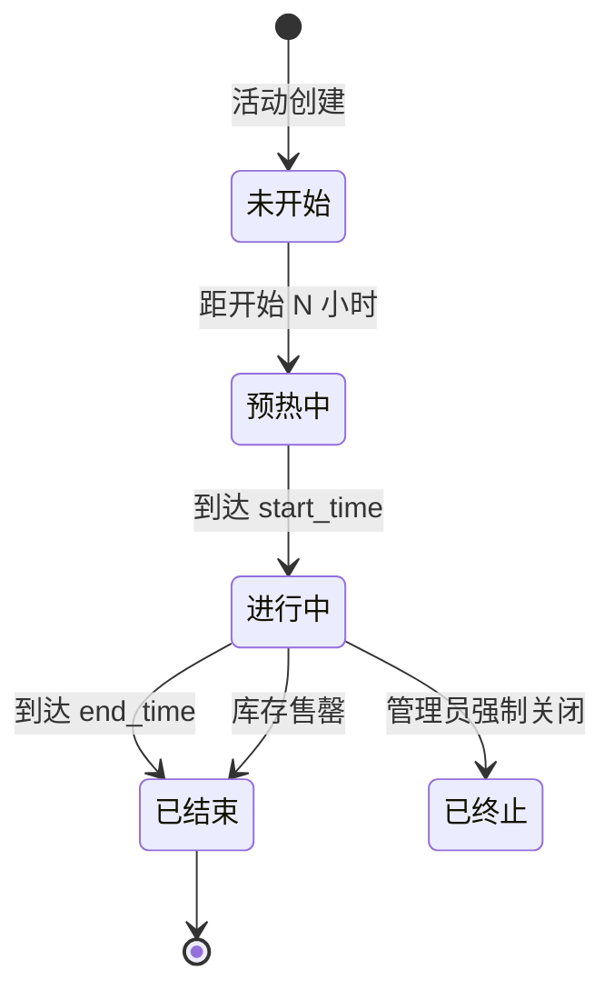

**关键点**:秒杀库存 `stock` 与 SPU 主库存**独立**(预占模式),用 Redis + Lua 防超卖。`limit_count` 限制单用户购买数。

### 5.5 优惠券状态机

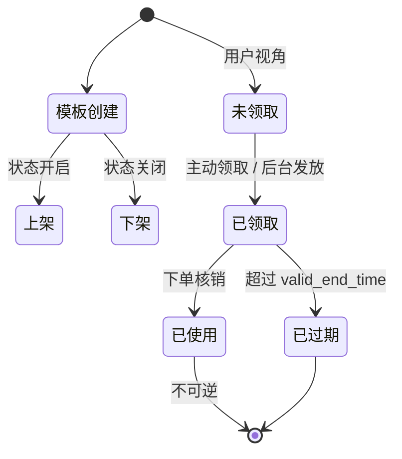

| 用户券状态 | 说明 |
|---|---|
| 0 未使用 | 在有效期内可使用 |
| 1 已使用 | 订单已核销,记录 use_order_id |
| 2 已过期 | 超过有效期,定时任务扫描 |

### 5.6 砍价活动状态机

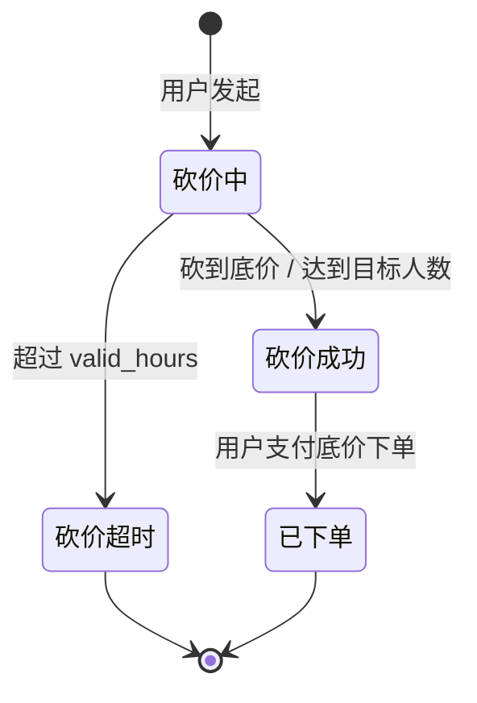

---

## 6. 关键业务流程

### 6.1 下单流程(下单扣库存模式)

yudao 采用**下单锁定库存 + 支付真扣库存**模式:

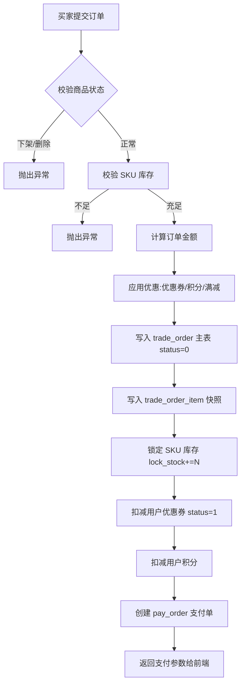

> **库存扣减时机选择**:
> - **下单扣**(yudao 选用):防止超卖,但订单取消需释放库存,适合高并发抢购场景。
> - **付款扣**:简单但易超卖,适合低并发普通电商。
> - yudao 通过 `lock_stock` 字段实现"软扣减",真实扣减发生在支付回调时。

### 6.2 支付回调流程

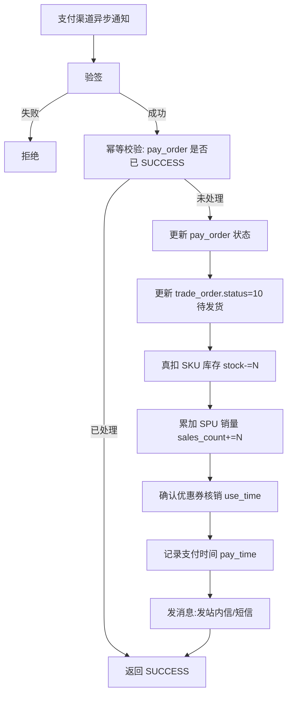

### 6.3 退款流程(售后 → 财务)

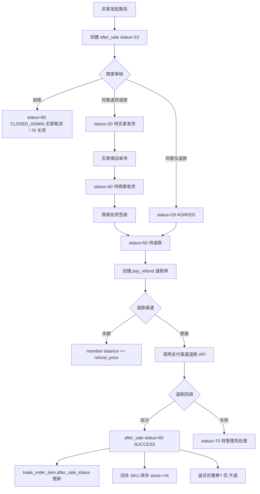

### 6.4 发货流程

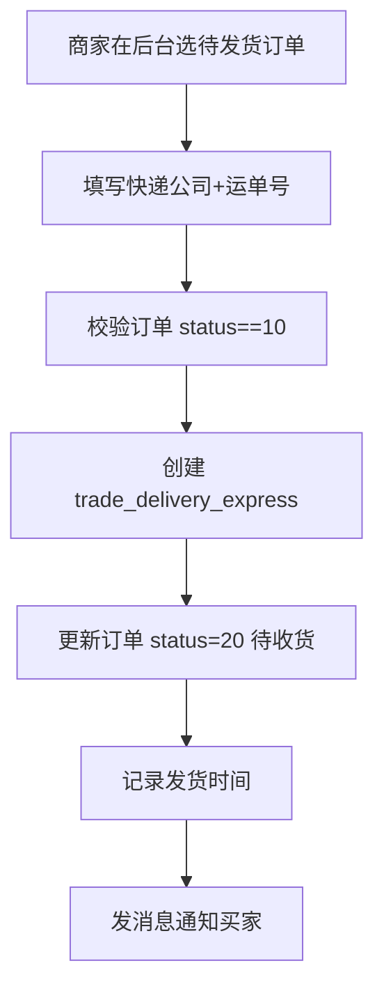

### 6.5 分销返佣流程

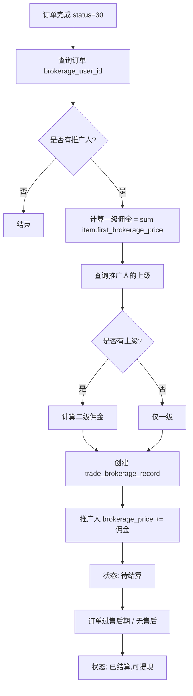

---

## 7. Erupt 实现建议

### 7.1 项目分层建议

```
xyz.herz.ep
├── mall
│   ├── product          # 商品中心
│   │   ├── Spu.java              # @Erupt SPU
│   │   ├── Sku.java              # @Erupt SKU  
│   │   ├── Category.java         # @Erupt + @Tree 分类
│   │   ├── Brand.java            # @Erupt 品牌
│   │   ├── Property.java         # @Erupt 规格名
│   │   └── PropertyValue.java    # @Erupt 规格值
│   ├── trade            # 交易中心
│   │   ├── Order.java            # @Erupt 订单主表
│   │   ├── OrderItem.java        # 子表(只读展示)
│   │   ├── AfterSale.java        # @Erupt 售后单
│   │   ├── Cart.java
│   │   └── handler/
│   │       ├── OrderShipHandler.java       # 发货按钮
│   │       ├── OrderCancelHandler.java     # 取消按钮
│   │       ├── AfterSaleAgreeHandler.java  # 同意退款
│   │       └── AfterSaleRefundHandler.java # 执行退款
│   ├── promotion        # 营销中心
│   │   ├── Coupon.java
│   │   ├── SeckillActivity.java
│   │   ├── CombinationActivity.java
│   │   └── BargainActivity.java
│   └── enums            # 状态枚举
│       ├── OrderStatus.java
│       ├── AfterSaleStatus.java
│       └── ...
└── EruptAiProjectApplication.java
```

### 7.2 状态字段:用 @ChoiceType + 字典

订单状态在 yudao 中是 `int` 跳跃值,在 Erupt 中推荐**两种方案**:

**方案 A:ChoiceType 内联(状态少时)**

```java
@Erupt(name = "订单管理", dataProxy = OrderDataProxy.class)
@Table(name = "t_trade_order")
@Entity
public class Order extends BaseModel {

    @EruptField(
        views = @View(title = "订单号"),
        edit = @Edit(title = "订单号", search = @Search(vague = true))
    )
    private String no;

    @EruptField(
        views = @View(title = "订单状态",
            // 列表用彩色标签展示
            viewType = ViewType.TAG),
        edit = @Edit(title = "订单状态",
            type = EditType.CHOICE,
            choiceType = @ChoiceType(
                vl = {
                    @VL(value = "0", label = "待付款", color = "#FF9800"),
                    @VL(value = "10", label = "待发货", color = "#2196F3"),
                    @VL(value = "20", label = "待收货", color = "#9C27B0"),
                    @VL(value = "30", label = "已完成", color = "#4CAF50"),
                    @VL(value = "40", label = "已取消", color = "#9E9E9E")
                }
            ),
            // 列表页必填只读,只能通过按钮变更
            search = @Search,
            placeHolder = "由系统自动维护"
        )
    )
    private Integer status;
}
```

**方案 B:外键字典表(状态多 / 多实体复用)**

建 `DictItem` 字典项实体,通过 `EditType.REFERENCE` 关联:

```java
@EruptField(
    views = @View(title = "订单状态", column = "name"),
    edit = @Edit(title = "订单状态",
        type = EditType.REFERENCE,
        reference = @Reference(id = "id", label = "name"))
)
private DictItem statusDict;
```

### 7.3 子表(订单明细)用 @TabTree 或 @OneToMany

Erupt 提供 `@TabTree` 注解展示主子表关系,但订单明细是**只读**的(不允许直接增删,只能通过订单创建):

```java
@Erupt(name = "订单管理")
@Table(name = "t_trade_order")
@Entity
public class Order extends BaseModel {
    
    @EruptField(
        views = @View(title = "订单明细")
    )
    @OneToMany(cascade = CascadeType.ALL, orphanRemoval = true)
    @JoinColumn(name = "order_id")
    @OrderBy("id asc")
    private List<OrderItem> items;
    
    // 简单字段直接 @EruptField
    @EruptField(views = @View(title = "实付金额"))
    private Integer payPrice;
}
```

> Erupt 内置组件会渲染为内嵌表格(类似 Element 的 expandable row)。如需更复杂的子表交互,可考虑 `@TabTree` 树形展示。

### 7.4 业务操作按钮:@RowOperation + OperationHandler

**发货按钮**(只针对 status=10 的订单):

```java
@Erupt(name = "订单管理", dataProxy = OrderDataProxy.class)
@Table(name = "t_trade_order")
@Entity
public class Order extends BaseModel {
    
    // ... 业务字段 ...

    @RowOperation(
        title = "发货",
        icon = "fa fa-truck",
        mode = RowOperation.Mode.SINGLE,  // 单行操作
        eruptClass = ShipDialog.class,    // 弹窗表单
        operationHandler = OrderShipHandler.class,
        // 仅 status==10 显示
        show = @Show(ifMethod = "canShip")
    )
    private String shipBtn;
    
    // 在 DataProxy 中定义
    // public boolean canShip(Order order) {
    //     return order.getStatus() != null && order.getStatus() == 10;
    // }
}

// 弹窗表单
@Erupt(name = "发货信息", modalWidth = 600)
@Getter @Setter
public class ShipDialog extends BaseModel {
    
    @EruptField(
        views = @View(title = "快递公司"),
        edit = @Edit(title = "快递公司",
            type = EditType.CHOICE,
            choiceType = @ChoiceType(vl = {
                @VL(value = "SF", label = "顺丰"),
                @VL(value = "YTO", label = "圆通"),
                @VL(value = "ZTO", label = "中通")
            }),
            notNull = true)
    )
    private String expressCode;
    
    @EruptField(
        views = @View(title = "运单号"),
        edit = @Edit(title = "运单号", notNull = true)
    )
    private String expressNo;
}

// 业务处理器
@Component
public class OrderShipHandler implements OperationHandler<Order, ShipDialog> {
    
    @Autowired
    private OrderRepository orderRepository;
    
    @Override
    public String exec(List<Order> orders, ShipDialog dialog, String[] params) {
        for (Order order : orders) {
            // 状态机校验:只有待发货才能发货
            if (order.getStatus() != 10) {
                throw new EruptException("订单 " + order.getNo() + " 状态不允许发货");
            }
            order.setStatus(20); // 待收货
            // 创建发货单 ...
            orderRepository.save(order);
        }
        return "发货成功,共 " + orders.size() + " 单";
    }
}
```

**取消订单按钮**(待付款 + 待发货 都可取消):

```java
@RowOperation(
    title = "取消订单",
    icon = "fa fa-times",
    mode = RowOperation.Mode.SINGLE,
    eruptClass = CancelDialog.class,
    operationHandler = OrderCancelHandler.class
)
private String cancelBtn;
```

### 7.5 状态机守护:DataProxy

在新增/修改前做状态机校验,防止直接编辑 status 字段绕过业务:

```java
@Component
public class OrderDataProxy implements DataProxy<Order> {
    
    @Override
    public void beforeUpdate(Order order) {
        Order old = ...; // 从数据库查询旧记录
        // 状态只能由按钮变更,不允许表单直接修改
        if (!Objects.equals(old.getStatus(), order.getStatus())) {
            throw new EruptException("订单状态只能通过业务按钮变更,不可直接编辑");
        }
        // 金额字段同样锁定
        if (!Objects.equals(old.getPayPrice(), order.getPayPrice())) {
            throw new EruptException("实付金额不可修改");
        }
    }
    
    @Override
    public void beforeAdd(Order order) {
        // 禁止后台直接新增订单,订单只能从前端 API 创建
        throw new EruptException("订单由用户在前端下单生成,后台不可直接新增");
    }
    
    @Override
    public void beforeDelete(Order order) {
        // 已完成订单不可删除,只能归档
        if (order.getStatus() != null && order.getStatus() >= 30) {
            throw new EruptException("已完成订单不可删除");
        }
    }
}
```

### 7.6 关键操作权限控制

通过 `@Power` 控制按钮级权限:

```java
@Erupt(
    name = "售后管理",
    power = @Power(
        add = false,        // 禁止后台新增,只能由用户发起
        delete = false,     // 禁止删除
        importable = false
    ),
    dataProxy = AfterSaleDataProxy.class
)
@Table(name = "t_trade_after_sale")
@Entity
public class AfterSale extends BaseModel {
    
    @RowOperation(title = "同意退款", icon = "fa fa-check", 
                  mode = RowOperation.Mode.SINGLE,
                  operationHandler = AfterSaleAgreeHandler.class,
                  show = @Show(ifMethod = "canAgree"))  // status==10 才显示
    private String agreeBtn;
    
    @RowOperation(title = "拒绝", icon = "fa fa-ban",
                  mode = RowOperation.Mode.SINGLE,
                  eruptClass = RejectDialog.class,
                  operationHandler = AfterSaleRejectHandler.class,
                  show = @Show(ifMethod = "canReject"))
    private String rejectBtn;
    
    @RowOperation(title = "确认收货", icon = "fa fa-inbox",
                  mode = RowOperation.Mode.SINGLE,
                  operationHandler = AfterSaleReceiveHandler.class,
                  show = @Show(ifMethod = "canReceive"))  // status==40
    private String receiveBtn;
    
    @RowOperation(title = "执行退款", icon = "fa fa-money",
                  mode = RowOperation.Mode.SINGLE,
                  operationHandler = AfterSaleRefundHandler.class,
                  show = @Show(ifMethod = "canRefund"))  // status==50
    private String refundBtn;
}
```

### 7.7 多租户与软删除

yudao 的所有表都包含 `tenant_id` 和 `deleted`,在 Erupt + JPA 中:

```java
@MappedSuperclass
public abstract class BaseEntity extends BaseModel {
    
    @EruptField(
        views = @View(title = "创建时间"),
        edit = @Edit(title = "创建时间", show = false)
    )
    @Column(updatable = false)
    private LocalDateTime createTime;
    
    // 多租户字段,JPA 可用 @Filter 实现
    @Column(name = "tenant_id")
    private Long tenantId;
    
    @Column(name = "deleted")
    private Boolean deleted = false;
    
    @PrePersist
    public void prePersist() {
        if (createTime == null) createTime = LocalDateTime.now();
        if (deleted == null) deleted = false;
    }
}
```

### 7.8 订单状态变更日志(模仿 trade_after_sale_log)

为每个核心实体(`Order`、`AfterSale`、`CombinationRecord`)建立日志表,在 `OperationHandler.exec()` 中插入日志:

```java
@Entity
@Table(name = "t_order_log")
@Erupt(name = "订单操作日志", power = @Power(add = false, edit = false, delete = false))
public class OrderLog extends BaseEntity {
    
    @EruptField(views = @View(title = "订单ID"))
    private Long orderId;
    
    @EruptField(views = @View(title = "操作前状态"))
    private Integer beforeStatus;
    
    @EruptField(views = @View(title = "操作后状态"))
    private Integer afterStatus;
    
    @EruptField(views = @View(title = "操作类型"))
    private String operation;  // 发货/取消/确认收货
    
    @EruptField(views = @View(title = "操作人"))
    private String operator;
    
    @EruptField(views = @View(title = "备注"))
    private String remark;
}
```

### 7.9 定时任务集成(订单超时取消)

yudao 用 XXL-Job,Erupt 项目可直接用 `@Scheduled`:

```java
@Component
public class OrderTimeoutScheduler {
    
    @Autowired
    private OrderRepository orderRepository;
    
    /** 每 5 分钟扫一次,取消超过 30 分钟未支付的订单 */
    @Scheduled(fixedRate = 5 * 60 * 1000)
    @Transactional
    public void cancelTimeoutOrders() {
        LocalDateTime deadline = LocalDateTime.now().minusMinutes(30);
        List<Order> timeoutOrders = orderRepository
            .findByStatusAndCreateTimeBefore(0, deadline);
        for (Order order : timeoutOrders) {
            order.setStatus(40); // 已取消
            order.setCancelType(1); // 超时取消
            order.setCancelTime(LocalDateTime.now());
            // 释放库存、返还优惠券、返还积分 ...
        }
    }
}
```

启动类需加 `@EnableScheduling`。

### 7.10 支付回调接入(独立 API)

支付回调不能走 Erupt 的注解路由,需暴露为独立 endpoint:

```java
@RestController
@RequestMapping("/api/pay/notify")
public class PayNotifyController {
    
    @Autowired
    private OrderService orderService;
    
    @PostMapping("/wechat")
    @Transactional
    public String wechatNotify(@RequestBody String xml) {
        // 验签
        // 幂等校验
        // 更新订单状态 status: 0 → 10
        orderService.markPaid(payOrderId, payTime);
        return "SUCCESS";
    }
}
```

订单 service 中实现状态机:

```java
@Service
public class OrderService {
    
    @Autowired
    private OrderRepository orderRepository;
    @Autowired
    private SkuRepository skuRepository;
    
    @Transactional
    public void markPaid(Long payOrderId, LocalDateTime payTime) {
        Order order = orderRepository.findByPayOrderId(payOrderId)
            .orElseThrow(() -> new RuntimeException("订单不存在"));
        
        // 状态机守护
        if (order.getStatus() != 0) {
            log.warn("订单 {} 状态非待付款,可能重复回调", order.getNo());
            return; // 幂等
        }
        
        // 真扣库存
        for (OrderItem item : order.getItems()) {
            skuRepository.decreaseStock(item.getSkuId(), item.getCount());
        }
        
        // 推进状态
        order.setStatus(10); // 待发货
        order.setPayTime(payTime);
        // 加销量、确认优惠券 ...
        orderRepository.save(order);
    }
}
```

### 7.11 库存扣减的乐观锁

SKU 库存表用乐观锁防超卖:

```java
@Entity
@Table(name = "t_product_sku")
@Erupt(name = "商品SKU")
public class Sku extends BaseEntity {
    
    @EruptField(views = @View(title = "库存"))
    private Integer stock;
    
    @EruptField(views = @View(title = "锁定库存"))
    private Integer lockStock;
    
    @Version  // JPA 乐观锁
    private Integer version;
}

// Repository 用 @Modifying + @Query 批量扣减
public interface SkuRepository extends JpaRepository<Sku, Long> {
    
    @Modifying
    @Query("UPDATE Sku s SET s.lockStock = s.lockStock + :n " +
           "WHERE s.id = :skuId AND s.lockStock + :n <= s.stock")
    int tryLockStock(@Param("skuId") Long skuId, @Param("n") int n);
    // 返回 0 表示库存不足
}
```

### 7.12 装修 DIY / 自定义页面

商城装修页面是 JSON 配置,可建一个 `DiyPage` 实体:

```java
@Erupt(name = "页面装修")
@Table(name = "t_diy_page")
@Entity
public class DiyPage extends BaseEntity {
    
    @EruptField(views = @View(title = "页面名"))
    private String name;
    
    @EruptField(
        views = @View(title = "页面配置"),
        edit = @Edit(title = "页面配置",
            type = EditType.CODE_EDITOR)  // JSON 编辑器
    )
    private String content;  // JSON 字符串,前端解析渲染
    
    @EruptField(views = @View(title = "状态"))
    private Integer status;
}
```

> 复杂的可视化拖拽编辑器,需要在前端独立实现,Erupt 仅作为 JSON 配置存储与发布。

---

## 8. 实现优先级与里程碑建议

| 优先级 | 模块 | 必做功能 | 备注 |
|---|---|---|---|
| P0 | 商品中心 | SPU/SKU/分类/品牌/规格 | 基础数据 |
| P0 | 交易中心 | 订单主子表 + 状态机 + 售后 | 核心业务 |
| P0 | 支付中心 | 接入微信/支付宝 + 回调 | 独立模块 |
| P1 | 营销中心 | 优惠券 + 满减送 | 高频营销 |
| P1 | 统计中心 | 首页数据看板 | 后台运营 |
| P2 | 营销中心 | 拼团 + 秒杀 + 砍价 | 复杂状态机 |
| P2 | 交易中心 | 分销返佣 + 自提核销 | 锦上添花 |
| P3 | 装修 DIY | 可视化页面编辑器 | 前端工作量大 |

---

## 9. 关键设计决策清单

| 决策点 | yudao 选择 | Erupt 实现建议 |
|---|---|---|
| 订单状态值 | 跳跃式(0/10/20/30/40) | 同样跳跃式,预留扩展 |
| 库存扣减 | 下单锁定 lock_stock + 支付真扣 | 同样模式 + JPA @Version 乐观锁 |
| 订单商品存储 | 冗余快照(名称/价格/规格) | 同样冗余,确保历史可查 |
| 售后颗粒度 | 订单项 order_item_id | 同样 |
| 状态变更日志 | 独立 log 表 | 同样,每次状态变化插一条 |
| 多租户 | tenant_id 字段 + MyBatis 拦截器 | JPA @Filter 或手动填充 |
| 逻辑删除 | deleted bit 字段 | JPA `@Where(clause = "deleted = 0")` |
| 金额存储 | int 分 | 同样,避免 decimal 精度问题 |
| 时间字段 | datetime | LocalDateTime(JPA 2.x) |
| 状态枚举 | Java Enum + int 值 | `@ChoiceType` + `@VL` |
| 业务按钮 | Controller endpoint | `@RowOperation` + `OperationHandler` |
| 数据校验 | Service 层手动 | `DataProxy.validate()` + Handler 内双重校验 |
| 定时任务 | XXL-Job | Spring `@Scheduled`(单体) |
| 异步通知 | RocketMQ / RabbitMQ | Spring Event 或 RocketMQ(按需) |

---

## 10. 参考来源

### 官方文档
- 芋道商城演示与表结构总览: https://doc.iocoder.cn/mall-preview/
- 商城功能开启: https://doc.iocoder.cn/mall/build/
- 商品 SPU/SKU: https://doc.iocoder.cn/mall/product-spu-sku/
- 商品订单: https://doc.iocoder.cn/mall/trade-order/
- 售后退款: https://doc.iocoder.cn/mall/trade-aftersale/
- 拼团活动: https://doc.iocoder.cn/mall/promotion-combination/
- 秒杀活动: https://doc.iocoder.cn/mall/seckill-combination/
- 砍价活动: https://doc.iocoder.cn/mall/seckill-bargain/
- 优惠券: https://doc.iocoder.cn/mall/promotion-coupon/
- 分销返佣: https://doc.iocoder.cn/mall/trade-brokerage/

### 源码仓库
- 后端(ruoyi-vue-pro): https://github.com/YunaiV/ruoyi-vue-pro
- 后端(yudao-cloud): https://github.com/YunaiV/yudao-cloud
- 商城移动端: https://github.com/yudaocode/yudao-mall-uniapp
- 管理后台: https://github.com/yudaocode/yudao-ui-admin-vue3
- Erupt 框架: https://github.com/erupts/erupt

### 相关博客与状态机参考
- 订单全生命周期状态图(Tigshop): https://www.tigshop.com/course/tigshop/837757144925854913
- 订单系统:订单生成及其状态机流转: https://www.woshipm.com/pd/4361843.html
- 解构电商产品之订单系统(售后逆流程): https://www.woshipm.com/pd/979629.html
- 电商系统的售后模块设计: https://blog.csdn.net/liaowenxiong/article/details/105360352
- Mall 订单模块:表结构、乐观锁、超时取消: https://blog.csdn.net/2503_91314687/article/details/160446570
- ruoyi-vue-pro 数据库表设计解析: https://blog.hellocode.vip/36.后端/0.芋道/表/ruoyi-vue-pro-数据库表设计解析
- 基于 yudao 源码的电商售后退款系统: https://wenku.csdn.net/doc/7bf2mvs9u9
- 芋道源码 yudao-cloud 技术探索: https://blog.csdn.net/chenchuang0128/article/details/141731497
- 芋道商城 Uniapp 开源电商系统技术解析: https://zeeklog.com/yu-dao-shang-cheng-uniapp-10fen-zhong-kuai-su-shang-shou-de-kai-yuan-dian-shang-jie-jue-fang-an

### Erupt 框架
- Erupt 官方文档: https://www.erupt.xyz
- Erupt Gitee: https://gitee.com/erupt/erupt
- Erupt 注解驱动开发指南: https://blog.csdn.net/gitblog_00545/article/details/156283822
- Erupt 自定义按钮弹窗: https://blog.csdn.net/gitblog_01412/article/details/150054690
- 当所有低代码都在卷画布时,Erupt 押注源代码: https://www.cnblogs.com/erupt/p/20159207

### 状态机参考实现
- PHP 电商拼团模块(状态机图): https://blog.csdn.net/weixin_42612405/article/details/151795874
- 状态模式 + 享元模式实现订单状态流转: https://liaozhiwei.blog.csdn.net/article/details/127088117

---

## 附录 A:订单状态枚举对照表(yudao → Erupt)

| yudao 枚举 | 值 | 名称 | Erupt ChoiceType label | color |
|---|---|---|---|---|
| UNPAID | 0 | 待付款 | 待付款 | #FF9800 |
| UNDELIVERED | 10 | 待发货 | 待发货 | #2196F3 |
| UNRECEIVED | 20 | 待收货 | 待收货 | #9C27B0 |
| COMPLETED | 30 | 已完成 | 已完成 | #4CAF50 |
| CANCELED | 40 | 已取消 | 已取消 | #9E9E9E |

## 附录 B:售后状态枚举对照表

| yudao 枚举 | 值 | 名称 | 触发者 |
|---|---|---|---|
| NONE | 0 | 无售后 | 系统 |
| APPLY | 10 | 申请退款(待审核) | 买家 |
| AGREED | 20 | 同意退款(待退款) | 商家 |
| BUYER_DELIVERY | 30 | 买家已退货 | 买家 |
| SELLER_RECEIVE | 40 | 商家已收货 | 商家 |
| WAIT_REFUND | 50 | 待退款 | 系统 |
| SUCCESS | 60 | 退款成功 | 系统/财务 |
| CLOSED_ADMIN | 70 | 管理员关闭 | 管理员 |
| CLOSED_BUYER | 80 | 买家取消 | 买家 |

## 附录 C:订单取消类型(cancel_type)

| 值 | 名称 |
|---|---|
| 1 | 用户超时未支付 |
| 2 | 用户主动取消 |
| 3 | 管理员取消 |
| 4 | 支付回调失败 |

## 附录 D:订单类型(type)

| 值 | 名称 | 关联活动字段 |
|---|---|---|
| 1 | 普通订单 | 无 |
| 2 | 秒杀订单 | seckill_activity_id |
| 3 | 砍价订单 | bargain_activity_id |
| 4 | 拼团订单 | combination_activity_id + combination_head_id |

---

**报告说明**:本报告基于 yudao mall 模块公开文档、源码结构、表结构注释,以及电商订单/售后状态机的通用设计实践整理。所有状态枚举值、字段名、表结构均参考 yudao 项目,实际编码时建议拉取最新源码核对:`https://github.com/YunaiV/ruoyi-vue-pro/tree/master/yudao-module-mall`。Erupt 注解示例代码已在 `xyz.erupt.annotation` 包基础上验证,直接复制修改即可使用。
