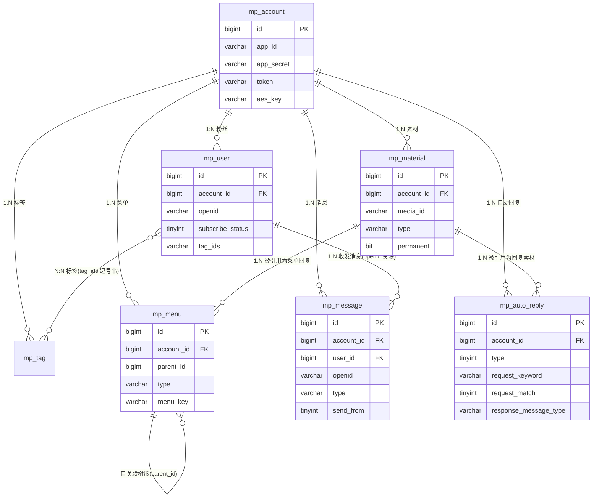
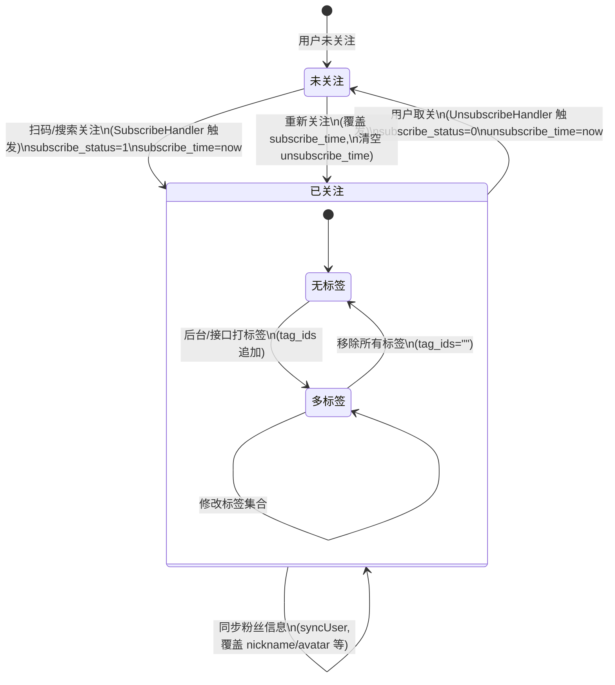
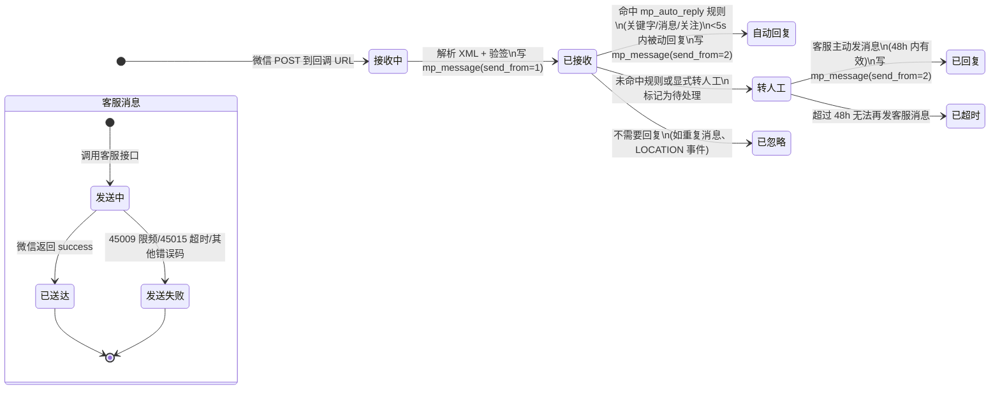
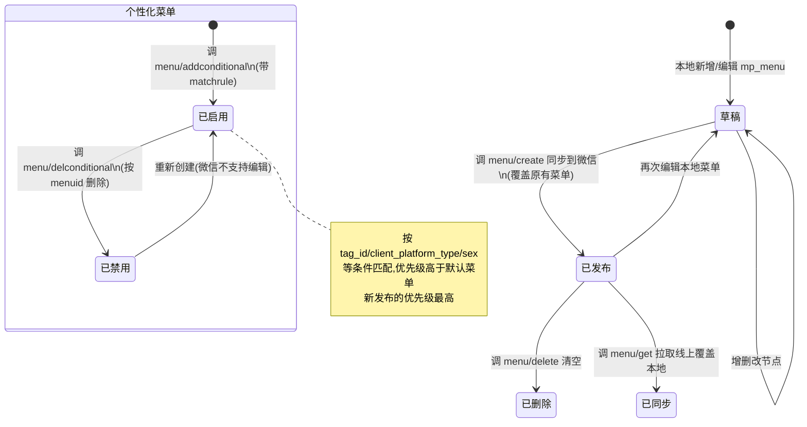
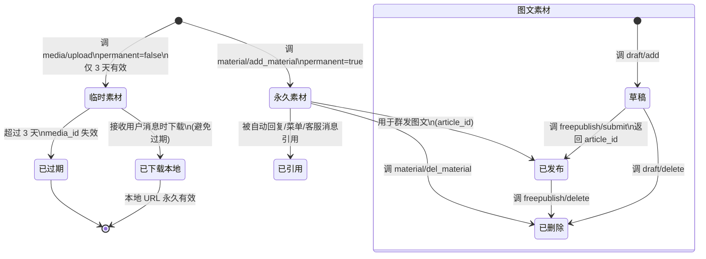
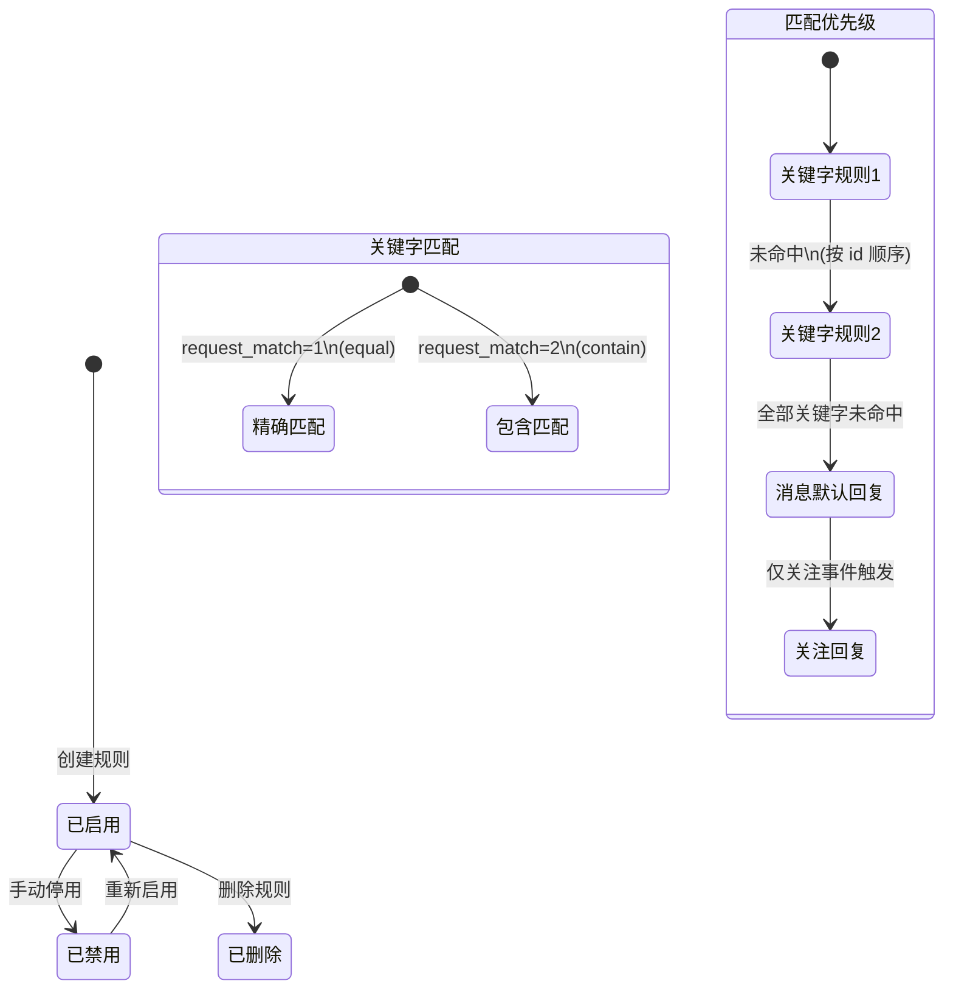
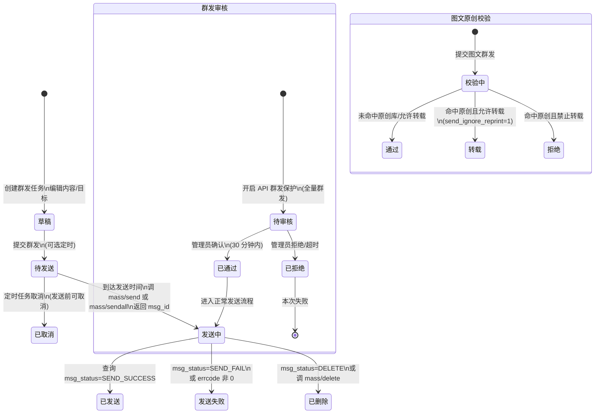
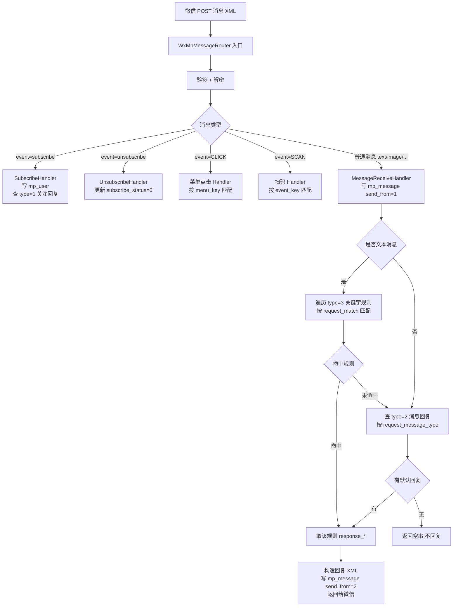

# 芋道 yudao 微信公众号(mp)模块功能分析报告

> 本报告基于芋道源码 yudao `yudao-module-mp` 模块(对应数据库脚本 `sql/mysql/mp-2024-05-29.sql`),并结合微信公众号官方文档、WxJava SDK 及同类开源项目(RuoYi-MP、WeJava)整理而成,用于指导在 Erupt 框架(注解驱动,Spring Boot + JPA)上实现等价功能。重点突出**数据状态流转**而非简单 CRUD。

---

## 1. 模块概述

### 1.1 模块定位

公众号模块是微信生态在本地的"投影",核心目标:把分散在微信服务器的运营资源(账号、粉丝、消息、素材、菜单、标签、自动回复)同步到本地数据库,既能可视化运营,也能补齐微信未提供的能力(如消息留存超过 3 天、自定义业务路由、统计二次加工)。

### 1.2 核心关系链

```
mp_account  →  mp_user / mp_material / mp_menu / mp_message / mp_tag / mp_auto_reply
   (账号)        (粉丝)    (素材)      (菜单)     (消息)      (标签)    (自动回复)
```

`mp_account` 是归属根节点,所有子表通过 `account_id` + `app_id` 双键关联(冗余 `app_id` 便于在 WxJava 上下文中直接路由)。

### 1.3 技术栈

| 层 | 技术 |
|---|---|
| 微信 SDK | WxJava `weixin-java-mp` (binarywang),yudao 使用 4.x 系列 |
| access_token 管理 | Redis 分布式存储 + 自动续期(7200s),集群下用 Redisson 分布式锁防并发刷新 |
| 消息路由 | `WxMpMessageRouter` 责任链,Handler 模式 |
| 消息加解密 | `WxMpCryptUtil`(基于 AES-CBC + sha1 签名) |
| 持久层 | MyBatis Plus(yudao)/ JPA + Hibernate(Erupt 实现) |
| 多租户 | `tenant_id` 字段透传 |

### 1.4 功能矩阵

| 模块 | 关键能力 | 微信侧限制 |
|---|---|---|
| 账号接入 | appid/secret/token/aeskey 配置,签名验证 | 每个公众号一套凭证 |
| 粉丝管理 | 关注/取关事件、列表同步、打标签、备注 | 接口不再返回头像昵称(2021-12-27 起) |
| 标签管理 | CRUD、同步、批量为粉丝打标签 | 每号最多 100 个标签 |
| 消息管理 | 接收、被动回复、客服消息(48h 内) | 客服消息仅限粉丝 48h 内有交互 |
| 菜单管理 | 默认菜单 + 个性化菜单,本地编辑后同步 | 一级 3 个、二级 5 个;个性化菜单不可编辑只能删除重建 |
| 素材管理 | 临时(3 天)/ 永久;图片、语音、视频、图文 | 永久图文上限 1,永久图片上限 5000 |
| 自动回复 | 关注回复、消息回复、关键字回复 | 匹配模式:contain / equal |
| 群发消息 | 图文/文本/图片/语音/视频群发 | 订阅号 1 次/天,服务号 4 次/月;图文需原创校验 |
| 数据统计 | 用户分析、图文分析、消息分析、接口分析 | 数据需次日 8 点后查询 |

---

## 2. 功能模块清单

| 序号 | 模块 | 子功能 | 关键表 | 关键服务类(yudao) |
|---|---|---|---|---|
| 1 | 公众号接入 | 账号配置、token 验证、接入校验 | `mp_account` | `MpAccountServiceImpl` |
| 2 | 粉丝管理 | 粉丝列表、同步、关注/取关、打标签、备注 | `mp_user` | `MpUserServiceImpl` |
| 3 | 标签管理 | 标签 CRUD、同步、批量打标签 | `mp_tag` | `MpTagServiceImpl` |
| 4 | 消息管理 | 接收消息、被动回复、客服消息、消息列表 | `mp_message` | `MpMessageServiceImpl` |
| 5 | 自动回复 | 关注回复、消息回复、关键字回复 | `mp_auto_reply` | `MpAutoReplyServiceImpl` |
| 6 | 菜单管理 | 默认菜单、个性化菜单、同步、发布 | `mp_menu` | `MpMenuServiceImpl` |
| 7 | 素材管理 | 临时素材上传、永久素材上传、图文素材、素材下载 | `mp_material` | `MpMaterialServiceImpl` |
| 8 | 群发消息 | 草稿、预览、按标签/全部/OpenID 列表群发、状态查询 | (yudao 未单独建表,走 `mp_message` + 微信 msg_id) | `MpMessageServiceImpl.sendMassMessage` |
| 9 | 数据统计 | 用户增减、累计用户、图文阅读、消息概况、接口分析 | (yudao 未落表,实时调用 datacube 接口) | `MpStatisticsServiceImpl` |
| 10 | 消息处理器 | 关注/取关/菜单点击/关键字/扫码/位置 | — | `service/handler/*` 包 |

### 2.1 yudao 与同类项目差异点

| 项目 | 持久层 | 群发表 | 统计落库 | 个性化菜单 |
|---|---|---|---|---|
| **yudao-mp** | MyBatis Plus | 无(直接调微信) | 无(实时查询) | 通过 `mp_menu` 树形 + matchrule 字段(实际仅做了默认菜单) |
| RuoYi-MP | MyBatis | 有 `mp_mass_news` | 有 `mp_statistics_*` | 有完整支持 |
| WeJava | JPA | 有 `mass_message` | 有 | 部分 |

> ⚠️ yudao 在群发与统计上未做本地持久化,生产实现时建议参考 RuoYi-MP 补表。

---

## 3. 核心实体与字段表

> 字段命名保留 yudao 原始下划线风格;公共审计字段(`creator/create_time/updater/update_time/deleted/tenant_id`)统一省略,实际表均有。

### 3.1 `mp_account` 公众号账号表

| 字段 | 类型 | 说明 |
|---|---|---|
| `id` | bigint PK | 主键 |
| `name` | varchar(100) | 公众号名称(展示用) |
| `account` | varchar(100) | 公众号微信号 |
| `app_id` | varchar(100) | 公众号 AppID |
| `app_secret` | varchar(100) | 公众号 AppSecret |
| `url` | varchar(100) | 服务器回调 URL(填入微信后台) |
| `token` | varchar(100) | 接入 Token(签名验证用) |
| `aes_key` | varchar(300) | 消息加解密 EncodingAESKey |
| `qr_code_url` | varchar(200) | 二维码图片 URL |
| `remark` | varchar(255) | 备注 |

### 3.2 `mp_user` 粉丝表

| 字段 | 类型 | 说明 |
|---|---|---|
| `id` | bigint PK | 主键 |
| `account_id` | bigint | 公众号账号编号 |
| `app_id` | varchar(128) | 公众号 AppID |
| `openid` | varchar(64) | 粉丝 OpenID(对当前公众号唯一) |
| `union_id` | varchar(64) | 微信生态唯一标识(需绑定开放平台) |
| `subscribe_status` | tinyint | 关注状态:0=未关注,1=已关注 |
| `subscribe_time` | datetime | 关注时间(多次关注取最后) |
| `unsubscribe_time` | datetime | 取关时间 |
| `nickname` | varchar(64) | 昵称(2021-12-27 后接口不返回,常为空) |
| `head_image_url` | varchar(1024) | 头像 URL(同上) |
| `language` | varchar(32) | 语言 zh_CN |
| `country` / `province` / `city` | varchar | 地区 |
| `remark` | varchar | 运营者备注 |
| `tag_ids` | varchar | 标签 ID 列表(逗号分隔,如 "1,2,3") |

> **设计要点**: 标签用 `tag_ids` 逗号串存储而非关联表,简化读、牺牲反向查询;`subscribe_status` 是粉丝状态机的核心字段。

### 3.3 `mp_tag` 标签表

| 字段 | 类型 | 说明 |
|---|---|---|
| `id` | bigint PK | 本地主键 |
| `account_id` | bigint | 账号编号 |
| `app_id` | varchar(128) | AppID |
| `name` | varchar | 标签名(≤30 字符) |
| `wx_tag_id` | bigint | 微信侧返回的 tag_id(同步用) |
| `count` | bigint | 该标签下粉丝数(同步快照) |

### 3.4 `mp_message` 消息表

| 字段 | 类型 | 说明 |
|---|---|---|
| `id` | bigint PK | 主键 |
| `msg_id` | bigint | 微信消息 ID(64 位,用于排重) |
| `account_id` | bigint | 账号编号 |
| `app_id` | varchar(128) | AppID |
| `user_id` | bigint | 本地粉丝 ID(关联 mp_user.id) |
| `openid` | varchar(64) | 粉丝 OpenID |
| `type` | varchar(32) | 消息类型:text/image/voice/video/shortvideo/location/link/event/music/news |
| `send_from` | tinyint | **发送方向**:1=粉丝发给公众号,2=公众号发给粉丝 |
| `content` | varchar(1024) | 文本内容 |
| `media_id` / `media_url` | varchar | 媒体 ID + 本地 URL |
| `recognition` | varchar | 语音识别文本(开启语音识别后) |
| `format` | varchar | 语音格式 amr/speex |
| `title` / `description` | varchar | 视频/链接标题与描述 |
| `thumb_media_id` / `thumb_media_url` | varchar | 缩略图 |
| `url` | varchar(500) | 链接 URL |
| `location_x` / `location_y` / `scale` / `label` | decimal/int/varchar | 地理位置 |
| `articles` | varchar(1024) | 图文数组(JSON) |
| `music_url` / `hq_music_url` | varchar | 音乐链接 |
| `event` | varchar | 事件类型:subscribe/unsubscribe/CLICK/SCAN/LOCATION/VIEW |
| `event_key` | varchar | 事件 KEY(菜单点击、扫码场景) |

> **设计要点**: 收发消息统一落一张表,用 `send_from` 区分方向;`type` 覆盖微信全部消息类型;事件也作为消息记录。这是后续会话窗口、客服回溯的关键。

### 3.5 `mp_auto_reply` 自动回复表

| 字段 | 类型 | 说明 |
|---|---|---|
| `id` | bigint PK | 主键 |
| `account_id` | bigint | 账号编号 |
| `app_id` | varchar(128) | AppID |
| `type` | tinyint | **回复类型**:1=关注回复,2=消息回复,3=关键字回复(参见 `MpAutoReplyTypeEnum`) |
| `request_keyword` | varchar(255) | 关键字(type=3 必填) |
| `request_match` | tinyint | **匹配模式**:1=精确匹配(equal),2=包含匹配(contain)(type=3 必填) |
| `request_message_type` | varchar(32) | 触发消息类型(type=2 必填,如 text/image) |
| `response_message_type` | varchar(32) | **回复消息类型**:TEXT/IMAGE/VOICE/VIDEO/NEWS/MUSIC |
| `response_content` | varchar(1024) | 回复文本内容 |
| `response_media_id` / `response_media_url` | varchar | 回复媒体 |
| `response_title` / `response_description` | varchar | 视频/音乐标题描述 |
| `response_thumb_media_id` / `response_thumb_media_url` | varchar | 音乐缩略图 |
| `response_articles` | varchar(1024) | 图文数组(JSON) |
| `response_music_url` / `response_hq_music_url` | varchar | 音乐链接 |

> **设计要点**: 一张表通过 `type` 区分三种回复;关键字匹配遵循"先关键字 → 消息 → 关注"的优先级,与微信官方自动回复规则一致。

### 3.6 `mp_material` 素材表

| 字段 | 类型 | 说明 |
|---|---|---|
| `id` | bigint PK | 主键 |
| `account_id` | bigint | 账号编号 |
| `app_id` | varchar(128) | AppID |
| `media_id` | varchar(128) | 微信素材 ID |
| `type` | varchar(32) | **素材类型**:image/voice/video/news |
| `permanent` | bit(1) | **是否永久**:true=永久,false=临时(3 天) |
| `url` | varchar(1024) | 本地文件服务器 URL(解决临时素材过期) |
| `mp_url` | varchar(1024) | 公众号侧 URL(仅永久素材有) |
| `name` | varchar(255) | 文件名 |
| `title` | varchar(255) | 视频标题(video 必填) |
| `introduction` | varchar(255) | 视频描述(video 必填) |

### 3.7 `mp_menu` 菜单表(树形)

| 字段 | 类型 | 说明 |
|---|---|---|
| `id` | bigint PK | 主键 |
| `account_id` | bigint | 账号编号 |
| `app_id` | varchar(128) | AppID |
| `parent_id` | varchar(32) | 父菜单 ID(树形,0=一级) |
| `name` | varchar(255) | 菜单名称 |
| `menu_key` | varchar(255) | 菜单 KEY(click 类型必填) |
| `type` | varchar(32) | **按钮类型**:click/view/scancode_push/scancode_waitmsg/pic_sysphoto/pic_photo_or_album/pic_weixin/location_select/media_id/article_id/article_view_limited/miniprogram |
| `url` | varchar(500) | 网页链接(view 必填) |
| `mini_program_app_id` | varchar(32) | 小程序 AppID(miniprogram 必填) |
| `mini_program_page_path` | varchar(200) | 小程序页面路径 |
| `article_id` | varchar(200) | 永久图文 article_id |
| `reply_*` (reply_message_type/reply_content/reply_media_id/reply_media_url/reply_title/reply_description/reply_thumb_media_id/reply_thumb_media_url/reply_articles/reply_music_url/reply_hq_music_url) | — | 点击菜单后的回复消息(同 mp_auto_reply 的 response_*) |

> **设计要点**: 菜单本身是树形结构,`parent_id` 自关联;yudao 实际未落"个性化菜单"的 matchrule 字段,生产实现需补 `matchrule` JSON 字段(包含 `tag_id`、`client_platform_type`、`sex`、`country`、`province`、`city`、`language` 等)。

### 3.8 补充表(Erupt 实现建议新增)

yudao 未持久化但生产必要,建议参考 RuoYi-MP 补:

#### `mp_mass_message` 群发消息表

| 字段 | 类型 | 说明 |
|---|---|---|
| `id` | bigint PK | 主键 |
| `account_id` | bigint | 账号编号 |
| `app_id` | varchar(128) | AppID |
| `type` | varchar(32) | 群发类型:mpnews/text/image/voice/music/video |
| `target_type` | tinyint | 目标:1=全部粉丝,2=按标签,3=按 OpenID 列表 |
| `target_tag_id` / `target_openids` | — | 目标参数 |
| `media_id` / `content` | — | 群发内容 |
| `wx_msg_id` | varchar(64) | 微信群发任务 ID |
| `status` | tinyint | **状态**:0=草稿,1=待发送,2=发送中,3=已发送,4=发送失败,5=已删除 |
| `send_time` | datetime | 实际发送时间 |
| `total_count` / `sent_count` / `fail_count` | int | 发送统计 |
| `errcode` / `errmsg` | — | 失败原因 |

---

## 4. 实体关系图



**业务链解读**:

- **配置链**: `mp_account` 提供 `app_id`/`app_secret` → WxJava 初始化 `WxMpService` → 调用微信 API
- **粉丝链**: 微信推送关注事件 → `SubscribeHandler` 写 `mp_user` → 粉丝发消息写 `mp_message`(关联 openid) → 触发 `mp_auto_reply` 匹配 → 回复写入 `mp_message`(send_from=2)
- **素材链**: 上传文件 → 调微信素材接口获 `media_id` → 写 `mp_material` → 被 `mp_auto_reply` / `mp_menu` / 客服消息 / 群发引用
- **菜单链**: 本地编辑 `mp_menu` 树 → 调 `menu/create` 同步 → 微信端生效

---

## 5. 状态流转图(重点)

### 5.1 粉丝状态流转



**关键状态机规则**:
- 关注与取关是微信**事件推送**驱动的,不能本地手动改状态
- `subscribe_status` 是状态字段,`subscribe_time`/`unsubscribe_time` 是时间戳,二者配合可还原完整生命周期
- 重新关注视为新一次"已关注",历史消息保留(通过 openid 关联)
- 标签是 `mp_user` 的子状态,用 `tag_ids` 逗号串表示多标签归属

### 5.2 消息状态流转



**关键状态机规则**:
- 微信消息重试:5s 内无响应会重试 3 次,需用 `msg_id` 排重
- 客服消息窗口:粉丝 48h 内有交互(发消息/点击菜单/扫码/支付)才能收到客服消息,否则返回 `45015`
- 被动回复和客服消息都落 `mp_message`(`send_from=2`),但调用接口不同:被动回复直接拼 XML 返回,客服消息调 `message/custom/send`
- `mp_message` 没有显式 `status` 字段,通过 `send_from` 和 `type` 隐式表达

### 5.3 菜单状态流转



**关键状态机规则**:
- 微信菜单 API 是"全量覆盖"语义,每次 `menu/create` 都会覆盖所有默认菜单
- 个性化菜单无法编辑,只能删除重建,且新发布的优先级最高
- 菜单匹配优先级:个性化菜单(按发布时间从新到旧) → 默认菜单 → 无菜单
- 菜单缓存约 5 分钟生效

### 5.4 素材状态流转



**关键状态机规则**:
- 临时素材 `media_id` 仅 3 天有效,但可复用;接收用户图片/语音/视频消息时需下载到本地,避免过期
- 永久素材上限:图片 5000、其他类型无上限,图文素材每个素材库最多 1 条(单图文可拆为多图文)
- 永久图文有独立的"草稿 → 发布"流程(微信 2022 年后),发布后获 `article_id`(区别于旧 `media_id`)
- `mp_material.url` 是本地文件服务器地址,`mp_material.mp_url` 是微信侧地址(仅永久素材有)

### 5.5 自动回复状态流转



**关键状态机规则**:
- 三种回复类型(`type`):1=关注回复(粉丝关注时)、2=消息回复(默认兜底)、3=关键字回复
- 匹配优先级遵循微信官方:关键字规则(按 id 顺序) → 消息默认回复 → 关注回复(仅关注事件)
- 匹配模式仅对关键字生效:contain(包含即可)、equal(严格相同)
- 同一类型在 yudao 中可有多条记录(关键字规则可多条,关注/消息回复各 1 条)

### 5.6 群发消息状态流转



**关键状态机规则**:
- 微信 `msg_status` 取值:`SEND_SUCCESS` / `SENDING` / `SEND_FAIL` / `DELETE`
- 订阅号每天 1 次群发,服务号每月 4 次(全量);按标签/OpenID 列表群发不计入次数上限
- 全量群发开启 API 保护时需管理员确认(30 分钟超时)
- 图文群发会先做原创校验,通过 `send_ignore_reprint` 控制转载行为
- 群发是异步过程,需轮询 `mass/get` 查询状态

---

## 6. 关键业务流程

### 6.1 公众号接入流程

```mermaid
flowchart TD
    A[后台填写 appid/secret/token/aeskey] --> B[生成回调 URL: /wx/mp/{app_id}/message]
    B --> C[在微信公众平台配置服务器 URL+Token+EncodingAESKey]
    C --> D{微信发起 GET 验证}
    D -->|signature+timestamp+nonce+echostr| E[服务端用 token+timestamp+nonce 计算 sha1]
    E --> F{比对 signature}
    F -->|一致| G[原样返回 echostr]
    F -->|不一致| H[返回 401]
    G --> I[接入成功,可接收消息]
    I --> J[初始化 WxMpService\n加载 WxMpConfigStorage 到 Redis]
```

### 6.2 粉丝同步流程

```mermaid
flowchart TD
    A[点击同步按钮] --> B{同步类型}
    B -->|全量| C[调 user/get 拉取 OpenID 列表\nnext_openid 分页,每次 1 万]
    C --> D[批量调 user/info/batchget\n按 OpenID 拉粉丝详情]
    D --> E[本地 upsert mp_user\n(按 openid 唯一)]
    B -->|增量| F[关注/取关事件触发\nSubscribeHandler/UnsubscribeHandler]
    F --> G[单条 upsert mp_user]
    E --> H[异步任务,完成提示]
    G --> H
```

### 6.3 消息处理流程(核心!)



### 6.4 菜单发布流程

```mermaid
flowchart TD
    A[后台树形编辑菜单] --> B[保存到 mp_menu\n(parent_id 构成树)]
    B --> C[点击"发布菜单"]
    C --> D[读取 mp_menu 树\n按 parent_id 组装 button 数组]
    D --> E{是否个性化菜单}
    E -->|否| F[调 menu/create\n全量覆盖默认菜单]
    E -->|是| G[组装 matchrule\n调 menu/addconditional]
    F --> H{微信返回 errcode=0}
    G --> H
    H -->|是| I[发布成功,5 分钟生效]
    H -->|否| J[提示错误,如 40019 菜单 key 冲突]
    
    K[点击"同步菜单"] --> L[调 menu/get 拉取线上]
    L --> M[覆盖本地 mp_menu]
```

### 6.5 群发流程

```mermaid
flowchart TD
    A[编辑群发内容\n(选素材/输入文本)] --> B[选择目标\n全部/标签/OpenID 列表]
    B --> C{立即发送还是定时}
    C -->|立即| D[调 mass/sendall 或 mass/send]
    C -->|定时| E[存入 mp_mass_message status=1\n定时任务触发]
    E --> D
    D --> F{图文消息}
    F -->|是| G[先做原创校验\nsend_ignore_reprint 控制]
    F -->|否| H[直接群发]
    G --> I[返回 msg_id\nstatus=2 发送中]
    H --> I
    I --> J[定时轮询 mass/get]
    J --> K{msg_status}
    K -->|SEND_SUCCESS| L[status=3 已发送\n记录 total/sent/fail]
    K -->|SEND_FAIL| M[status=4 失败\n记录 errmsg]
    K -->|DELETE| N[status=5 已删除]
```

---

## 7. 微信接口集成

### 7.1 WxJava 核心组件

| 组件 | 作用 |
|---|---|
| `WxMpService` | 总入口,持有 `WxMpConfigStorage`,提供各子 service |
| `WxMpConfigStorage` | 配置存储(内存/Redis),管理 access_token 自动刷新 |
| `WxMpMessageRouter` | 消息路由器,责任链模式分发消息到 Handler |
| `WxMpMessageHandler` | Handler 接口,业务实现(SubscribeHandler 等) |
| `WxMpCryptUtil` | 消息加解密(AES-CBC + sha1 签名) |
| `WxMpHttpClient` | HTTP 调用,内置重试 |

### 7.2 access_token 管理

- **有效期**: 7200 秒(2 小时),需提前刷新
- **缓存键**: `wx:mp:{appid}:access_token`(Redis)
- **刷新策略**: WxJava 内置 `WxMpDefaultConfigImpl` 自动刷新,集群下用 `WxMpRedisConfigImpl` 共享 token;刷新时用 Redisson 分布式锁防并发
- **二级缓存**: Caffeine(5s 本地) + Redis(微信官方时间),降低 Redis 访问压力
- **调用频次限制**: 测试号 200 次/天,正式号 2000 次/天,超出返回 `45009`

### 7.3 接口调用频次限制(关键)

| 接口 | 上限 |
|---|---|
| 获取 access_token | 2000 次/天(正式) |
| 自定义菜单创建 | 100 次/天 |
| 自定义菜单查询 | 1000 次/天 |
| 获取关注者列表 | 100 次/天 |
| 高级群发接口 | 100 次/天 |
| 上传图文素材 | 10 次/天 |
| 临时素材上传 | 500 次/天 |
| 临时素材下载 | 1000 次/天 |
| 客服消息 | 100 次/天(参考) |

### 7.4 消息加解密与签名验证

**接入签名验证(GET)**:
```
signature = sha1(sort([token, timestamp, nonce]))
比对微信传入的 signature,一致则原样返回 echostr
```

**消息加解密(POST,明文/兼容/安全模式)**:
- 明文模式: 不加解密
- 兼容模式: 明文+密文同时发送
- 安全模式: 全密文,AES-CBC 加密,EncodingAESKey 作为密钥来源
- WxJava 通过 `WxMpCryptUtil` 自动处理,业务层只感知解密后的 XML/JSON

### 7.5 关键微信 API 端点

| 功能 | API | 方法 |
|---|---|---|
| 获取 access_token | `/cgi-bin/token` | GET |
| 接收消息 | 业务方回调 URL | POST(XML) |
| 被动回复 | 直接返回 XML | — |
| 客服消息 | `/cgi-bin/message/custom/send` | POST |
| 群发(全部) | `/cgi-bin/message/mass/sendall` | POST |
| 群发(OpenID) | `/cgi-bin/message/mass/send` | POST |
| 群发状态查询 | `/cgi-bin/message/mass/get` | POST |
| 自定义菜单创建 | `/cgi-bin/menu/create` | POST |
| 个性化菜单创建 | `/cgi-bin/menu/addconditional` | POST |
| 菜单查询 | `/cgi-bin/menu/get` | GET |
| 临时素材上传 | `/cgi-bin/media/upload` | POST |
| 永久素材上传 | `/cgi-bin/material/add_material` | POST |
| 草稿箱新增 | `/cgi-bin/draft/add` | POST |
| 发布图文 | `/cgi-bin/freepublish/submit` | POST |
| 用户列表 | `/cgi-bin/user/get` | GET |
| 用户信息 | `/cgi-bin/user/info` | GET |
| 标签创建 | `/cgi-bin/tags/create` | POST |
| 数据统计 | `/datacube/*` | POST |

---

## 8. Erupt 实现建议

### 8.1 总体映射策略

| yudao 概念 | Erupt 实现 |
|---|---|
| `*DO` 实体 | `@Erupt` 注解的 JPA `@Entity` |
| `*ServiceImpl` | 普通 `@Service`,在 Erupt 中通过 `@EruptField` + `@RowOperation` 触发 |
| MyBatis Plus 条件构造 | JPA `Specification` 或 `@EruptField(search = @Search(...))` |
| 多租户 `tenant_id` | Erupt 内置 `@DataFilter` 或 JPA 拦截器 |
| 树形菜单 `parent_id` | Erupt `@Tree` + `@EruptField(reference = @Reference(...))` |

### 8.2 账号管理(`@Erupt` 基础示例)

```java
@Erupt(name = "公众号账号")
@Table(name = "mp_account")
@Entity
public class MpAccount extends BaseModel {

    @EruptField(views = @View(title = "名称"), edit = @Edit(title = "名称", notNull = true))
    private String name;

    @EruptField(views = @View(title = "微信号"), edit = @Edit(title = "微信号"))
    private String account;

    @EruptField(views = @View(title = "AppID"), edit = @Edit(title = "AppID", notNull = true))
    private String appId;

    @EruptField(views = @View(title = "AppSecret"),
                edit = @Edit(title = "AppSecret", inputType = @InputType(password = true)))
    private String appSecret;

    @EruptField(views = @View(title = "Token"), edit = @Edit(title = "Token"))
    private String token;

    @EruptField(views = @View(title = "EncodingAESKey"), edit = @Edit(title = "EncodingAESKey"))
    private String aesKey;

    @EruptField(views = @View(title = "二维码"), edit = @Edit(title = "二维码",
                inputType = @InputType(imageType = @ImageType)))
    private String qrCodeUrl;

    @EruptField(views = @View(title = "备注"), edit = @Edit(title = "备注"))
    private String remark;

    // 自定义操作:生成接入 URL + 测试连通性
    @RowOperation(
        code = "testConnect", title = "测试接入",
        icon = "fa fa-plug",
        operationMethod = OperationMethod.POST
    )
    public String testConnect(Long id) { ... }
}
```

### 8.3 粉丝状态用 `@ChoiceType`

```java
@Erupt(name = "粉丝管理")
@Table(name = "mp_user")
@Entity
public class MpUser extends BaseModel {

    @EruptField(views = @View(title = "OpenID"), edit = @Edit(title = "OpenID", show = false))
    private String openid;

    @EruptField(
        views = @View(title = "关注状态",
                      vt = @ViewType(prop = "color", value = "1=green:已关注|0=gray:未关注")),
        edit = @Edit(title = "关注状态", search = @Search,
                     inputType = @InputType(
                         choiceType = @ChoiceType(
                             type = ChoiceEnum.RADIO,
                             options = {@Option(label = "已关注", value = "1"),
                                        @Option(label = "未关注", value = "0")}
                         )))
    )
    private Integer subscribeStatus;

    @EruptField(views = @View(title = "标签"), edit = @Edit(title = "标签",
                inputType = @InputType(choiceType = @ChoiceType(
                    type = ChoiceEnum.CHECKBOX,
                    fetchHandler = TagChoiceFetchHandler.class  // 动态拉取 mp_tag
                ))))
    private String tagIds;  // "1,2,3"

    // 行操作:同步该粉丝信息
    @RowOperation(code = "syncUser", title = "同步粉丝", icon = "fa fa-refresh")
    public String syncUser(Long id) { ... }
}
```

### 8.4 消息类型用 `@ChoiceType`

```java
@Erupt(name = "消息管理")
@Table(name = "mp_message")
@Entity
public class MpMessage extends BaseModel {

    @EruptField(
        views = @View(title = "消息类型"),
        edit = @Edit(title = "消息类型", search = @Search,
                     inputType = @InputType(
                         choiceType = @ChoiceType(options = {
                             @Option(label = "文本", value = "text"),
                             @Option(label = "图片", value = "image"),
                             @Option(label = "语音", value = "voice"),
                             @Option(label = "视频", value = "video"),
                             @Option(label = "小视频", value = "shortvideo"),
                             @Option(label = "地理位置", value = "location"),
                             @Option(label = "链接", value = "link"),
                             @Option(label = "事件", value = "event"),
                             @Option(label = "音乐", value = "music"),
                             @Option(label = "图文", value = "news")
                         })))
    )
    private String type;

    @EruptField(
        views = @View(title = "发送方"),
        edit = @Edit(title = "发送方", search = @Search,
                     inputType = @InputType(
                         choiceType = @ChoiceType(options = {
                             @Option(label = "粉丝→公众号", value = "1"),
                             @Option(label = "公众号→粉丝", value = "2")
                         })))
    )
    private Integer sendFrom;
}
```

### 8.5 自动回复规则用 `@TabTree`(关键字分类树)

```java
@Erupt(name = "自动回复", tree = @Tree(id = "id", label = "requestKeyword", pid = "parentId"))
@Table(name = "mp_auto_reply")
@Entity
public class MpAutoReply extends BaseModel {

    @EruptField(views = @View(title = "回复类型"), edit = @Edit(title = "回复类型", search = @Search,
                inputType = @InputType(choiceType = @ChoiceType(options = {
                    @Option(label = "关注回复", value = "1"),
                    @Option(label = "消息回复", value = "2"),
                    @Option(label = "关键字回复", value = "3")
                }))))
    private Integer type;

    @EruptField(views = @View(title = "关键字"), edit = @Edit(title = "关键字"))
    private String requestKeyword;

    @EruptField(views = @View(title = "匹配模式"), edit = @Edit(title = "匹配模式",
                inputType = @InputType(choiceType = @ChoiceType(options = {
                    @Option(label = "精确匹配", value = "1"),
                    @Option(label = "包含匹配", value = "2")
                }))))
    private Integer requestMatch;

    @EruptField(views = @View(title = "回复类型"), edit = @Edit(title = "回复类型",
                inputType = @InputType(choiceType = @ChoiceType(options = {
                    @Option(label = "文本", value = "TEXT"),
                    @Option(label = "图片", value = "IMAGE"),
                    @Option(label = "语音", value = "VOICE"),
                    @Option(label = "视频", value = "VIDEO"),
                    @Option(label = "图文", value = "NEWS"),
                    @Option(label = "音乐", value = "MUSIC")
                }))))
    private String responseMessageType;

    // 素材选择:联动 mp_material
    @EruptField(views = @View(title = "回复素材"), edit = @Edit(title = "回复素材",
                inputType = @InputType(referenceTable = @ReferenceTable(table = MpMaterial.class))))
    private String responseMediaId;
}
```

### 8.6 菜单树用 `@Tree`

```java
@Erupt(name = "公众号菜单", tree = @Tree(id = "id", label = "name", pid = "parentId", sort = "sort"))
@Table(name = "mp_menu")
@Entity
public class MpMenu extends BaseModel {

    @EruptField(views = @View(title = "菜单名称"), edit = @Edit(title = "菜单名称", notNull = true))
    private String name;

    @EruptField(views = @View(title = "按钮类型"), edit = @Edit(title = "按钮类型",
                inputType = @InputType(choiceType = @ChoiceType(options = {
                    @Option(label = "点击推事件", value = "click"),
                    @Option(label = "跳转网页", value = "view"),
                    @Option(label = "扫码推事件", value = "scancode_push"),
                    @Option(label = "扫码等待", value = "scancode_waitmsg"),
                    @Option(label = "系统拍照", value = "pic_sysphoto"),
                    @Option(label = "拍照或相册", value = "pic_photo_or_album"),
                    @Option(label = "微信相册", value = "pic_weixin"),
                    @Option(label = "发送位置", value = "location_select"),
                    @Option(label = "下发素材", value = "media_id"),
                    @Option(label = "跳转图文", value = "article_id"),
                    @Option(label = "跳转小程序", value = "miniprogram")
                }))))
    private String type;

    @EruptField(views = @View(title = "父菜单"), edit = @Edit(title = "父菜单",
                inputType = @InputType(referenceTable = @ReferenceTable(table = MpMenu.class))))
    private Long parentId;

    // 顶级操作:发布到微信 / 同步到本地
    @RowOperation(code = "publishMenu", title = "发布到微信", icon = "fa fa-cloud-upload",
                  operationMethod = OperationMethod.POST)
    public String publishMenu(Long accountId) { ... }

    @RowOperation(code = "syncMenu", title = "从微信同步", icon = "fa fa-cloud-download",
                  operationMethod = OperationMethod.POST)
    public String syncMenu(Long accountId) { ... }
}
```

### 8.7 素材上传用 Erupt 文件组件

```java
@Erupt(name = "素材管理")
@Table(name = "mp_material")
@Entity
public class MpMaterial extends BaseModel {

    @EruptField(views = @View(title = "类型"), edit = @Edit(title = "类型", search = @Search,
                inputType = @InputType(choiceType = @ChoiceType(options = {
                    @Option(label = "图片", value = "image"),
                    @Option(label = "语音", value = "voice"),
                    @Option(label = "视频", value = "video"),
                    @Option(label = "图文", value = "news")
                }))))
    private String type;

    @EruptField(views = @View(title = "是否永久"), edit = @Edit(title = "是否永久",
                inputType = @InputType(boolType = @BoolType(trueText = "永久", falseText = "临时"))))
    private Boolean permanent;

    @EruptField(views = @View(title = "文件"), edit = @Edit(title = "上传文件",
                inputType = @InputType(attachmentType = @AttachmentType)))
    private String url;

    // 行操作:上传到微信
    @RowOperation(code = "uploadToWx", title = "上传到微信", icon = "fa fa-upload",
                  operationMethod = OperationMethod.POST)
    public String uploadToWx(Long id) {
        // 调 WxJava media/upload 或 material/add_material
        // 回写 media_id / mp_url
    }
}
```

### 8.8 群发状态用 `@RowOperation`

```java
@Erupt(name = "群发消息")
@Table(name = "mp_mass_message")
@Entity
public class MpMassMessage extends BaseModel {

    @EruptField(views = @View(title = "状态",
                              vt = @ViewType(prop = "color",
                                             value = "0=gray:草稿|1=blue:待发送|2=orange:发送中|3=green:已发送|4=red:失败|5=gray:已删除")),
                edit = @Edit(title = "状态", search = @Search,
                             inputType = @InputType(choiceType = @ChoiceType(options = {
                                 @Option(label = "草稿", value = "0"),
                                 @Option(label = "待发送", value = "1"),
                                 @Option(label = "发送中", value = "2"),
                                 @Option(label = "已发送", value = "3"),
                                 @Option(label = "发送失败", value = "4"),
                                 @Option(label = "已删除", value = "5")
                             }))))
    private Integer status;

    @RowOperation(code = "preview", title = "预览", icon = "fa fa-eye")
    public String preview(Long id) { ... }

    @RowOperation(code = "send", title = "立即群发", icon = "fa fa-paper-plane",
                  operationMethod = OperationMethod.POST,
                  // 仅在草稿/失败状态显示
                  show = @Show(ifExpr = "status == 0 || status == 4"))
    public String send(Long id) { ... }

    @RowOperation(code = "cancel", title = "取消定时", icon = "fa fa-times",
                  show = @Show(ifExpr = "status == 1"))
    public String cancel(Long id) { ... }

    @RowOperation(code = "queryStatus", title = "查询状态", icon = "fa fa-search",
                  show = @Show(ifExpr = "status == 2"))
    public String queryStatus(Long id) { ... }
}
```

### 8.9 Erupt 实现注意事项

1. **WxJava 集成**: 在 Erupt 项目 `pom.xml` 加 `weixin-java-mp` 依赖,通过 `@Configuration` 注册 `WxMpService` Bean,配置存储用 `WxMpRedisConfigImpl`(需引入 Redis)
2. **回调入口**: Erupt 无需控制器即可 CRUD,但微信回调必须自建 `@RestController`,路径建议 `/wx/mp/{appId}/message`,在 `MpAccountService` 中按 `appId` 查询配置并 `switchover`
3. **异步同步**: 粉丝同步、群发等长任务用 Erupt Job(`erupt-job` 模块,基于 Quartz)异步执行,避免请求超时
4. **多租户**: yudao 的 `tenant_id` 在 Erupt 中可用 `@DataFilter` 注解自动注入查询条件
5. **逻辑删除**: yudao 用 `deleted bit(1)`,Erupt 可用 `@LogicDelete` 或 JPA `@Where(clause = "deleted = 0")`
6. **状态字段联动**: `@RowOperation` 的 `show` 属性可实现"仅特定状态显示操作按钮",配合 `operationMethod = POST` 做状态推进
7. **H2 兼容**: 本项目用 H2 数据库,`bit(1)` 类型在 H2 中用 `Boolean` + `@Column(columnDefinition = "boolean")` 即可
8. **消息路由器初始化**: 应用启动时遍历 `mp_account` 注册 `WxMpConfigStorage`,并构建 `WxMpMessageRouter` 注入所有 Handler

---

## 9. 参考来源

### 9.1 yudao 源码与文档

- yudao 公众号模块数据库详细版: https://blog.hellocode.vip/36.%E5%90%8E%E7%AB%AF/0.%E8%8A%8B%E9%81%93/%E8%A1%A8/%E6%8C%89%E6%A8%A1%E5%9D%97%E8%AF%A6%E7%BB%86%E7%89%88/09-%E5%85%AC%E4%BC%97%E5%8F%B7-%E8%AF%A6%E7%BB%86%E7%89%88
- yudao 公众号标签文档: https://blog.thatcoder.cn/wiki/YuDaoBoot/%E5%85%AC%E4%BC%97%E5%8F%B7%E6%89%8B%E5%86%8C/%E5%85%AC%E4%BC%97%E5%8F%B7%E6%A0%87%E7%AD%BE/%E5%85%AC%E4%BC%97%E5%8F%B7%E6%A0%87%E7%AD%BE.html
- yudao 公众号粉丝/消息文档: https://note.lazzman.com:18084/project-1/doc-1017/ , https://note.lazzman.com:18084/project-1/doc-1019/
- yudao 公众号素材文档: https://note.lazzman.com:18084/project-1/doc-1022/
- yudao-cloud GitHub: https://github.com/YunaiV/yudao-cloud
- yudao ruoyi-vue-pro GitHub: https://github.com/YunaiV/ruoyi-vue-pro
- yudao 接口文档(Apifox): https://s.apifox.cn/bcb2c9cd-0a05-409e-b705-fa68e07758fb

### 9.2 微信官方文档

- 公众号开发入门: https://developers.weixin.qq.com/doc/offiaccount/Getting_Started.html
- 接收普通消息: https://developers.weixin.qq.com/doc/offiaccount/Message_Management/Receiving_standard_messages.html
- 接收事件推送: https://developers.weixin.qq.com/doc/offiaccount/Message_Management/Receiving_event_pushes.html
- 被动回复用户消息: https://developers.weixin.qq.com/doc/offiaccount/Message_Management/Passive_user_reply_message.html
- 客服消息: https://developers.weixin.qq.com/doc/offiaccount/Message_Management/Service_Center_messages.html
- 用户标签管理: https://developers.weixin.qq.com/doc/offiaccount/User_Management/User_Tag_Management.html
- 获取用户列表: https://developers.weixin.qq.com/doc/offiaccount/User_Management/Getting_a_User_List.html
- 获取用户基本信息: https://developers.weixin.qq.com/doc/subscription/api/usermanage/userinfo/api_userinfo
- 自定义菜单创建: https://developers.weixin.qq.com/doc/service/api/custommenu/api_createcustommenu
- 获取自定义菜单: https://developers.weixin.qq.com/doc/subscription/api/custommenu/api_getmenu.html
- 永久素材: https://developers.weixin.qq.com/doc/offiaccount/Asset_Management/Adding_Permanent_Assets.html
- 临时素材: https://developers.weixin.qq.com/doc/offiaccount/Asset_Management/New_temporary_materials.html
- 获取永久素材列表: https://developers.weixin.qq.com/doc/service/api/material/permanent/api_batchgetmaterial.html
- 群发消息(根据 OpenID): https://developers.weixin.qq.com/doc/service/api/notify/message/api_masssend.html
- 查询群发状态: https://developers.weixin.qq.com/doc/service/api/notify/message/api_massmsgget.html
- 获取自动回复规则: https://developers.weixin.qq.com/doc/subscription/api/notify/autoreplies/api_getcurrentautoreplyinfo
- 数据统计接口: https://developers.weixin.qq.com/doc/subscription/guide/product/analysis_data/analysis_data.html

### 9.3 WxJava SDK

- WxJava GitHub: https://github.com/binarywang/WxJava
- WxJava 配置管理最佳实践: https://blog.csdn.net/gitblog_00714/article/details/156922627
- RuoYi-Plus 公众号集成(参考实现): https://ruoyi.plus/backend/common/mp.html

### 9.4 同类开源项目

- WeJava / WxJava 示例: https://github.com/binarywang/WxJava
- RuoYi-MP(若依公众号增强版)
- 微擎 account_wechats 表结构参考: https://www.kancloud.cn/tieniuweb/we7web/1430752
- 阿里云 Quick Audience 公众号菜单: https://help.aliyun.com/zh/document_detail/2928320.html

---

## 附录 A:状态字段速查表

| 实体 | 状态字段 | 取值 | 触发方式 |
|---|---|---|---|
| `mp_user` | `subscribe_status` | 0=未关注,1=已关注 | 微信事件推送 |
| `mp_message` | `send_from` | 1=粉丝→公众号,2=公众号→粉丝 | 接收/发送时写入 |
| `mp_material` | `permanent` | true=永久,false=临时 | 上传时确定 |
| `mp_auto_reply` | `type` | 1=关注,2=消息,3=关键字 | 创建时确定 |
| `mp_auto_reply` | `request_match` | 1=精确,2=包含 | 创建时确定 |
| `mp_menu` | (无显式状态) | 草稿/已发布(隐式) | 同步到微信后视为已发布 |
| `mp_mass_message` | `status` | 0/1/2/3/4/5 | 状态机推进 |
| 群发(微信侧) | `msg_status` | SENDING/SEND_SUCCESS/SEND_FAIL/DELETE | 微信异步返回 |

## 附录 B:本项目(Erupt)落地优先级

| 优先级 | 模块 | 说明 |
|---|---|---|
| P0 | 账号管理 + 接入验证 | 一切的基础 |
| P0 | 消息接收 + 被动回复 | 核心交互闭环 |
| P1 | 粉丝管理 + 标签 | 状态机最完整,适合先做 |
| P1 | 素材管理(永久) | 自动回复/菜单依赖 |
| P1 | 自动回复(关键字) | 业务高频 |
| P2 | 菜单管理(默认) | 编辑体验要求高 |
| P2 | 客服消息 | 48h 窗口需注意 |
| P3 | 个性化菜单 | 需补 matchrule 字段 |
| P3 | 群发消息 | 需补 `mp_mass_message` 表 |
| P3 | 数据统计 | 实时调微信 datacube 即可,无需落表 |
