# WMS 模块功能分析报告（基于主流开源 WMS 项目研究）

> 本报告基于对若依 wms-ruoyi（zccbbg/wms-ruoyi）、RuoYi-WMS-Vue、Trailer98/wms-system、vivibro/iWMS、openwms.org 等开源 WMS 项目源码与文档，以及海外仓 WMS、菜鸟智能仓储、医药 GSP-WMS 等行业实践的对照研究，重点剖析**数据状态流转（状态机）**与**库存四态模型**，并给出在 Erupt 框架（注解驱动，Spring Boot + JPA）上的落地建议。
> 报告目标读者：在 Erupt 上实现 WMS（仓储管理系统）模块的开发者。
> 芋道 yudao **没有独立的 WMS 模块**，仅有 `yudao-module-erp` 下的简易库存（erp_stock / erp_stock_record），本报告在功能对照时会与 erp 库存模块对比，说明 WMS 的独立价值。

---

## 1. 模块概述

### 1.1 WMS 与 yudao-erp 库存模块的本质差异

WMS（Warehouse Management System）与 ERP 的库存模块（stock）虽都涉及"库存"，但关注点完全不同：

| 维度 | yudao-erp `stock` 模块 | WMS 仓储管理系统 |
|---|---|---|
| **关注粒度** | 产品 + 仓库（2 维） | 产品 + 仓库 + 库区 + 库位 + 批次 + 序列号（6+ 维） |
| **库存状态** | 仅 `count`（可用单一态） | 可用 / 锁定 / 在途 / 冻结（四态） |
| **入库流程** | 采购入库审批即增库存（一步） | ASN → 收货 → 质检 → 上架（四步状态机） |
| **出库流程** | 销售出库审批即减库存（一步） | 通知 → 分配 → 波次 → 拣货 → 复核 → 打包 → 发货（七步状态机） |
| **库内作业** | 仅调拨、盘点 | 调拨、移库、补货、盘点、冻结/解冻、加工、批次转移 |
| **策略引擎** | 无 | 上架策略、分配策略（FIFO/LIFO/FEFO）、波次策略、补货策略 |
| **物理位置** | 仓库档案无层级 | 仓库 → 库区 → 货架 → 库位（树形 + 坐标） |
| **设备对接** | 无 | PDA、扫码枪、AGV、输送线、WCS |
| **典型用户** | 中小商贸企业 | 3PL、电商仓、海外仓、医药/食品冷库 |

**结论**：ERP 的 stock 模块解决"账面库存"问题，WMS 解决"实物在仓库哪个位置、处于什么状态、按什么策略流转"问题。两者是互补关系：WMS 上架/发货产生的库存变动可上抛 ERP 形成库存流水与成本核算。

### 1.2 主流开源 WMS 项目对照

| 项目 | 技术栈 | 状态机复杂度 | 库存模型 | 多租户 | 多仓库/库区 | 备注 |
|---|---|---|---|---|---|---|
| **若依 wms-ruoyi** | Spring Boot + MyBatis + Vue2/Vue3 | **极简**（暂存/作废/完成） | 单态 count | ✅ | lite 单仓 / advance 多仓多库区 | 文档完善，代码结构清晰，最易上手 |
| **RuoYi-WMS-Vue** | Spring Boot + Vue3 + Element Plus | 极简 | 单态 | ✅ | 多仓多库区 | wms-ruoyi 的前端工程 |
| **vivibro/iWMS** | Spring Boot 3 + MyBatis-Plus + Vue3 | 中 | 多态（可用/锁定） | ✅ 多租户 | 多仓 | 智能仓储，多租户架构 |
| **Trailer98/wms-system** | Spring Boot 3 + 微服务 + Nacos + pgvector | 中 | 多态 | ✅ | 多仓 | 微服务架构，含 AI 知识库 |
| **openwms.org** | Java + Spring Boot | 复杂（国际标准） | 多态 | 部分 | 多仓多库区 | 国际开源，OSCommOS 体系 |
| **金蝶云星空 WMS / 用友 U8 WMS / SAP EWM** | 商用 | **极复杂**（行状态 + 头状态 + 暂存/提交/审核/作废 + 执行状态） | 四态 + 批次 + 序列号 | ✅ | 多仓多库区 | 企业级标杆 |
| **yudao-erp stock**（对比） | Spring Boot + MyBatis Plus | 极简（10/20 审批态） | 单态 | ✅ | 单仓 | 非真正 WMS |

### 1.3 关键发现（重要）

> **若依 wms-ruoyi 的状态机也是极简的**（暂存 / 作废 / 完成入库、完成出库、完成移库、完成盘库），与完整 WMS 状态机相差甚远。完整的 WMS 应该有：
> - **入库四张单据**：ASN（入库通知）→ 收货单 → 质检单 → 上架单，各自独立状态机
> - **出库多张单据**：出库通知单 → 波次 → 拣货单 → 复核单 → 打包单 → 发货单
> - **库存四态**：可用 / 锁定 / 在途 / 冻结
> - **执行状态派生**：通过 `received_count` / `putaway_count` / `picked_count` / `shipped_count` 与 `total_count` 比较得出"未执行 / 部分执行 / 全部执行"
>
> 本报告在「状态流转图」部分同时给出：**A. wms-ruoyi 实际状态机**（极简）与 **B. 完整 WMS 状态机**（行业标准，含 ASN/收货/质检/上架/波次/拣货/复核/打包/发货全链路），供 Erupt 实现时按需选择复杂度。

---

## 2. 功能模块清单（完整覆盖）

### 2.1 基础数据（主数据）

| 模块 | 表 | 说明 | 关键字段 |
|---|---|---|---|
| 仓库管理 | `wms_warehouse` | 多仓库，含负责人、地址、状态 | code, name, address, manager_id, status |
| 库区管理 | `wms_zone` | 存储区/拣货区/退货区/收货区/质检区/不合格品区 | warehouse_id, code, name, type, status |
| 库位管理 | `wms_location` | 货架-层-位，含 ABC 分类、容量、坐标 | zone_id, code, row, bay, level, abc_class, capacity, x, y, status |
| 托盘/容器管理 | `wms_container` | 托盘、周转箱、笼车，含状态与当前库位 | code, type, capacity, status, current_location_id |
| 商品管理 | `wms_sku` | SKU + 条码 + 规格 + 批次/保质期控制 | code, barcode, name, spec, weight, volume, is_batch, is_expiry, shelf_days |
| 商品分类 | `wms_sku_category` | 树形（pid 自关联） | name, parent_id, status |
| 计量单位 | `wms_uom` + `wms_sku_uom` | 基本单位和辅助单位换算 | sku_id, uom, ratio, is_base |
| 供应商 | `wms_supplier` | 采购往来单位 | name, contact, mobile, status |
| 客户 | `wms_customer` | 销售往来单位 | name, contact, mobile, status |
| 承运商 | `wms_carrier` | 物流承运商 | name, code, contact, type |

### 2.2 入库管理（四单据链路）

| 模块 | 表 | 说明 | 状态字段 |
|---|---|---|---|
| 入库通知单 ASN | `wms_asn` / `wms_asn_line` | 上游预报，告诉仓库"将要来什么" | status + received_count + putaway_count |
| 收货单 | `wms_receipt` / `wms_receipt_line` | 实物收货结果，支持多次收货 | status + received_qty |
| 质检单 | `wms_quality` / `wms_quality_line` | 来料/在库质检，记录合格/不合格 | status + qualified_qty + unqualified_qty |
| 上架单 | `wms_putaway` / `wms_putaway_line` | 推荐库位 + 实际上架 | status + putaway_qty |
| 入库类型 | 枚举 | 采购入库/生产入库/退货入库/调拨入库/赠品入库/盘盈入库 | biz_type |

### 2.3 出库管理（多单据链路）

| 模块 | 表 | 说明 | 状态字段 |
|---|---|---|---|
| 出库通知单 | `wms_shipment` / `wms_shipment_line` | OMS/ERP 推送的出库需求 | status + allocated_count + picked_count + shipped_count |
| 波次 | `wms_wave` / `wms_wave_line` | 订单聚合，按规则组波 | status + pick_count |
| 拣货单 | `wms_pick` / `wms_pick_line` | 拣货任务，含库位、数量、批次 | status + picked_qty |
| 复核单 | `wms_check_out` | 拣货后复核校验 | status |
| 打包单 | `wms_pack` | 装箱、称重、贴标 | status + weight + volume + box_no |
| 发货单 | `wms_delivery` | 出库交接承运商 | status + ship_time + carrier + tracking_no |
| 出库类型 | 枚举 | 销售出库/领料出库/退货出库/调拨出库/报损出库/盘亏出库 | biz_type |

### 2.4 库存管理（核心）

| 模块 | 表 | 说明 | 状态字段 |
|---|---|---|---|
| 库存余额 | `wms_stock` | 多维：sku + warehouse + zone + location + batch + lot | available / locked / in_transit / frozen |
| 库存流水 | `wms_stock_move` | 每笔出入库的明细，含 biz_type + biz_id | (无状态字段，append-only) |
| 库存快照 | `wms_stock_snapshot` | 按日/月冻结，用于月结报表 | snapshot_date, count, cost |
| 批次表 | `wms_stock_batch` | 批次号 + 生产日期 + 过期日期 + 状态 | batch_no, production_date, expiry_date, qty_remaining |
| 序列号表 | `wms_stock_serial` | 一物一码追踪 | serial_no, sku_id, status (在库/出库/退货) |
| 库存预警 | `wms_stock_warning` | 安全库存上下限、临期预警 | sku_id, warehouse_id, min_qty, max_qty, warning_date |

### 2.5 调拨管理

| 模块 | 表 | 说明 | 状态字段 |
|---|---|---|---|
| 库内调拨（移库） | `wms_transfer` / `wms_transfer_line` | 同仓库位间转移 | status + from_location + to_location |
| 跨仓调拨 | `wms_transfer` / `wms_transfer_line` | 跨仓库转移，含在途 | status + from_warehouse + to_warehouse + in_transit_qty |

### 2.6 盘点管理

| 模块 | 表 | 说明 | 状态字段 |
|---|---|---|---|
| 盘点计划 | `wms_check_plan` | 周期盘点/循环盘点/全盘计划 | status |
| 盘点单 | `wms_check` / `wms_check_line` | 明盘/盲盘、静态/动态 | status + stock_count + actual_count + diff_count |
| 盘点差异 | `wms_check_diff` | 差异明细，需审批 | status + diff_qty + reason |
| 盘盈入库/盘亏出库 | 走 `wms_stock_move` 流水 | 审批通过生成流水 | - |

### 2.7 质检管理

| 模块 | 表 | 说明 | 状态字段 |
|---|---|---|---|
| 来料质检 | `wms_quality` | 收货后质检 | status + sample_qty + qualified_qty |
| 在库质检 | `wms_quality` | 库存冻结后质检 | status + frozen_qty |
| 质检报告 | `wms_quality_report` | 质检结果归档 | result, conclusion |

### 2.8 加工管理（可选）

| 模块 | 表 | 说明 | 状态字段 |
|---|---|---|---|
| 加工单 | `wms_process` / `wms_process_line` | 拆箱/组装/贴标/换包 | status + input_qty + output_qty |
| 加工 BOM | `wms_process_bom` | 输入 SKU → 输出 SKU 的换算关系 | input_sku, output_sku, ratio |

### 2.9 策略管理

| 模块 | 表 | 说明 |
|---|---|---|
| 上架策略 | `wms_strategy_putaway` | 同类合并、就近上架、ABC 分类、空库位优先 |
| 分配策略 | `wms_strategy_allocation` | FIFO、LIFO、FEFO、批次指定、库位优先级 |
| 拣货策略 | `wms_strategy_pick` | 波次规则、路径优化、边拣边分/先拣后分 |
| 补货策略 | `wms_strategy_replenish` | 安全库存下限触发、订单触发 |

### 2.10 计费管理（可选，3PL 场景）

| 模块 | 表 | 说明 |
|---|---|---|
| 计费规则 | `wms_billing_rule` | 仓储费（按天/体积/重量）、操作费（按单）、加工费 |
| 计费账单 | `wms_billing` | 月度账单，关联客户 |

### 2.11 设备对接（可选）

| 模块 | 说明 |
|---|---|
| PDA 接口 | 收货、上架、拣货、盘点扫码作业 |
| AGV/WCS | 任务下发、状态回传 |
| 扫码枪/打印机 | 单据打印、标签打印 |

### 2.12 统计报表

| 报表 | 说明 |
|---|---|
| 出入库统计 | 按日/月/仓库/SKU 维度 |
| 库存周转率 | 出库金额 / 平均库存金额 |
| 操作员绩效 | 拣货员单量、准确率 |
| 库龄分析 | 30/60/90/180 天分布 |
| 临期预警 | 距过期天数分布 |
| 库位利用率 | 已占用 / 总容量 |

---

## 3. 核心实体与字段表

> 通用字段（所有表均含，下文省略）：`id` bigint PK, `code` varchar(业务编码), `creator`, `create_time`, `updater`, `update_time`, `deleted` bit(逻辑删除), `tenant_id` bigint(多租户)。
> 数量统一使用 `decimal(18,4)`，重量 `decimal(18,4)` kg，体积 `decimal(18,6)` m³。

### 3.1 基础数据

#### wms_warehouse（仓库）
| 字段 | 类型 | 说明 |
|---|---|---|
| id | bigint | 仓库编号 |
| code | varchar(32) | 仓库编码（唯一） |
| name | varchar(64) | 仓库名称 |
| address | varchar(255) | 仓库地址 |
| manager_id | bigint | 负责人（→ upms_user） |
| area | decimal(18,4) | 仓库面积（㎡） |
| type | varchar(16) | 仓库类型（自营/3PL/冷链/保税） |
| status | tinyint | 0 停用 / 1 启用 |
| sort | int | 排序 |

#### wms_zone（库区）
| 字段 | 类型 | 说明 |
|---|---|---|
| id | bigint | 库区编号 |
| warehouse_id | bigint | 所属仓库（→ wms_warehouse） |
| code | varchar(32) | 库区编码 |
| name | varchar(64) | 库区名称 |
| type | varchar(16) | **库区类型**：存储区/拣货区/收货区/退货区/质检区/不合格品区/暂存区 |
| status | tinyint | 状态 |

#### wms_location（库位）⭐
| 字段 | 类型 | 说明 |
|---|---|---|
| id | bigint | 库位编号 |
| zone_id | bigint | 所属库区（→ wms_zone） |
| warehouse_id | bigint | 所属仓库（冗余，便于查询） |
| code | varchar(32) | **库位编码**（推荐规则：仓库码-库区码-排-列-层，如 WH01-A-01-03-2） |
| row_no | int | 排号 |
| bay_no | int | 列号 |
| level_no | int | 层号 |
| abc_class | varchar(1) | **ABC 分类**：A（高频）/B（中频）/C（低频） |
| capacity_qty | decimal(18,4) | 容量（数量） |
| capacity_volume | decimal(18,6) | 容量（体积 m³） |
| capacity_weight | decimal(18,4) | 容量（重量 kg） |
| x / y / z | decimal(12,2) | 三维坐标（路径优化用） |
| status | tinyint | 0 停用 / 1 启用 / 2 冻结 / 3 锁定 |

#### wms_sku（商品）
| 字段 | 类型 | 说明 |
|---|---|---|
| id | bigint | SKU 编号 |
| code | varchar(32) | SKU 编码（唯一） |
| barcode | varchar(64) | 国际条码（EAN/UPC） |
| name | varchar(128) | 商品名称 |
| category_id | bigint | 分类（→ wms_sku_category） |
| spec | varchar(128) | 规格（如 500ml/红色） |
| weight | decimal(18,4) | 单件重量（kg） |
| length / width / height | decimal(12,2) | 长/宽/高（mm） |
| volume | decimal(18,6) | 单件体积（m³） |
| base_uom | varchar(16) | 基本计量单位（个/箱/千克） |
| is_batch | bit | 是否启用批次管理 |
| is_expiry | bit | 是否启用保质期管理 |
| shelf_days | int | 保质期天数（用于生产日期 + 警戒天数预警） |
| is_serial | bit | 是否启用序列号管理（一物一码） |
| abc_class | varchar(1) | ABC 分类（影响上架策略） |
| status | tinyint | 0 停用 / 1 启用 |

#### wms_sku_category（商品分类，树形）
| 字段 | 类型 | 说明 |
|---|---|---|
| id | bigint | 分类编号 |
| name | varchar(64) | 分类名称 |
| parent_id | bigint | 父分类（自关联，根=0） |
| sort | int | 排序 |
| status | tinyint | 状态 |

#### wms_container（托盘/容器）
| 字段 | 类型 | 说明 |
|---|---|---|
| id | bigint | 容器编号 |
| code | varchar(32) | 容器编码 |
| type | varchar(16) | 类型：托盘/周转箱/笼车 |
| capacity_volume | decimal(18,6) | 容量 |
| status | tinyint | 空闲/在用/维修 |
| current_location_id | bigint | 当前所在库位 |

### 3.2 库存表（核心）⭐⭐⭐

#### wms_stock（库存余额表，四态模型）
| 字段 | 类型 | 说明 |
|---|---|---|
| id | bigint | 编号 |
| sku_id | bigint | SKU |
| warehouse_id | bigint | 仓库 |
| zone_id | bigint | 库区 |
| location_id | bigint | 库位 |
| batch_no | varchar(32) | 批次号（无批次管理时为空） |
| lot_no | varchar(32) | 序列号/lot 号 |
| **available_qty** | decimal(18,4) | **可用库存**（≥0） |
| **locked_qty** | decimal(18,4) | **锁定库存**（分配/拣货占用） |
| **in_transit_qty** | decimal(18,4) | **在途库存**（跨仓调拨已出未入） |
| **frozen_qty** | decimal(18,4) | **冻结库存**（质检/盘点冻结） |
| production_date | date | 生产日期（FEFO 用） |
| expiry_date | date | 过期日期 |
| inbound_time | datetime | 最近入库时间（FIFO 用） |

> **联合唯一键**：(sku_id, warehouse_id, location_id, batch_no, lot_no)
> **可用量** = available_qty；**预计可用** = available_qty + in_transit_qty - locked_qty
> wms-ruoyi lite 版仅维护 available_qty；advance 版增加 batch_no + production_date + expiry_date。完整四态是行业标配。

#### wms_stock_move（库存流水/明细，append-only）⭐
| 字段 | 类型 | 说明 |
|---|---|---|
| id | bigint | 流水编号 |
| sku_id | bigint | SKU |
| warehouse_id | bigint | 仓库 |
| location_id | bigint | 库位 |
| batch_no | varchar(32) | 批次 |
| biz_type | tinyint | **业务类型**（见附录 B） |
| biz_id | bigint | 业务单据 ID |
| biz_no | varchar | 业务单据号 |
| move_type | varchar(8) | **变动方向**：IN（入库）/OUT（出库）/TRANSFER（调拨）/FREEZE（冻结）/UNFREEZE（解冻） |
| qty | decimal(18,4) | **变动数量**（正数；方向由 move_type 决定） |
| before_qty | decimal(18,4) | 变动前余额（快照） |
| after_qty | decimal(18,4) | 变动后余额（快照） |
| state_type | varchar(16) | 影响的库存状态：AVAILABLE/LOCKED/IN_TRANSIT/FROZEN |
| operator_id | bigint | 操作人 |
| operate_time | datetime | 操作时间 |

#### wms_stock_batch（批次表）⭐
| 字段 | 类型 | 说明 |
|---|---|---|
| id | bigint | 批次编号 |
| batch_no | varchar(32) | 批次号 |
| sku_id | bigint | SKU |
| supplier_id | bigint | 供应商 |
| production_date | date | 生产日期 |
| expiry_date | date | 过期日期 |
| inbound_time | datetime | 入库时间 |
| inbound_qty | decimal(18,4) | 入库数量 |
| remaining_qty | decimal(18,4) | 剩余数量（FIFO 扣减用） |
| unit_cost | decimal(18,4) | 单位成本 |
| status | tinyint | 正常/冻结/作废 |

#### wms_stock_serial（序列号表，一物一码）
| 字段 | 类型 | 说明 |
|---|---|---|
| id | bigint | 编号 |
| serial_no | varchar(64) | 序列号（唯一） |
| sku_id | bigint | SKU |
| batch_no | varchar(32) | 关联批次 |
| warehouse_id | bigint | 当前仓库 |
| location_id | bigint | 当前库位 |
| status | tinyint | 在库/已出库/退货中/已报废 |
| inbound_time | datetime | 入库时间 |
| outbound_time | datetime | 出库时间 |

### 3.3 入库单据

#### wms_asn（入库通知单）⭐
| 字段 | 类型 | 说明 |
|---|---|---|
| id | bigint | 编号 |
| no | varchar(32) | ASN 单号（{prefix}{yyyyMMdd}{4位自增}） |
| **status** | tinyint | **状态机**（见 5.1） |
| asn_type | tinyint | 入库类型：采购/生产/退货/调拨/赠品 |
| warehouse_id | bigint | 目标仓库 |
| supplier_id / customer_id | bigint | 来源单位 |
| source_order_no | varchar | 上游单号（PO/生产单/调拨单） |
| expected_arrival_time | datetime | 预计到货时间 |
| actual_arrival_time | datetime | 实际到货时间 |
| total_qty | decimal(18,4) | 通知总数量 |
| total_line_count | int | 行数 |
| **received_qty** | decimal(18,4) | **已收货数量**（派生执行状态） |
| **putaway_qty** | decimal(18,4) | **已上架数量**（派生上架状态） |
| remark | varchar | 备注 |

#### wms_asn_line（ASN 明细）
| 字段 | 类型 | 说明 |
|---|---|---|
| id | bigint | |
| asn_id | bigint | ASN FK |
| line_no | int | 行号 |
| sku_id | bigint | SKU |
| expected_qty | decimal(18,4) | 通知数量 |
| received_qty | decimal(18,4) | 已收数量 |
| putaway_qty | decimal(18,4) | 已上架数量 |
| batch_no | varchar(32) | 预报批次 |
| production_date / expiry_date | date | 预报生产/过期日期 |

#### wms_receipt（收货单）⭐
| 字段 | 类型 | 说明 |
|---|---|---|
| id | bigint | 编号 |
| no | varchar(32) | 收货单号 |
| **status** | tinyint | 状态机（见 5.2） |
| asn_id | bigint | 关联 ASN |
| warehouse_id | bigint | 收货仓库 |
| receive_type | tinyint | 正常收货/部分收货/超量收货 |
| receiver_id | bigint | 收货员 |
| receive_time | datetime | 收货时间 |
| total_qty | decimal(18,4) | 实收总数 |
| dock_location_id | bigint | 收货月台库位 |
| container_id | bigint | 收货托盘 |
| remark | varchar | |

#### wms_receipt_line（收货明细）
| 字段 | 类型 | 说明 |
|---|---|---|
| id | bigint | |
| receipt_id | bigint | 收货单 FK |
| asn_line_id | bigint | 关联 ASN 明细 |
| sku_id | bigint | SKU |
| expected_qty | decimal(18,4) | 应收数量 |
| received_qty | decimal(18,4) | 实收数量 |
| diff_qty | decimal(18,4) | 差异数量 |
| batch_no / production_date / expiry_date | | 实际批次信息（与预报可能不同） |
| quality_status | tinyint | 待检/合格/不合格 |

#### wms_quality（质检单）⭐
| 字段 | 类型 | 说明 |
|---|---|---|
| id | bigint | 编号 |
| no | varchar(32) | 质检单号 |
| **status** | tinyint | 状态机（见 5.3） |
| receipt_id | bigint | 关联收货单 |
| quality_type | tinyint | 来料质检/在库质检 |
| inspector_id | bigint | 质检员 |
| sample_qty | decimal(18,4) | 抽样数量 |
| qualified_qty | decimal(18,4) | 合格数量 |
| unqualified_qty | decimal(18,4) | 不合格数量 |
| unqualified_reason | varchar | 不合格原因 |
| conclusion | varchar | 质检结论 |

#### wms_putaway（上架单）⭐
| 字段 | 类型 | 说明 |
|---|---|---|
| id | bigint | 编号 |
| no | varchar(32) | 上架单号 |
| **status** | tinyint | 状态机（见 5.4） |
| receipt_id / quality_id | bigint | 关联收货/质检 |
| warehouse_id | bigint | 上架仓库 |
| putaway_user_id | bigint | 上架员 |
| total_qty | decimal(18,4) | 待上架总数 |
| putaway_qty | decimal(18,4) | 已上架数量 |

#### wms_putaway_line（上架明细）
| 字段 | 类型 | 说明 |
|---|---|---|
| id | bigint | |
| putaway_id | bigint | 上架单 FK |
| sku_id | bigint | SKU |
| batch_no | varchar | 批次 |
| qty | decimal(18,4) | 待上架数量 |
| **suggested_location_id** | bigint | **系统推荐库位**（按上架策略） |
| **actual_location_id** | bigint | **实际上架库位** |
| putaway_qty | decimal(18,4) | 已上架数量 |
| putaway_time | datetime | 上架时间 |

### 3.4 出库单据

#### wms_shipment（出库通知单）⭐
| 字段 | 类型 | 说明 |
|---|---|---|
| id | bigint | 编号 |
| no | varchar(32) | 出库单号 |
| **status** | tinyint | 状态机（见 5.5） |
| ship_type | tinyint | 出库类型：销售/领料/退货/调拨/报损 |
| warehouse_id | bigint | 出库仓库 |
| customer_id / supplier_id | bigint | 收货单位 |
| carrier_id | bigint | 承运商 |
| source_order_no | varchar | 上游单号（SO/调拨单） |
| expected_ship_time | datetime | 预计发货时间 |
| total_qty | decimal(18,4) | 通知总数量 |
| **allocated_qty** | decimal(18,4) | **已分配数量** |
| **picked_qty** | decimal(18,4) | **已拣货数量** |
| **packed_qty** | decimal(18,4) | **已打包数量** |
| **shipped_qty** | decimal(18,4) | **已发货数量** |
| tracking_no | varchar | 物流单号 |

#### wms_shipment_line（出库明细）
| 字段 | 类型 | 说明 |
|---|---|---|
| id | bigint | |
| shipment_id | bigint | 出库单 FK |
| sku_id | bigint | SKU |
| qty | decimal(18,4) | 需求数量 |
| allocated_qty | decimal(18,4) | 已分配数量 |
| picked_qty | decimal(18,4) | 已拣货数量 |
| shipped_qty | decimal(18,4) | 已发货数量 |
| require_batch_no | varchar | 指定批次（可选） |
| require_expiry_date | date | 指定过期日期（可选） |

#### wms_wave（波次）⭐
| 字段 | 类型 | 说明 |
|---|---|---|
| id | bigint | 波次编号 |
| no | varchar(32) | 波次号 |
| **status** | tinyint | 状态机（见 5.6） |
| wave_type | tinyint | 单品波次/多品波次/A+X 波次 |
| warehouse_id | bigint | 仓库 |
| strategy | varchar | 组波规则（承运商/区域/物流/单品等） |
| total_qty | decimal(18,4) | 波次总量 |
| total_order_count | int | 订单数 |
| pick_count | int | 已生成拣货单数 |
| release_time | datetime | 释放时间 |
| release_user_id | bigint | 释放人 |

#### wms_pick（拣货单）⭐
| 字段 | 类型 | 说明 |
|---|---|---|
| id | bigint | 编号 |
| no | varchar(32) | 拣货单号 |
| **status** | tinyint | 状态机（见 5.7） |
| wave_id | bigint | 关联波次（可空，单件拣货无波次） |
| shipment_id | bigint | 关联出库通知（可空） |
| pick_type | tinyint | 总拣/分拣/拣复合一 |
| picker_id | bigint | 拣货员 |
| total_qty | decimal(18,4) | 拣货总量 |
| picked_qty | decimal(18,4) | 已拣数量 |
| pick_path | varchar | 拣货路径（库位序列） |

#### wms_pick_line（拣货明细）
| 字段 | 类型 | 说明 |
|---|---|---|
| id | bigint | |
| pick_id | bigint | 拣货单 FK |
| shipment_line_id | bigint | 关联出库明细 |
| sku_id | bigint | SKU |
| location_id | bigint | 拣货库位 |
| batch_no | varchar | 拣货批次 |
| qty | decimal(18,4) | 应拣数量 |
| picked_qty | decimal(18,4) | 实拣数量 |
| diff_qty | decimal(18,4) | 差异 |
| pick_time | datetime | 拣货时间 |

#### wms_pack（打包单）
| 字段 | 类型 | 说明 |
|---|---|---|
| id | bigint | |
| no | varchar(32) | 打包单号 |
| status | tinyint | 待打包/打包中/已打包 |
| pick_id | bigint | 关联拣货单 |
| packer_id | bigint | 打包员 |
| box_no | varchar | 箱号 |
| weight | decimal(18,4) | 重量 |
| volume | decimal(18,6) | 体积 |
| pack_time | datetime | 打包时间 |

#### wms_delivery（发货单）
| 字段 | 类型 | 说明 |
|---|---|---|
| id | bigint | |
| no | varchar(32) | 发货单号 |
| status | tinyint | 待发货/已发货/已签收 |
| shipment_id | bigint | 关联出库通知 |
| carrier_id | bigint | 承运商 |
| tracking_no | varchar | 物流单号 |
| ship_time | datetime | 发货时间 |
| signed_time | datetime | 签收时间 |

### 3.5 调拨与盘点

#### wms_transfer（调拨单）⭐
| 字段 | 类型 | 说明 |
|---|---|---|
| id | bigint | |
| no | varchar(32) | 调拨单号 |
| **status** | tinyint | 状态机（见 5.8） |
| transfer_type | tinyint | 库内调拨/跨仓调拨 |
| from_warehouse_id | bigint | 调出仓库 |
| to_warehouse_id | bigint | 调入仓库 |
| from_location_id | bigint | 调出库位（库内调拨用） |
| to_location_id | bigint | 调入库位 |
| total_qty | decimal(18,4) | 总数量 |
| out_qty | decimal(18,4) | 已出库数量 |
| in_transit_qty | decimal(18,4) | 在途数量 |
| received_qty | decimal(18,4) | 已收货数量 |
| approver_id | bigint | 审批人 |
| approve_time | datetime | 审批时间 |

#### wms_check（盘点单）⭐
| 字段 | 类型 | 说明 |
|---|---|---|
| id | bigint | |
| no | varchar(32) | 盘点单号 |
| **status** | tinyint | 状态机（见 5.9） |
| check_type | tinyint | 明盘/盲盘 |
| scope | tinyint | 全盘/库区/库位/SKU/批次 |
| static_type | tinyint | 静态盘/动态盘 |
| warehouse_id | bigint | 盘点仓库 |
| zone_id / location_id | bigint | 盘点范围 |
| plan_id | bigint | 关联盘点计划 |
| checker_id | bigint | 盘点员 |
| reviewer_id | bigint | 复盘员 |
| total_qty | decimal(18,4) | 盘点项数 |

#### wms_check_line（盘点明细）⭐
| 字段 | 类型 | 说明 |
|---|---|---|
| id | bigint | |
| check_id | bigint | 盘点单 FK |
| sku_id | bigint | SKU |
| location_id | bigint | 库位 |
| batch_no | varchar | 批次 |
| **stock_count** | decimal(18,4) | **账面数量**（系统当前） |
| **actual_count** | decimal(18,4) | **实盘数量** |
| **diff_count** | decimal(18,4) | **差异** = actual - stock（正=盘盈 / 负=盘亏） |
| diff_reason | varchar | 差异原因 |
| review_count | decimal(18,4) | 复盘数量 |
| final_count | decimal(18,4) | 终盘数量（以此调整库存） |

### 3.6 加工单（可选）

#### wms_process（加工单）
| 字段 | 类型 | 说明 |
|---|---|---|
| id | bigint | |
| no | varchar(32) | 加工单号 |
| **status** | tinyint | 状态机（见 5.10） |
| process_type | tinyint | 拆箱/组装/贴标/换包 |
| warehouse_id | bigint | 加工仓库 |
| input_qty | decimal(18,4) | 投入数量 |
| output_qty | decimal(18,4) | 产出数量 |
| worker_id | bigint | 加工员 |
| start_time / end_time | datetime | 开始/结束时间 |

---

## 4. 实体关系图

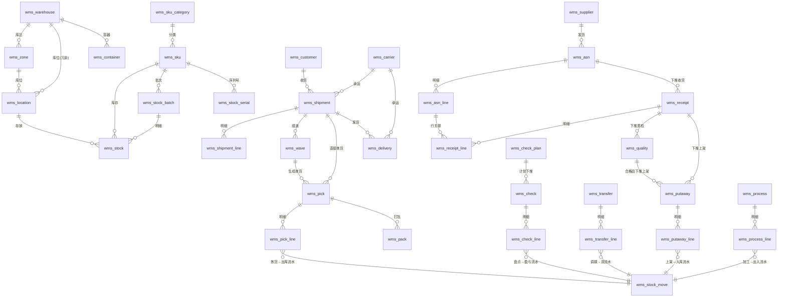

### 业务链一句话总结

> **入库**：ASN（通知）→ 收货单（实收）→ 质检单（合格率）→ 上架单（落库位）→ 库存 available+。
> **出库**：出库通知单 → 分配库存（available→locked）→ 波次（组单）→ 拣货单（locked→扣减）→ 复核 → 打包 → 发货。
> **调拨**：申请 → 审批 → 出库（from- + in_transit+）→ 在途 → 收货（to+ + in_transit-）。
> **盘点**：计划 → 盘点单 → 差异 → 审批 → 盘盈入库/盘亏出库流水。
> **退货**：退货 ASN → 收货 → 质检 → 入库（合格）或退供应商（不合格）。
> **补货**：拣货区低于安全库存 → 从存储区调拨到拣货区（库内调拨变种）。

---

## 5. 状态流转图（重点）

### 5.1 ASN（入库通知单）状态机

**A. wms-ruoyi 实际状态机（极简）**：

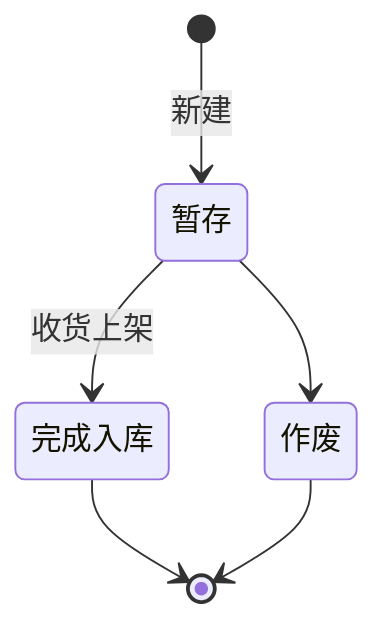

**B. 完整 ASN 状态机（行业标准，推荐 Erupt 采用）**：

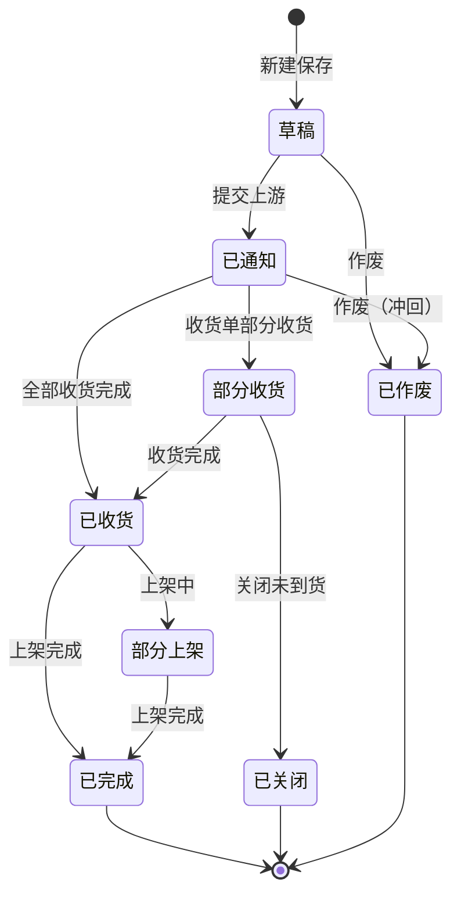

**状态枚举建议**：
| 值 | 状态 | 说明 |
|---|---|---|
| 0 | 草稿 DRAFT | 可编辑/删除 |
| 10 | 已通知 NOTIFIED | 已发预报给仓库 |
| 20 | 部分收货 PARTIAL_RECEIVED | 收货单部分收货 |
| 30 | 已收货 RECEIVED | 收货完成 |
| 40 | 部分上架 PARTIAL_PUTAWAY | 上架进行中 |
| 50 | 已完成 COMPLETED | 上架完成 |
| 60 | 已关闭 CLOSED | 关闭未到货部分 |
| 70 | 已作废 CANCELLED | 作废 |

### 5.2 收货单状态机

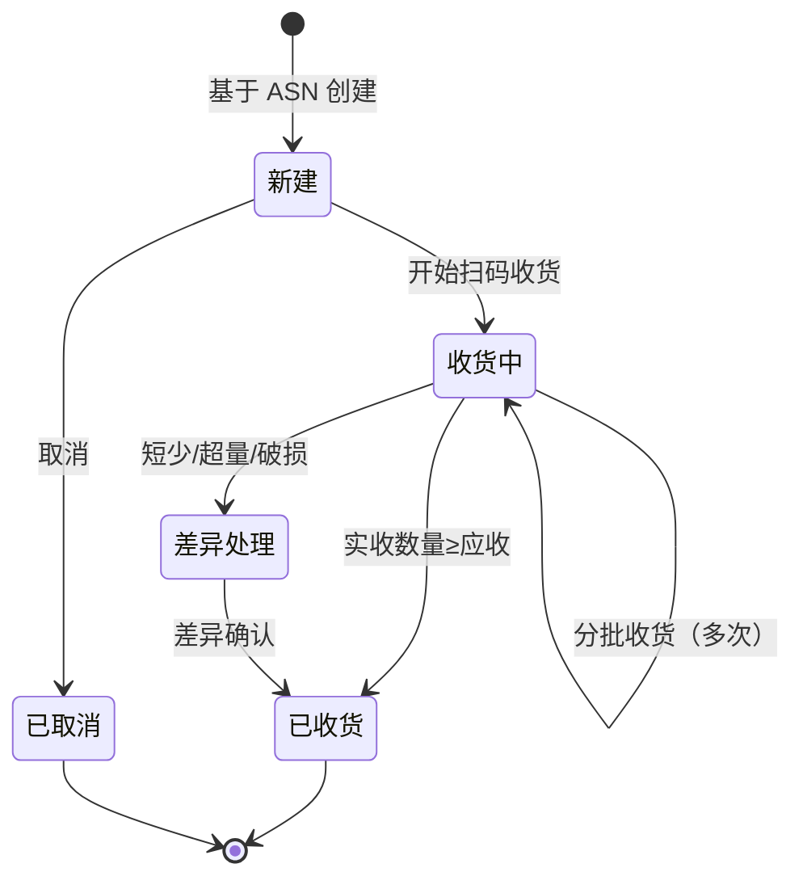

> **关键校验**：单行 `received_qty <= expected_qty * (1 + 容差%)`，超量收货抛异常或走差异审批。

### 5.3 质检单状态机

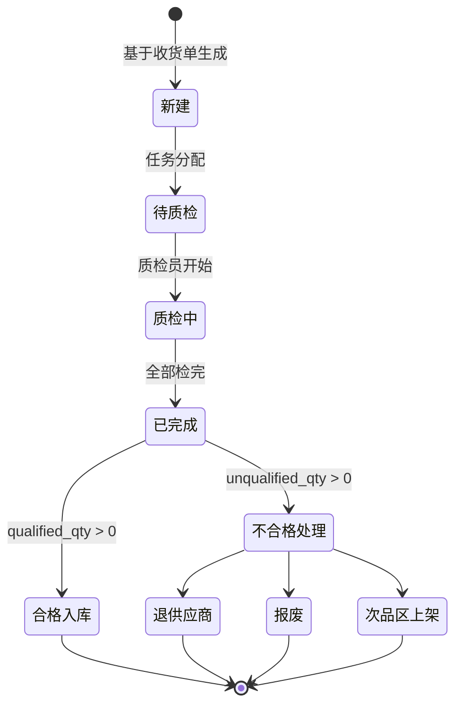

### 5.4 上架单状态机

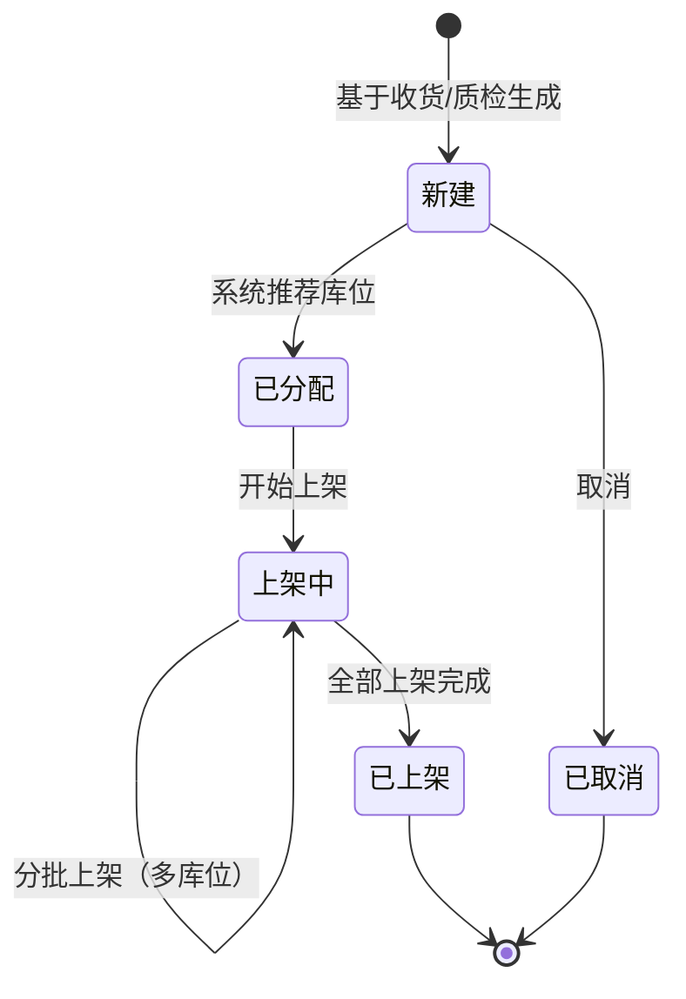

> **上架策略**：① 同 SKU 合并 ② ABC 分类就近 ③ 空库位优先 ④ 同批次合并 ⑤ 重量体积适配。

### 5.5 出库通知单状态机

**A. wms-ruoyi 实际（极简）**：暂存 / 作废 / 完成出库。

**B. 完整出库通知状态机（推荐）**：

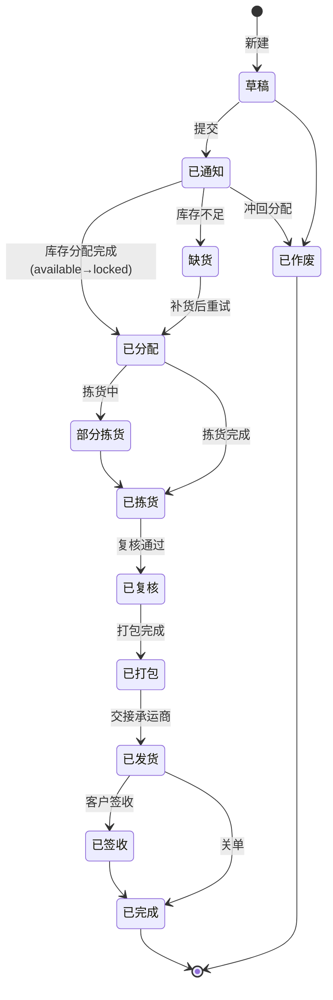

### 5.6 波次状态机

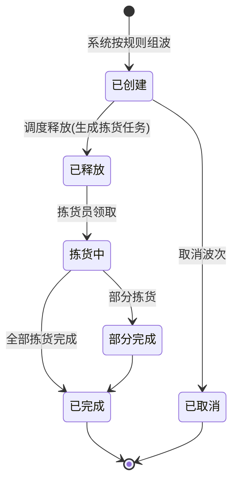

### 5.7 拣货单状态机

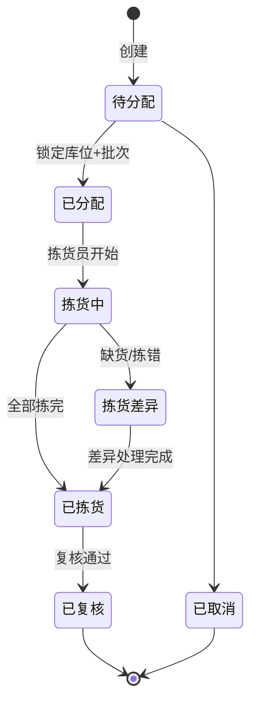

### 5.8 调拨单状态机

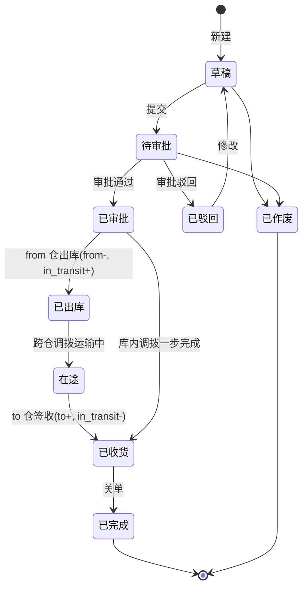

**调拨事务性**（重要）：
- **库内调拨（一步）**：审批 → `from.available -= n` + `to.available += n` + 1 条 TRANSFER 流水，单事务。
- **跨仓调拨（两步在途）**：审批 → `from.available -= n` + `from.in_transit += n` + 1 条 OUT 流水；签收 → `to.available += n` + `from.in_transit -= n` + 1 条 IN 流水。
- **反审批**：必须判断 from 仓当前 available 是否足够冲回。

### 5.9 盘点单状态机

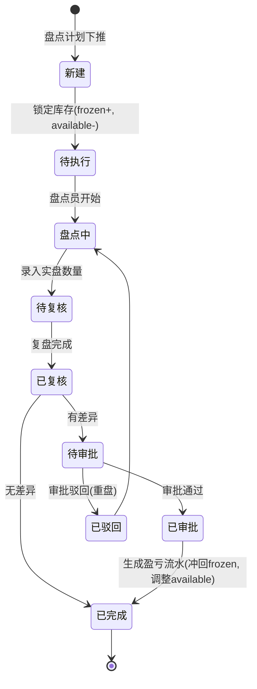

**盘盈/盘亏处理**：
- `diff_count > 0`（盘盈）：`available += diff` + IN 流水（biz_type=13 盘盈入库）
- `diff_count < 0`（盘亏）：`available -= diff` + OUT 流水（biz_type=23 盘亏出库）
- 静态盘点：先 `frozen += stock_count, available -= stock_count`；完成后再冲回。

### 5.10 加工单状态机（可选）

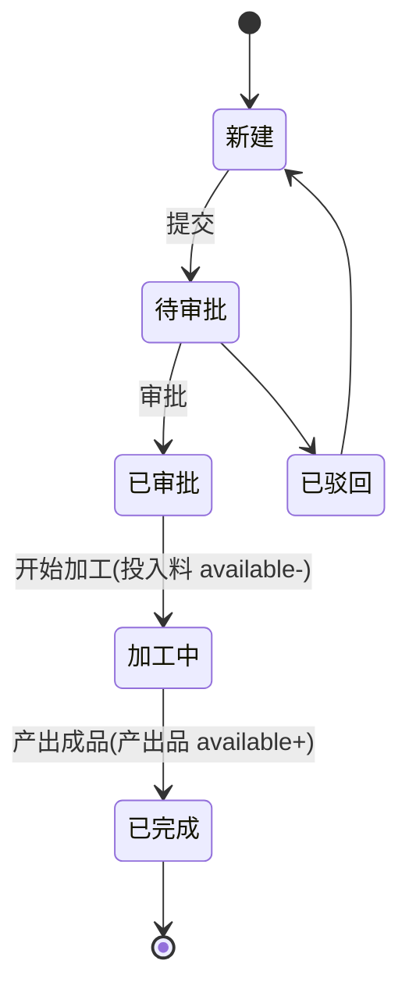

### 5.11 库存状态流转（四态模型）⭐

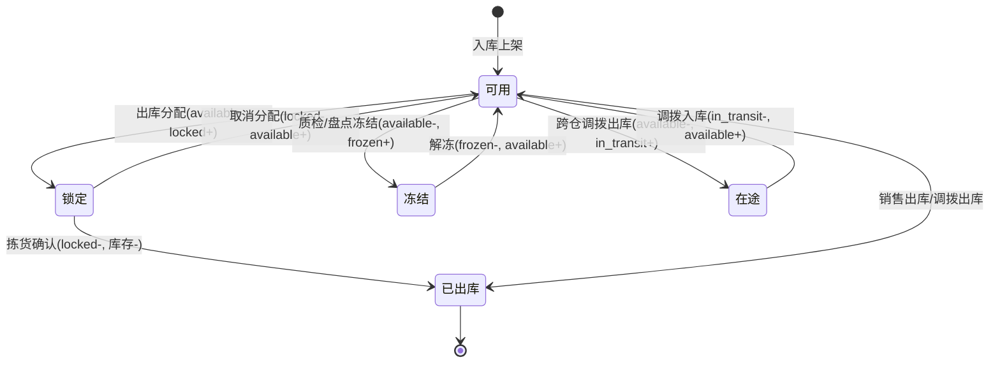

> **状态平衡式**：`当前总库存 = available + locked + in_transit + frozen`（任一 SKU 在任一库位的四态之和应等于历史流水累计）。

---

## 6. 关键业务流程

### 6.1 入库全流程（ASN → 收货 → 质检 → 上架 → 库存增加）

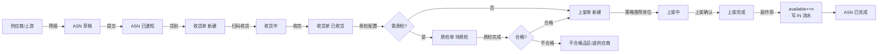

### 6.2 出库全流程（通知 → 分配 → 波次 → 拣货 → 复核 → 打包 → 发货）


### 6.3 库存分配流程（FIFO/FEFO/LIFO）

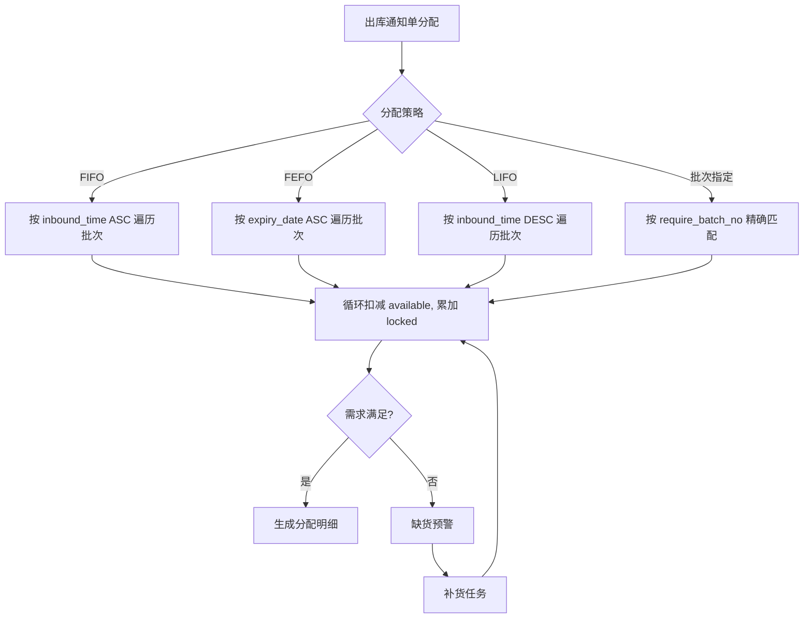

### 6.4 调拨流程（跨仓两步在途）

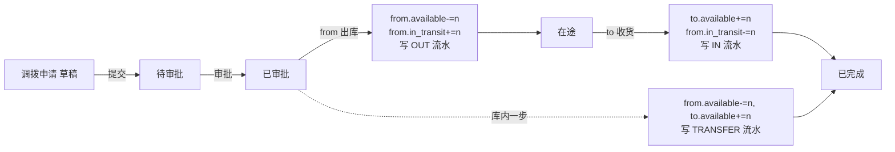

### 6.5 盘点流程（差异 → 审批 → 调整）

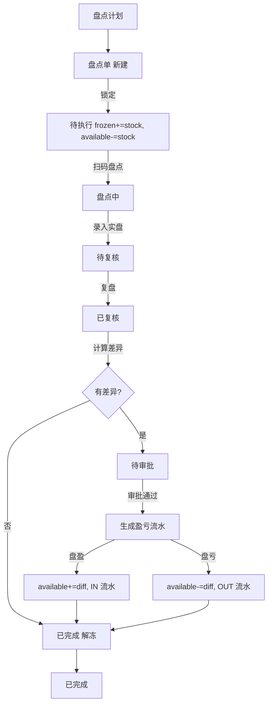

### 6.6 退货流程（退货 ASN → 收货 → 质检 → 入库）

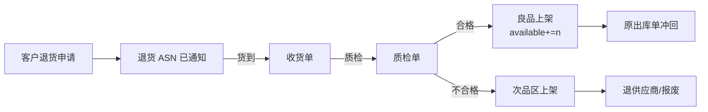

### 6.7 补货流程（存储区 → 拣货区）

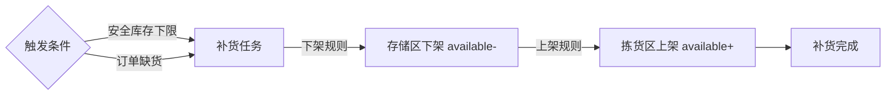

### 6.8 库存联动机制（统一副作用入口）

```mermaid
flowchart TB
    A[业务单据状态变更] --> B{单据类型}
    B -->|上架完成| C[available+=n, 写 IN 流水]
    B -->|拣货确认| D[locked-=n, 写 OUT 流水]
    B -->|出库分配| E[available-=n, locked+=n, 写 LOCKED 流水]
    B -->|取消分配| F[locked-=n, available+=n, 写 UNLOCK 流水]
    B -->|调拨出库| G[from.available-=n, in_transit+=n]
    B -->|调拨入库| H[in_transit-=n, to.available+=n]
    B -->|盘点冻结| I[available-=n, frozen+=n]
    B -->|盘盈/亏| J[available±=diff]
    B -->|质检冻结| K[available-=n, frozen+=n]
    C --> L[写 wms_stock_move]
    D --> L
    E --> L
    F --> L
    G --> L
    H --> L
    I --> L
    J --> L
    K --> L
```

---

## 7. 库存计算与策略

### 7.1 库存四态模型（行业标配）

| 状态 | 字段 | 含义 | 来源操作 |
|---|---|---|---|
| 可用 | `available_qty` | 可被分配出库的库存 | 上架入库 / 解冻 / 调拨入库 |
| 锁定 | `locked_qty` | 已被分配但未拣货 | 出库分配 / 波次释放 |
| 在途 | `in_transit_qty` | 跨仓调拨已出未入 | 调拨出库 |
| 冻结 | `frozen_qty` | 质检/盘点冻结 | 质检冻结 / 盘点冻结 |

**关键公式**：
- 总库存 = available + locked + in_transit + frozen
- 可用量 = available
- 预计可用 = available + in_transit - locked

> **对比 yudao-erp**：yudao 仅 `count`（可用），无锁定/在途/冻结。WMS 必须四态分离，否则无法支撑分配、波次、调拨、盘点等场景。

### 7.2 库存余额表设计（多维度）

**联合唯一键**：`(sku_id, warehouse_id, location_id, batch_no, lot_no)`

设计要点：
1. **库位级**：库存精确到库位，支持库位级拣货、盘点。
2. **批次级**：同 SKU 不同批次分行存储，支持 FEFO。
3. **序列号级**：序列号单独建表 `wms_stock_serial`，不进余额表（一物一码场景）。
4. **冗余字段**：`warehouse_id` 在 `wms_location` 已有，但余额表冗余便于跨库位聚合查询。

### 7.3 库存流水（append-only）

`wms_stock_move` 是只追加不修改的流水表，每笔变动记录：
- `before_qty` / `after_qty`：变动前后余额（行级快照）
- `biz_type` + `biz_id` + `biz_no`：关联业务单据
- `move_type`：IN/OUT/TRANSFER/FREEZE/UNFREEZE
- `state_type`：影响的状态维度（AVAILABLE/LOCKED/IN_TRANSIT/FROZEN）

**用途**：
1. 任一时间点库存追溯（按流水倒推）
2. 操作员绩效统计
3. 库龄分析（按 IN 流水的 operate_time）
4. 库存对账（流水累加 = 余额表）

### 7.4 批次管理与 FEFO

**批次表** `wms_stock_batch` 关键字段：
- `batch_no`：批号
- `production_date`：生产日期
- `expiry_date`：过期日期（= production_date + sku.shelf_days）
- `inbound_time`：入库时间（FIFO 用）
- `remaining_qty`：剩余数量

**FEFO 分配 SQL**（出库时按过期日期升序消耗批次）：

```sql
SELECT b.id, b.batch_no, b.remaining_qty, b.expiry_date
FROM wms_stock_batch b
JOIN wms_stock s ON s.sku_id = b.sku_id AND s.batch_no = b.batch_no
WHERE b.sku_id = :skuId
  AND s.warehouse_id = :warehouseId
  AND s.location_id = :locationId
  AND s.available_qty > 0
  AND b.remaining_qty > 0
  AND b.status = 1
ORDER BY b.expiry_date ASC, b.inbound_time ASC
```

**分配算法**（伪代码）：

```
function allocate(skuId, warehouseId, qty, strategy):
    batches = queryBatchesOrderedBy(strategy)  # FEFO/FIFO/LIFO
    allocated = []
    remaining = qty
    for batch in batches:
        take = min(remaining, batch.available_qty)
        if take > 0:
            allocated.append({batch, take})
            remaining -= take
            if remaining == 0: break
    if remaining > 0:
        throw InsufficientStockException
    return allocated
```

### 7.5 序列号管理（一物一码）

适用场景：高价值商品（手机、电脑）、医疗器械、药品 GSP。

- 入库时为每件商品生成唯一 `serial_no`
- 出库时按序列号逐件扫描，记录出库时间与客户
- 支持反追：客户退回的序列号 → 查原始入库批次、供应商、生产日期

### 7.6 库存分配策略对照

| 策略 | 排序字段 | 适用场景 |
|---|---|---|
| FIFO 先进先出 | `inbound_time ASC` | 通用库存（无保质期） |
| LIFO 后进先出 | `inbound_time DESC` | 钢材、大宗商品（堆叠式存储） |
| FEFO 先到期先出 | `expiry_date ASC, inbound_time ASC` | 食品、医药、冷链 |
| 批次指定 | `batch_no = require_batch_no` | 客户指定批次、召回 |
| 库位优先级 | `location.priority ASC` | 清仓优先、就近优先 |

### 7.7 波次策略（出库优化）

**组波规则**：
- 按承运商（顺丰一起、圆通一起）
- 按区域（华东、华南）
- 按物流时效（次日达、经济件）
- 按订单结构（单品订单、多品订单、A+X 订单）
- 按时间窗口（截单时间）

**两种分配顺序**：
1. **先波后分**：先组波再分配库存。适合大批量、多品类、促销场景。
2. **先分后波**：先分配库存再组波。适合小批量、订单精度要求高。

**波次约束**：
- 订单数量上下限
- 总件数、总重量、总体积上限
- 最长等待时间（定时器触发）

### 7.8 ABC 分类管理

基于帕累托分析：
- **A 类**：销量前 20% 的 SKU，贡献 80% 出库量。放置在拣货区黄金位置（货架 3-4 层，靠近出库口）。
- **B 类**：中间 30% SKU。放置在次优位置。
- **C 类**：后 50% SKU。放置在远端、高层。

**影响**：
- 上架策略：A 类优先上架到拣货区，C 类上架到存储区。
- 拣货路径：A 类库位在路径起点。
- 盘点频率：A 类高频盘点（每月），C 类低频（每季）。

### 7.9 上架策略

| 策略 | 说明 |
|---|---|
| 同 SKU 合并 | 优先上架到已有该 SKU 的库位 |
| 同批次合并 | 优先上架到已有同批次的库位 |
| ABC 就近 | A 类上架到拣货区，C 类上架到存储区 |
| 空库位优先 | 优先选择空库位 |
| 容量适配 | 按重量、体积匹配库位容量 |
| 最短路径 | 按库位坐标计算最近距离 |

### 7.10 补货策略

**触发方式**：
- **正常补货**：拣货区 `available_qty < safety_stock_min`，补货量 = `safety_stock_max - available_qty`
- **订单补货**：出库分配时拣货区库存不足，按缺货量触发补货

**补货流程**：
1. 系统生成补货任务
2. 按下架规则从存储区下架（available-）
3. 按上架规则到拣货区上架（available+）
4. 等价于库内调拨

---

## 8. Erupt 实现建议

本项目基于 Erupt 2.0.1（Spring Boot 3.5.15 + JPA/Hibernate + H2），下面给出注解落地方案。

### 8.1 总体架构

```
xyz.herz.ep
├── entity
│   ├── base/           // Warehouse, Zone, Location(@Tree), Container, Sku, SkuCategory(@Tree), Supplier, Customer, Carrier
│   ├── stock/          // Stock, StockMove, StockBatch, StockSerial, StockSnapshot
│   ├── inbound/        // Asn(+Line), Receipt(+Line), Quality(+Line), Putaway(+Line)
│   ├── outbound/       // Shipment(+Line), Wave(+Line), Pick(+Line), Pack, Delivery
│   ├── transfer/       // Transfer(+Line)
│   ├── check/          // CheckPlan, Check(+Line), CheckDiff
│   ├── process/        // Process(+Line)
│   └── strategy/       // StrategyPutaway, StrategyAllocation, StrategyPick, StrategyReplenish
├── proxy               // DataProxy 业务钩子
│   ├── AsnDataProxy.java
│   ├── PutawayDataProxy.java
│   ├── ShipmentDataProxy.java
│   ├── PickDataProxy.java
│   ├── TransferDataProxy.java
│   └── CheckDataProxy.java
├── handler             // OperationHandler 状态机操作
│   ├── NotifyHandler.java        // 通知
│   ├── ReceiveHandler.java       // 收货
│   ├── PutawayConfirmHandler.java // 上架确认
│   ├── AllocateHandler.java      // 库存分配
│   ├── ReleaseWaveHandler.java   // 释放波次
│   ├── PickConfirmHandler.java   // 拣货确认
│   ├── ShipHandler.java          // 发货
│   ├── TransferOutHandler.java   // 调拨出库
│   ├── TransferInHandler.java    // 调拨入库
│   └── CheckApproveHandler.java  // 盘点审批
├── service             // 核心服务
│   ├── WmsStockService.java       // 库存四态操作统一入口
│   ├── WmsAllocateService.java    // 分配策略引擎
│   ├── WmsPutawayStrategyService.java  // 上架策略
│   ├── WmsWaveService.java        // 波次引擎
│   └── WmsStateMachineService.java // 状态机校验
└── enums
    ├── AsnStatus.java
    ├── ShipmentStatus.java
    ├── StockStateType.java
    └── MoveType.java
```

### 8.2 仓库-库区-库位 树形结构（@Tree + @LinkTree）

Erupt 的树形结构有两种实现方式：**自关联树**（@Tree + pid）和**左树右表**（@LinkTree）。

#### 库位树形（仓库 → 库区 → 库位 多级）

WMS 的仓库-库区-库位本质是三级树，但通常**库位本身是叶子节点**，不做成自关联树。推荐用「**库区左树右表库位**」模式：

```java
// 库区作为左侧树
@Erupt(name = "库位管理",
       linkTree = @LinkTree(field = "zone", expandLevel = 2))
@Table(name = "wms_location")
@Entity
public class Location extends BaseModel {

    @ManyToOne
    @JoinColumn(name = "zone_id")
    @EruptField(views = @View(title = "所属库区", column = "name"),
                edit = @Edit(title = "所属库区", type = EditType.REFERENCE_TREE,
                             referenceTreeType = @ReferenceTreeType(pid = "warehouse.id")))
    private Zone zone;

    @EruptField(views = @View(title = "库位编码"),
                edit = @Edit(title = "库位编码", notNull = true, search = @Search))
    private String code;

    @EruptField(views = @View(title = "排"))
    @Edit(title = "排", type = EditType.NUMBER)
    private Integer rowNo;

    @EruptField(views = @View(title = "列"))
    private Integer bayNo;

    @EruptField(views = @View(title = "层"))
    private Integer levelNo;

    @EruptField(views = @View(title = "ABC 分类"),
                edit = @Edit(title = "ABC 分类", type = EditType.CHOICE,
                             choiceType = @ChoiceType(vl = {
                                 @VL(value = "A", label = "A 类(高频)"),
                                 @VL(value = "B", label = "B 类(中频)"),
                                 @VL(value = "C", label = "C 类(低频)")
                             })))
    private String abcClass;

    @EruptField(views = @View(title = "容量(体积)"))
    private BigDecimal capacityVolume;

    @EruptField(views = @View(title = "状态"),
                edit = @Edit(title = "状态", type = EditType.CHOICE,
                             choiceType = @ChoiceType(fetchHandler = SqlChoiceFetchHandler.class,
                                                      fetchHandlerParams = {"0:停用","1:启用","2:冻结","3:锁定"})))
    private Integer status;
}
```

#### 商品分类（自关联树 @Tree）

```java
@Erupt(name = "商品分类", tree = @Tree(id = "id", label = "name", pid = "parent.id"))
@Table(name = "wms_sku_category")
@Entity
public class SkuCategory extends BaseModel {

    @EruptField(views = @View(title = "分类名称"),
                edit = @Edit(title = "分类名称", notNull = true, search = @Search(vague = true)))
    private String name;

    @ManyToOne
    @JoinColumn(name = "parent_id")
    @EruptField(views = @View(title = "上级分类", column = "name"),
                edit = @Edit(title = "上级分类", type = EditType.REFERENCE_TREE,
                             referenceTreeType = @ReferenceTreeType(pid = "parent.id")))
    private SkuCategory parent;

    @EruptField(edit = @Edit(title = "状态", type = EditType.CHOICE,
                             choiceType = @ChoiceType(fetchHandler = SqlChoiceFetchHandler.class,
                                                      fetchHandlerParams = {"0:停用","1:启用"})))
    private Integer status;
}
```

> **注意**：Erupt 的 `@Tree` 用于「整张表本身就是树」（如分类、部门）；`@LinkTree` 用于「左侧树过滤右侧表」（如库区-库位）。WMS 仓库-库区-库位是三层不同实体，用 `@LinkTree` 串联。

### 8.3 库存余额表（查询视图 + DataProxy）

库存余额表是 WMS 的"账本"，需要支持多维度查询。Erupt 实现要点：

```java
@Erupt(name = "库存余额",
       dataProxy = StockDataProxy.class,
       power = @Power(add = false, delete = false, edit = false))  // 禁止直接增删改,只能通过业务单据
@Table(name = "wms_stock")
@Entity
public class Stock extends BaseModel {

    @ManyToOne
    @JoinColumn(name = "sku_id")
    @EruptField(views = @View(title = "SKU", column = "code"),
                edit = @Edit(title = "SKU", type = EditType.REFERENCE_CHOICE, notNull = true))
    private Sku sku;

    @ManyToOne
    @JoinColumn(name = "warehouse_id")
    @EruptField(views = @View(title = "仓库", column = "name"),
                edit = @Edit(title = "仓库", type = EditType.REFERENCE_CHOICE, notNull = true))
    private Warehouse warehouse;

    @ManyToOne
    @JoinColumn(name = "location_id")
    @EruptField(views = @View(title = "库位", column = "code"),
                edit = @Edit(title = "库位", type = EditType.REFERENCE_CHOICE, notNull = true))
    private Location location;

    @EruptField(views = @View(title = "批次"),
                edit = @Edit(title = "批次"))
    private String batchNo;

    @EruptField(views = @View(title = "可用库存", sortable = true))
    private BigDecimal availableQty;

    @EruptField(views = @View(title = "锁定库存", sortable = true))
    private BigDecimal lockedQty;

    @EruptField(views = @View(title = "在途库存", sortable = true))
    private BigDecimal inTransitQty;

    @EruptField(views = @View(title = "冻结库存", sortable = true))
    private BigDecimal frozenQty;

    @EruptField(views = @View(title = "生产日期"))
    private LocalDate productionDate;

    @EruptField(views = @View(title = "过期日期"))
    private LocalDate expiryDate;

    @EruptField(views = @View(title = "临期预警"),
                edit = @Edit(show = false))
    private String expiryWarning;  // 由 DataProxy 动态计算
}
```

**StockDataProxy** 动态计算临期预警：

```java
@Component
public class StockDataProxy implements DataProxy<Stock> {
    @Override
    public void afterUpdate(Stock stock) {
        // 校验四态平衡
        BigDecimal total = stock.getAvailableQty()
            .add(stock.getLockedQty())
            .add(stock.getInTransitQty())
            .add(stock.getFrozenQty());
        if (total.compareTo(BigDecimal.ZERO) < 0) {
            throw new BusinessException("库存四态之和不能为负");
        }
    }

    // 列表查询时动态计算临期预警
    @Override
    public void beforeFetch(List<Condition> conditions) {
        // 可加入默认条件: availableQty > 0
    }
}
```

### 8.4 主子表（ASN - 明细）

```java
@Erupt(name = "入库通知单 ASN",
       dataProxy = AsnDataProxy.class,
       rowOperation = {
           @RowOperation(title = "通知", code = "NOTIFY", icon = "fa fa-bell",
                         mode = RowOperation.Mode.SINGLE, operationHandler = NotifyHandler.class),
           @RowOperation(title = "下推收货", code = "PUSH_RECEIPT", icon = "fa fa-truck",
                         mode = RowOperation.Mode.SINGLE, eruptClass = Receipt.class,
                         operationHandler = ReceiptPushHandler.class),
           @RowOperation(title = "作废", code = "CANCEL", icon = "fa fa-ban",
                         mode = RowOperation.Mode.SINGLE, operationHandler = AsnCancelHandler.class)
       })
@Table(name = "wms_asn")
@Entity
public class Asn extends BaseModel {

    @EruptField(views = @View(title = "ASN 单号"),
                edit = @Edit(title = "ASN 单号", notNull = true, search = @Search, readonly = true))
    private String no;

    @EruptField(views = @View(title = "状态"),
                edit = @Edit(title = "状态", type = EditType.CHOICE, readonly = true,
                             choiceType = @ChoiceType(fetchHandler = SqlChoiceFetchHandler.class,
                                                      fetchHandlerParams = {
                                                          "0:草稿","10:已通知","20:部分收货",
                                                          "30:已收货","40:部分上架","50:已完成",
                                                          "60:已关闭","70:已作废"
                                                      })))
    private Integer status;

    @ManyToOne
    @JoinColumn(name = "warehouse_id")
    @EruptField(views = @View(title = "目标仓库", column = "name"),
                edit = @Edit(title = "目标仓库", type = EditType.REFERENCE_CHOICE, notNull = true))
    private Warehouse warehouse;

    @ManyToOne
    @JoinColumn(name = "supplier_id")
    @EruptField(views = @View(title = "供应商", column = "name"),
                edit = @Edit(title = "供应商", type = EditType.REFERENCE_CHOICE))
    private Supplier supplier;

    @EruptField(views = @View(title = "入库类型"),
                edit = @Edit(title = "入库类型", type = EditType.CHOICE, notNull = true,
                             choiceType = @ChoiceType(fetchHandler = SqlChoiceFetchHandler.class,
                                                      fetchHandlerParams = {
                                                          "1:采购入库","2:生产入库",
                                                          "3:退货入库","4:调拨入库","5:赠品入库"
                                                      })))
    private Integer asnType;

    @EruptField(views = @View(title = "预计到货"),
                edit = @Edit(title = "预计到货", type = EditType.DATE, notNull = true))
    private LocalDateTime expectedArrivalTime;

    @EruptField(views = @View(title = "通知总数"))
    private BigDecimal totalQty;

    @EruptField(views = @View(title = "已收货数"))
    private BigDecimal receivedQty;

    @EruptField(views = @View(title = "已上架数"))
    private BigDecimal putawayQty;

    // 主子表:明细 TAB_TABLE
    @OneToMany(mappedBy = "asn", cascade = CascadeType.ALL, orphanRemoval = true)
    @OrderBy("lineNo asc")
    @EruptField(
        views = @View(title = "ASN 明细"),
        edit = @Edit(title = "ASN 明细", type = EditType.TAB_TABLE)
    )
    private List<AsnLine> lines = new ArrayList<>();
}
```

**ASN 明细**：

```java
@Erupt(name = "ASN 明细")
@Table(name = "wms_asn_line")
@Entity
public class AsnLine extends BaseModel {

    @ManyToOne
    @JoinColumn(name = "asn_id")
    @EruptField(edit = @Edit(title = "所属 ASN", type = EditType.REFERENCE_TABLE, show = false))
    private Asn asn;

    @EruptField(views = @View(title = "行号"))
    private Integer lineNo;

    @ManyToOne
    @JoinColumn(name = "sku_id")
    @EruptField(views = @View(title = "SKU", column = "code"),
                edit = @Edit(title = "SKU", type = EditType.REFERENCE_CHOICE, notNull = true))
    private Sku sku;

    @EruptField(views = @View(title = "通知数量"),
                edit = @Edit(title = "通知数量", type = EditType.NUMBER, notNull = true))
    private BigDecimal expectedQty;

    @EruptField(views = @View(title = "已收数量"))
    private BigDecimal receivedQty;

    @EruptField(views = @View(title = "预报批次"),
                edit = @Edit(title = "预报批次"))
    private String batchNo;

    @EruptField(views = @View(title = "生产日期"),
                edit = @Edit(title = "生产日期", type = EditType.DATE))
    private LocalDate productionDate;

    @EruptField(views = @View(title = "过期日期"),
                edit = @Edit(title = "过期日期", type = EditType.DATE))
    private LocalDate expiryDate;
}
```

### 8.5 状态机操作（@RowOperation + OperationHandler）

**通知操作**：

```java
@Component
public class NotifyHandler implements OperationHandler<Asn, Object> {
    @Autowired private AsnRepository asnRepo;

    @Override
    public String exec(List<Asn> data, Object param, String[] operationParam) {
        for (Asn asn : data) {
            if (!Integer.valueOf(0).equals(asn.getStatus())) {
                return "ASN[" + asn.getNo() + "] 非草稿状态,无法通知";
            }
            asn.setStatus(10);  // 已通知
            asnRepo.save(asn);
        }
        return "通知成功";
    }

    @Override
    public Boolean beforeFetch(Integer[] ids) {
        // 列表按钮可用性:仅 status=0 显示
        return true;
    }
}
```

**下推收货操作**（带弹窗表单）：

```java
// 弹窗表单
@Erupt(name = "下推收货参数")
@Getter @Setter
public class ReceiptPushDialog extends BaseModel {
    @EruptField(
        views = @View(title = "收货月台"),
        edit = @Edit(title = "收货月台", type = EditType.REFERENCE_CHOICE, notNull = true)
    )
    private Location dockLocation;

    @EruptField(
        views = @View(title = "收货托盘"),
        edit = @Edit(title = "收货托盘", type = EditType.REFERENCE_CHOICE)
    )
    private Container container;
}

@Component
public class ReceiptPushHandler implements OperationHandler<Asn, ReceiptPushDialog> {
    @Autowired private ReceiptService receiptService;

    @Override
    public String exec(List<Asn> data, ReceiptPushDialog param, String[] operationParam) {
        for (Asn asn : data) {
            if (!Integer.valueOf(10).equals(asn.getStatus())
                && !Integer.valueOf(20).equals(asn.getStatus())) {
                return "ASN[" + asn.getNo() + "] 状态不允许下推收货";
            }
            receiptService.createFromAsn(asn, param);
        }
        return "下推成功";
    }
}
```

### 8.6 状态机校验（DataProxy beforeUpdate）

```java
@Component
public class AsnDataProxy implements DataProxy<Asn> {
    @Autowired private AsnRepository asnRepo;

    // 状态迁移矩阵
    private static final Map<Integer, Set<Integer>> TRANSITIONS = Map.of(
        0,  Set.of(10, 70),       // 草稿 -> 已通知/已作废
        10, Set.of(20, 30, 70),   // 已通知 -> 部分收货/已收货/已作废
        20, Set.of(20, 30, 60),   // 部分收货 -> 部分收货/已收货/已关闭
        30, Set.of(40, 50),       // 已收货 -> 部分上架/已完成
        40, Set.of(40, 50)        // 部分上架 -> 部分上架/已完成
    );

    @Override
    public void beforeUpdate(Asn asn) {
        Asn old = asnRepo.findById(asn.getId()).orElseThrow();
        if (!Objects.equals(old.getStatus(), asn.getStatus())) {
            Set<Integer> allowed = TRANSITIONS.getOrDefault(old.getStatus(), Set.of());
            if (!allowed.contains(asn.getStatus())) {
                throw new BusinessException(String.format(
                    "ASN 状态不允许从 %s 迁移到 %s", old.getStatus(), asn.getStatus()));
            }
        }
    }

    @Override
    public void afterAdd(Asn asn) {
        if (asn.getNo() == null) {
            asn.setNo(generateAsnNo());  // 单号生成
        }
        if (asn.getStatus() == null) {
            asn.setStatus(0);  // 默认草稿
        }
    }
}
```

### 8.7 库存联动（统一服务 + 事务保证一致性）

```java
@Service
@Transactional
public class WmsStockService {
    @Autowired private StockRepository stockRepo;
    @Autowired private StockMoveRepository moveRepo;
    @PersistenceContext private EntityManager em;

    /**
     * 统一库存变动入口(所有业务单据调用)
     * @param stateType 影响的状态维度
     * @param moveType  变动方向 IN/OUT/TRANSFER/FREEZE/UNFREEZE
     * @param delta     正数表示增加,负数表示减少
     */
    public void changeStock(Long skuId, Long warehouseId, Long locationId, String batchNo,
                            StockStateType stateType, MoveType moveType, BigDecimal delta,
                            Integer bizType, Long bizId, String bizNo) {
        // 1. 悲观锁查询库存行
        Stock stock = stockRepo.findForUpdate(skuId, warehouseId, locationId, batchNo)
            .orElseGet(() -> createEmptyStock(skuId, warehouseId, locationId, batchNo));

        // 2. 按状态维度计算变动
        BigDecimal before = getStateQty(stock, stateType);
        BigDecimal after = before.add(delta);
        if (after.compareTo(BigDecimal.ZERO) < 0) {
            throw new BusinessException(String.format(
                "库存不足: SKU[%d] 仓库[%d] 库位[%d] 状态[%s] 当前=%s 需=%s",
                skuId, warehouseId, locationId, stateType, before, delta.negate()));
        }
        setStateQty(stock, stateType, after);

        // 3. 写流水
        StockMove move = new StockMove();
        move.setSkuId(skuId);
        move.setWarehouseId(warehouseId);
        move.setLocationId(locationId);
        move.setBatchNo(batchNo);
        move.setBizType(bizType);
        move.setBizId(bizId);
        move.setBizNo(bizNo);
        move.setMoveType(moveType.name());
        move.setQty(delta.abs());
        move.setBeforeQty(before);
        move.setAfterQty(after);
        move.setStateType(stateType.name());
        move.setOperateTime(LocalDateTime.now());
        moveRepo.save(move);
    }

    private BigDecimal getStateQty(Stock s, StockStateType type) {
        return switch (type) {
            case AVAILABLE -> s.getAvailableQty();
            case LOCKED -> s.getLockedQty();
            case IN_TRANSIT -> s.getInTransitQty();
            case FROZEN -> s.getFrozenQty();
        };
    }
}
```

**业务单据调用示例（上架确认）**：

```java
@Component
public class PutawayDataProxy implements DataProxy<Putaway> {
    @Autowired private WmsStockService stockService;
    @Autowired private PutawayLineRepository lineRepo;

    @Override
    public void afterUpdate(Putaway putaway) {
        if (Integer.valueOf(50).equals(putaway.getStatus())) {  // 已上架
            for (PutawayLine line : lineRepo.findByPutawayId(putaway.getId())) {
                // available += qty
                stockService.changeStock(
                    line.getSku().getId(),
                    putaway.getWarehouse().getId(),
                    line.getActualLocation().getId(),
                    line.getBatchNo(),
                    StockStateType.AVAILABLE,
                    MoveType.IN,
                    line.getPutawayQty(),
                    11,  // biz_type=11 上架入库
                    putaway.getId(),
                    putaway.getNo()
                );
            }
            // 回写 ASN putaway_qty
            asnService.addPutawayQty(putaway.getAsnId(), putaway.getTotalQty());
        }
    }
}
```

### 8.8 状态字段与按钮联动（PowerHandler 动态权限）

Erupt 的 `@RowOperation` 默认对所有行显示，但状态机要求"只有特定状态的行才能执行某操作"。两种方案：

**方案 A：前端按钮显隐（PowerHandler）**

```java
@Erupt(name = "出库通知单",
       powerHandler = ShipmentPowerHandler.class,
       rowOperation = {...})
public class Shipment extends BaseModel { ... }

@Component
public class ShipmentPowerHandler implements PowerHandler {
    @Override
    public void process(PowerObject power, erupt annotation) {
        // 根据当前选中行状态动态控制按钮
        // Erupt 2.x 支持 beforeFetch 注入条件
    }
}
```

**方案 B（推荐）：OperationHandler 内部校验**

不依赖前端显隐，每个 Handler 在 `exec` 内部校验状态，不合法直接返回错误信息。简单可靠，适合状态机场景。

### 8.9 批次/序列号子表管理

**批次通过 TAB_TABLE 嵌入收货明细**：

```java
@Erupt(name = "收货明细")
@Entity
@Table(name = "wms_receipt_line")
public class ReceiptLine extends BaseModel {
    // ... 其他字段

    @EruptField(views = @View(title = "实际批次"),
                edit = @Edit(title = "实际批次"))
    private String batchNo;

    @EruptField(views = @View(title = "生产日期"),
                edit = @Edit(title = "生产日期", type = EditType.DATE))
    private LocalDate productionDate;

    @EruptField(views = @View(title = "过期日期"),
                edit = @Edit(title = "过期日期", type = EditType.DATE))
    private LocalDate expiryDate;
}
```

**序列号单独表 + 关联收货明细**（一物一码场景）：

```java
@Erupt(name = "序列号", linkTree = @LinkTree(field = "sku"))
@Entity
@Table(name = "wms_stock_serial")
public class StockSerial extends BaseModel {

    @ManyToOne
    @JoinColumn(name = "sku_id")
    @EruptField(views = @View(title = "SKU", column = "code"),
                edit = @Edit(title = "SKU", type = EditType.REFERENCE_CHOICE, notNull = true))
    private Sku sku;

    @EruptField(views = @View(title = "序列号"),
                edit = @Edit(title = "序列号", notNull = true, search = @Search))
    private String serialNo;

    @EruptField(views = @View(title = "状态"),
                edit = @Edit(title = "状态", type = EditType.CHOICE,
                             choiceType = @ChoiceType(fetchHandler = SqlChoiceFetchHandler.class,
                                                      fetchHandlerParams = {"1:在库","2:已出库","3:退货中","4:已报废"})))
    private Integer status;
}
```

### 8.10 单号生成（Redis 自增）

参考 yudao 的 `ErpNoRedisDAO` 模式：

```java
@Component
public class WmsNoGenerator {
    @Autowired private StringRedisTemplate redis;

    public String generate(String prefix) {
        String date = LocalDate.now().format(DateTimeFormatter.BASIC_ISO_DATE);
        String key = "wms:no:" + prefix + ":" + date;
        Long seq = redis.opsForValue().increment(key);
        if (seq == 1) redis.expire(key, Duration.ofDays(2));
        return prefix + date + String.format("%04d", seq);
    }
}
```

前缀：ASN（入库通知）、RC（收货）、QC（质检）、PA（上架）、SHP（出库通知）、WAVE（波次）、PICK（拣货）、PK（打包）、DLV（发货）、TRF（调拨）、CHK（盘点）、PRC（加工）。

### 8.11 Erupt 注解速查表（WMS 场景）

| 注解 | 作用 | WMS 应用场景 |
|---|---|---|
| `@Erupt(name, dataProxy, power, rowOperation, linkTree, tree)` | 实体元数据 | ASN/收货/出库/拣货等单据 |
| `@EruptField(views, edit)` | 字段配置 | |
| `@View(title, column, sortable)` | 列表视图列 | 库存列表可排序 |
| `@Edit(title, type, notNull, search, readonly)` | 表单编辑 | 状态字段 readonly |
| `EditType.TEXT/TEXTAREA/NUMBER/DATE/CHOICE/REFERENCE_CHOICE/REFERENCE_TREE/REFERENCE_TABLE/TAB_TABLE/ATTACHMENT` | 编辑控件类型 | |
| `@ChoiceType(fetchHandler, fetchHandlerParams)` 或 `@ChoiceType(vl={@VL})` | 下拉选项 | 状态枚举、入库类型 |
| `@ManyToOne` + `@JoinColumn` | 多对一引用 | 关联仓库/SKU/供应商 |
| `@OneToMany(mappedBy=, cascade=)` + `@Edit(type=TAB_TABLE)` | 主子表 | 单据-明细 |
| `@Tree(id, label, pid)` | 自关联树 | 商品分类、库位树 |
| `@LinkTree(field=)` | 左树右表 | 库区-库位、分类-SKU |
| `@ReferenceTreeType(pid=)` | 树形引用 | parent.id |
| `@RowOperation(title, code, icon, mode, operationHandler, eruptClass)` | 行操作按钮 | 通知/收货/上架/分配/拣货/发货/审批 |
| `OperationHandler<P, D>.exec(List<P>, D, String[])` | 操作处理器 | 状态机迁移入口 |
| `DataProxy<T>` 钩子: `beforeAdd/afterAdd/beforeUpdate/afterUpdate/beforeDelete/afterDelete/beforeFetch` | 数据代理 | 状态校验、库存联动、单号生成 |
| `@Power(add, edit, delete, importable, exportable)` | 权限控制 | 库存余额表禁止直接增删改 |
| `@EruptJob(name, cron)` + `JobHandler` | 定时任务 | 临期预警、补货触发、月结快照 |

### 8.12 实施路线图建议

| 阶段 | 内容 | 优先级 |
|---|---|---|
| P0 | 基础数据:仓库/库区/库位(@LinkTree)、SKU/分类(@Tree)、供应商/客户/承运商 | 高 |
| P0 | 库存余额表(四态) + 库存流水表 + 统一 `WmsStockService.changeStock` | 高 |
| P1 | ASN + 收货单 + 上架单(含库存联动 + 状态机) | 高 |
| P1 | 出库通知单 + 库存分配(FIFO/FEFO) + 拣货单 + 发货单 | 高 |
| P2 | 调拨单(库内一步 + 跨仓两步在途) | 中 |
| P2 | 盘点单(明盘/盲盘 + 盈亏流水) | 中 |
| P3 | 质检单 + 退货流程 | 中 |
| P3 | 波次引擎 + 拣货路径优化 | 中 |
| P4 | 批次管理(FEFO) + 序列号管理(一物一码) | 中 |
| P4 | 补货策略 + ABC 分类 + 临期预警 | 中 |
| P5 | 加工单、计费(3PL)、PDA 接口、WCS 对接 | 低 |
| P5 | 库存快照月结 Job、库龄分析报表、操作员绩效 | 低 |

---

## 9. 参考来源

### 9.1 开源 WMS 项目

- [若依 wms-ruoyi（zccbbg/wms-ruoyi）- Gitee](https://gitee.com/zccbbg/wms-ruoyi) — 主要参考对象，lite/advance 分支分别对应单仓和多仓多库区
- [RuoYi-WMS-Vue（前端）- GitHub](https://github.com/zccbbg/RuoYi-WMS-VUE)
- [若依 wms 在线体验](https://wms.ichengle.top/)
- [若依 wms 开发文档](https://docs.ichengle.top/wms/open/run2.html)
- [若依库存管理 ruoyi-wms V2.0 发布说明（CSDN）](https://blog.csdn.net/qq_27575627/article/details/141932980) — V2.0 升级 JDK17 + Vue3，支持一物一码、批号、过期日期
- [若依 WMS 仓库管理系统：10 分钟快速上手（CSDN）](https://blog.csdn.net/gitblog_00891/article/details/160243108)
- [vivibro/iWMS 智能仓储管理系统 - GitHub](https://github.com/vivibro/wms) — Spring Boot 3 + Vue3，多租户
- [Trailer98/wms-system - GitHub](https://github.com/Trailer98/wms-system) — Spring Boot 3 微服务 + Nacos + pgvector
- [openwms.org 国际开源 WMS](https://openwms.org/) — 国际标准 WMS 项目
- [CVEDetect/wms-ruoyi fork - GitHub](https://github.com/CVEDetect/wms-ruoyi)

### 9.2 WMS 业务设计与状态机

- [海外仓 WMS 的入库功能模块（人人都是产品经理）](https://www.woshipm.com/pd/5856270.html) — ASN、收货、上架完整流程
- [WMS 入库单据设计，用 4 张单、3 张单还是 1 张单？（商业新知）](https://www.shangyexinzhi.com/article/32529009.html) — ASN/收货单/质检单/上架单四单据模式
- [WMS 仓储系统入库流程详解与面试题精讲（51CTO）](https://blog.51cto.com/u_14850/14593343) — 状态机源码级解析，含 WAIT_FOR_CHECK/BEGIN_FOR_CHECK/END_FOR_CHECK/WAIT_FOR_SHELF
- [WMS — receiving state machine spec（GitHub lasealco/po-management）](https://github.com/lasealco/po-management/blob/main/docs/wms/WMS_RECEIVING_STATE_MACHINE_SPEC.md) — NOT_TRACKED/EXPECTED/AT_DOCK/RECEIVING/RECEIPT_COMPLETE/DISCREPANCY/CLOSED
- [WMS 系统拆解-出库流程总结（人人都是产品经理）](https://www.woshipm.com/pd/6180866.html) — 波次、分配、拣货、复核、打包、发货全流程
- [WMS 系统拆解-库内管理（人人都是产品经理）](https://www.woshipm.com/share/6183322.html) — 移库、盘点、冻结/解冻、补货、库存调整
- [教你如何应对五花八门的业务场景——WMS 智能业务策略（人人都是产品经理）](https://www.woshipm.com/pd/5688927.html) — 上架/质检/波次/库存周转/分配/拣货策略
- [作为供应链产品经理，你需要掌握仓库作业流程与 WMS 系统规划（人人都是产品经理）](https://www.woshipm.com/pd/2361636.html) — 采购入库/B2C 出库标准作业流程
- [WMS 基础流程和设计（CSDN）](https://blog.csdn.net/malu_record/article/details/134095609) — 关键概念：区域、波次、容器、暂存区、复核台、补货
- [wms 的自动化库存管理、智能分拣及出库优化（博客园）](https://www.cnblogs.com/itqinls/p/18923722) — FIFO/FEFO 实现细节、菜鸟智能货架
- [一个简单 WMS 系统的设计方案（CSDN）](https://blog.csdn.net/m0_55477902/article/details/146049799) — 数据库表结构设计
- [WMS 数据库设计表（CSDN 文库）](https://wenku.csdn.net/answer/5pjkkwce6v) — 仓库/入库单/库存表 SQL
- [WMS 入库管理界面状态机（CSDN 文库）](https://wenku.csdn.net/answer/9hrjwirn46nu) — 0-6 状态码驱动作业流程

### 9.3 库存策略与算法

- [仓库先入先出管理技巧解析（简道云）](https://www.jiandaoyun.com/nblog/468837/) — FIFO + 波次拣货 + 播种墙
- [WMS 仓库管理使用教程（简道云）](https://www.jiandaoyun.com/nblog/471620/) — 动态盘点/循环盘点/明盘/盲盘

### 9.4 Erupt 框架

- [Erupt Framework 官方 - Gitee](https://gitee.com/erupt/erupt)
- [Erupt Framework - GitHub](https://github.com/erupts/erupt)
- [Erupt Framework：开源神器，助你无需前端代码搞定企业级后台（CSDN）](https://learner.blog.csdn.net/article/details/111493802) — 商品管理左树右表示例
- [零基础掌握 Erupt 框架自定义按钮弹窗（CSDN）](https://blog.csdn.net/gitblog_01412/article/details/150054690) — @RowOperation + OperationHandler 全攻略
- [当所有低代码都在卷画布时，我们押注了源代码本身（博客园 Erupt 官方）](https://www.cnblogs.com/erupt/p/20159207) — DataProxy 生命周期钩子
- [ERUPT 事件溯源：领域驱动设计实现（CSDN）](https://blog.csdn.net/gitblog_01172/article/details/151042992) — DataProxy + 事件 + DDD

### 9.5 对比参考：yudao-erp 库存模块

- [yudao-module-erp 数据库表详细版](https://blog.hellocode.vip/36.%E5%90%8E%E7%AB%AF/0.%E8%8A%8B%E9%81%93/%E8%A1%A8/%E6%8C%89%E6%A8%A1%E5%9D%97%E8%AF%A6%E7%BB%86%E7%89%88/07-ERP-%E8%AF%A6%E7%BB%86%E7%89%88)
- 本项目 `doc/erp.md` — ERP 模块功能分析报告（含状态机、库存计算、Erupt 实现建议，可对照阅读）

---

## 附录 A：单号生成规则建议

| 单据 | 前缀 | 示例 |
|---|---|---|
| 入库通知单 ASN | ASN | ASN20260811000001 |
| 收货单 | RC | RC20260811000001 |
| 质检单 | QC | QC20260811000001 |
| 上架单 | PA | PA20260811000001 |
| 出库通知单 | SHP | SHP20260811000001 |
| 波次 | WAVE | WAVE20260811000001 |
| 拣货单 | PICK | PICK20260811000001 |
| 打包单 | PK | PK20260811000001 |
| 发货单 | DLV | DLV20260811000001 |
| 调拨单 | TRF | TRF20260811000001 |
| 盘点单 | CHK | CHK20260811000001 |
| 加工单 | PRC | PRC20260811000001 |

格式：`{prefix}{yyyyMMdd}{6位自增}`，Redis INCR + 当日过期。

## 附录 B：业务类型枚举（biz_type）建议

| 值 | 业务类型 | 库存方向 | 流水 move_type | 影响状态 |
|---|---|---|---|---|
| 10 | ASN 收货 | - | - | （仅记录,不动库存） |
| 11 | 上架入库 | + | IN | AVAILABLE+ |
| 12 | 退货入库 | + | IN | AVAILABLE+ |
| 13 | 盘盈入库 | + | IN | AVAILABLE+ |
| 14 | 调拨入库 | + | IN | AVAILABLE+（to 仓） |
| 20 | 出库分配 | - | - | AVAILABLE- / LOCKED+ |
| 21 | 取消分配 | + | - | LOCKED- / AVAILABLE+ |
| 22 | 拣货出库 | - | OUT | LOCKED- |
| 23 | 盘亏出库 | - | OUT | AVAILABLE- |
| 24 | 调拨出库 | - | OUT | AVAILABLE- / IN_TRANSIT+（from 仓） |
| 25 | 报废出库 | - | OUT | AVAILABLE- |
| 30 | 质检冻结 | - | FREEZE | AVAILABLE- / FROZEN+ |
| 31 | 质检解冻 | + | UNFREEZE | FROZEN- / AVAILABLE+ |
| 32 | 盘点冻结 | - | FREEZE | AVAILABLE- / FROZEN+ |
| 33 | 盘点解冻 | + | UNFREEZE | FROZEN- / AVAILABLE+ |
| 40 | 加工投入 | - | OUT | AVAILABLE- |
| 41 | 加工产出 | + | IN | AVAILABLE+ |

## 附录 C：关键校验规则

1. **ASN 收货数量校验**：`asn_line.received_qty + 本次收货 <= asn_line.expected_qty * (1 + 容差%)`，超量收货走差异审批。
2. **上架数量校验**：`putaway_line.putaway_qty <= receipt_line.received_qty - 已上架`，防止超上架。
3. **出库分配校验**：`stock.available_qty - allocate_qty >= 0`，否则缺货。
4. **拣货数量校验**：`pick_line.picked_qty <= allocated_qty`，超拣拦截。
5. **调拨出库校验**：`from.available_qty >= transfer_qty`，否则不能出库。
6. **盘点冻结校验**：`stock.available_qty >= frozen_qty`，冻结后该库位该 SKU 不可再分配。
7. **状态迁移校验**：通过 DataProxy 的 `beforeUpdate` 校验状态机矩阵（见 8.6）。
8. **库存四态平衡**：`available + locked + in_transit + frozen >= 0`，且每态独立 ≥ 0。
9. **批次过期校验**：FEFO 分配时跳过 `expiry_date < today` 的批次（除非允许出库临期品）。
10. **序列号唯一性**：`wms_stock_serial.serial_no` 全局唯一，入库扫码校验。
11. **库位容量校验**：上架时 `Σ stock.available_qty <= location.capacity_qty`（可选强校验）。
12. **多租户隔离**：所有表 `tenant_id`，查询自动注入租户条件。

---

> 报告完。后续在 Erupt 实现时，建议从「基础数据 + 库存四态余额表 + ASN→收货→上架」最小闭环切入，验证 `WmsStockService.changeStock` + `DataProxy` 副作用机制跑通后，再逐步扩展出库（含波次/拣货）、调拨、盘点、质检、批次/序列号等模块。对照 `doc/erp.md` 可在 WMS 之上叠加业财一体（WMS 上架流水 → ERP 库存流水 + 成本核算）。
